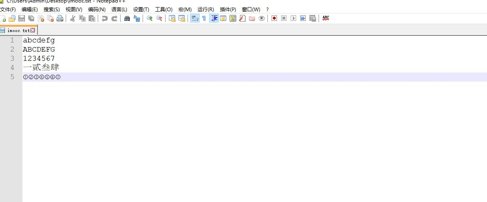

# 第1章 数据库的介绍

## 1.1 数据库概述

### 1.1.1 什么是数据库

 存储数据的仓库. 其本质是一个文件系统，数据库按照特定的格式将数据存储起来，用户可以对数据库中的数据进行增加，修改，删除及查询操作。

 

### 1.1.2 数据的存储方式

1.	数据保存在内存

 

**优点**：内存速度快

**缺点**：断电/程序退出,数据就清除了.内存价格贵

2.	数据保存在普通文件

 

**优点**：永久保存

**缺点**：查找，增加，修改，删除数据比较麻烦，效率低

2. 数据保存在数据库

 

**优点**：永久保存,通过`SQL`语句比较方便的操作数据库

## 1.2 数据库的优点

数据库是按照特定的格式将数据存储在文件中，通过`SQL`语句可以方便的对大量数据进行增、删、改、查操作，数据库是对大量的信息进行管理的高效的解决方案。

 

## 1.3 常见数据库

 

`MYSQL`：开源免费的数据库，小型的数据库.已经被`Oracle`收购了。

`Oracle`：收费的大型数据库，`Oracle`公司的产品。`Oracle`收购SUN公司，收购`MYSQL`。

`DB2` ：`IBM`公司的数据库产品,收费的。常应用在银行系统中.

`SQLServer`：`MicroSoft` 公司收费的中型的数据库。`C#`、`.net`等语言常使用。

`SyBase`：已经淡出历史舞台。提供了一个非常专业数据建模的工具`PowerDesigner`。

`SQLite`: 嵌入式的小型数据库，应用在手机端。

**常用数据库：`MYSQL`，`Oracle`**

在web应用中，使用的最多的就是`MySQL`数据库，原因如下：

1.	开源、免费

2. 功能足够强大，足以应付`web`应用开发（最高支持千万级别的并发访问）

# 第2章 数据库的安装与使用

## 2.1 数据库的卸载

1.打开电脑的服务窗口，关闭`MySQL`服务并且卸载一切与`mysql`相关的模块

 
 
 

2.找到`MySQL`的安装目录，查找是否还残留相关文件夹，如果有删除即可

 

3.勾选显示文件夹选项

 

4.找到`ProgramDate`文件夹，删除里面`mysql`文件夹即可

 

## 2.2 数据库的安装

 
 
 
 
 
 
 
 
 
 
 
 
 
 
 
 
 
 
 
 
 
 
 

## 2.3 数据库的启动

`MySQL`启动方式和普通的`windows`程序双击启动方式不同，分为以下3种：

1.	`Windows`服务方式启动

操作步骤：


2.	命令方式启动

`windows+r`键调出运行窗口，输入`services.msc`命令。

随后在服务中找到`MySQL80`服务启动即可


3.以管理员身份运行`cmd`打开`dos`窗口，输出`net start mysql80`


4.使用`cmd`命令打开`dos`窗口，输出`mysql -V`查看当前`MySQL`版本


## 2.4 控制台连接数据库

 `MySQL`是一个需要账户名密码登录的数据库，登陆后使用，它提供了一个默认的`root`账号，使用安装时设置的密码即可登录

1.	登录格式1：`mysql -u用户名 -p密码`

例如：`mysql –uroot -proot`


后输入密码方式：

`mysql -u用户名 -p回车`

密码


2.	登录格式2：`mysql -hip地址 -u用户名 -p密码`

例如：`mysql –h127.0.0.1 –uroot -proot`


3.	登录格式3：`mysql --host=ip地址 --user=用户名 --password=密码`
	

例如：`mysql --host=localhost --user=root --password=root`


4.	退出`MySQL`：`exit`


## 2.5 数据库管理系统、数据库和表的关系

 	数据库管理系统（`DataBase Management System`，`DBMS`）：指一种操作和管理数据库的大型软件，用于建立、使用和维护数据库，对数据库进行统一管理和控制，以保证数据库的安全性和完整性。用户通过数据库管理系统访问数据库中表内的数据

数据库管理程序(`DBMS`)可以管理多个数据库，一般开发人员会针对每一个应用创建一个数据库。为保存应用中实体的数据，一般会在数据库创建多个表，以保存程序中实体的数据。数据库管理系统、数据库和表的关系如图所示：


先有数据库 → 再有表 → 再有数据

一个库包含多个表

# 第3章 `SQL`语句

## 3.1 `SQL`的概念

### 3.1.1 什么是`SQL`

 结构化查询语言`(Structured Query Language)`简称`SQL`,`SQL`语句就是对数据库进行操作的一种语言。

### 3.1.2 `SQL`作用

 通过`SQL`语句我们可以方便的操作数据库中的数据库、表、数据。

 `SQL`是数据库管理系统都需要遵循的规范。不同的数据库生产厂商都支持`SQL`语句，但都有特有内容。


### 3.1.3 `SQL`语句分类

1.	`DDL(Data Definition Language)`数据定义语言

用来定义数据库对象：数据库，表，列等。关键字：`create`, `drop`,`alter`等

2.	`DML(Data Manipulation Language)`数据操作语言

用来对数据库中表的数据进行增删改。关键字：`insert`, `delete`, `update`等

3.	`DQL(Data Query Language)`数据查询语言

用来查询数据库中表的记录(数据)。关键字：`select`, `where`等

4.	`DCL(Data Control Language)`数据控制语言(了解)

用来定义数据库的访问权限和安全级别，及创建用户。关键字：`GRANT`， `REVOKE`等

## 3.2 `SQL`通用语法

1.	`SQL`语句可以单行或多行书写，以分号结尾。

2.	可使用空格和缩进来增强语句的可读性。
	
3.	`MySQL`数据库的`SQL`语句不区分大小写，关键字建议使用大写。（大写速度快，因为后台会把小写转大写，会多这一步。）

```mysql
SELECT * FROM student;
select * from student;
SELECT * FROM student;
```
## 3.3 `DDL`语句

`DDL(Data Definition Language)`数据定义语言

用来定义数据库对象：数据库，表，列等。关键字：`create`, `drop`,`alter`等

### 3.3.1 `DDL`操作数据库

#### 3.3.1.1 创建数据库

直接创建数据库   
```mysql
CREATE DATABASE 数据库名;
```

判断是否存在并创建数据库  
```mysql
CREATE DATABASE IF NOT EXISTS 数据库名;
```

创建数据库并指定字符集(编码表)  
```mysql
CREATE DATABASE 数据库名 CHARACTER SET 字符集;
```


具体操作：

•	直接创建数据库`db1`  
```mysql
CREATE DATABASE db1;
```


判断是否存在并创建数据库`db2`（好处：不影响后面的`sql`语句执行）

```mysql
CREATE DATABASE IF NOT EXISTS db2;
```


创建数据库并指定字符集为`gbk`  

```mysql
CREATE DATABASE db3 CHARACTER SET gbk;
```


3.3.1.2 查看数据库

查看所有的数据库

```mysql
SHOW DATABASES;
```
 

查看某个数据库的定义信息 
```mysql
SHOW CREATE DATABASE 数据库名;
```
 

#### 3.3.1.3 修改数据库

修改数据库字符集格式

```mysql
ALTER DATABASE 数据库名 DEFAULT CHARACTER SET 字符集;
```

具体操作：

将`db3`数据库的字符集改成`utf8`
```mysql
ALTER DATABASE db3 DEFAULT CHARACTER SET utf8;
```


#### 3.3.1.4 删除数据库
```mysql
DROP DATABASE 数据库名;
```
具体操作：

删除`db2`数据库  
```mysql
DROP DATABASE db2;
```


#### 3.3.1.5 使用数据库

查看正在使用的数据库  
```mysql
SELECT DATABASE();
```
使用/切换数据库  
```mysql
USE 数据库名;
```
具体操作：

查看正在使用的数据库  
```mysql
SELECT DATABASE();
```
 

使用`db1`数据库  
```mysql
USE db1;
```


### 3.3.2 `DDL`操作表

> 前提先使用某个数据库

#### 3.3.2.1 创建表

表的结构与excel相似


语法：
```mysql
CREATE TABLE 表名 (字段名1 字段类型1, 字段名2 字段类型2…);
```
关键字说明：

`CREATE` -- 表示创建

`TABLE` -- 表示创建一张表

建议写成如下格式:

```mysql
CREATE TABLE 表名 (
字段名1 字段类型1, 
字段名2 字段类型2
);
```
`MySQL`数据类型

`MySQL`中的我们常使用的数据类型如下：


| 类型      | 描述                                                     |
| :-------- | :------------------------------------------------------- |
| `int` | 整型 |
| `double` | 浮点型 |
| `varchar` | 字符串型 |
| `data` | 日期类型：`yyyy-MM-dd` |

详细的数据类型如下(不建议详细阅读！)


| 分类   	| 类型名称	| 说明                                              |
| :-------- | :-------  | :------------------------------------------------ |
| 整数类型 |	`tinyInt`	| 很小的整数 |
|  | `smallint` | 小的整数 |
|  | `mediumint`	| 中等大小的整数 |
|  | `int(integer)` | 普通大小的整数 |
| 小数类型	| `float`	| 单精度浮点数 |
| 	| `double`	| 双精度浮点数 |
| 	| `decimal（m,d）`	| 压缩严格的定点数 |
| 日期类型	| `year`	| `YYYY 1901~2155` |
| 	| `time`	| `HH:MM:SS -838:59:59~838:59:59` |
| 	| `date`	| `YYYY-MM-DD 1000-01-01~9999-12-3` |
| 	| `datetime`	| `YYYY-MM-DD HH:MM:SS 1000-01-01 00:00:00~ 9999-12-31 23:59:59` |
| 	| `timestamp`	| `YYYY-MM-DD HH:MM:SS 19700101 00:00:01 UTC~2038-01-19 03:14:07UTC` |
| 文本、二进制类型	| `CHAR(M)` |	M为0~255之间的整数 |
| 	| `VARCHAR(M)`	| M为0~65535之间的整数 |
| 	| `TINYBLOB`	| 允许长度0~255字节 |
| 	| `BLOB`	| 允许长度0~65535字节 |
| 	| `MEDIUMBLOB`	| 允许长度0~167772150字节 |
| 	| `LONGBLOB`	| 允许长度0~4294967295字节 |
| 	| `TINYTEXT`	| 允许长度0~255字节 |
| 	| `TEXT`	| 允许长度0~65535字节 |
| 	| `MEDIUMTEXT`	| 允许长度0~167772150字节 |
| 	| `LONGTEXT`	| 允许长度0~4294967295字节 |
| 	| `VARBINARY(M)` |	允许长度0~M个字节的变长字节字符串 |
| 	| `BINARY(M)`	| 允许长度0~M个字节的定长字节字符串 |

具体操作:

创建`student`表包含`id`,`name`,`birthday`字段

```mysql
CREATE TABLE student (
      id INT,
      name VARCHAR(20),
	age INT,
	sex CHAR(1)
      birthday DATE
);
```
 

#### 3.3.2.2 查看表

1.	查看某个数据库中的所有表  
```mysql
SHOW TABLES;
```


2.	查看表结构 
```mysql
DESC 表名;
```


3.	查看创建表的`SQL`语句  
```mysql
SHOW CREATE TABLE 表名;
```


#### 3.3.2.3 快速创建一个表结构相同的表

```mysql
CREATE TABLE 新表名 LIKE 旧表名;
```
具体操作：

•	创建`s1`表，`s1`表结构和`student`表结构相同

```mysql
CREATE TABLE s1 LIKE student;
```


#### 3.3.2.4 删除表

1.	直接删除表  
```mysql
DROP TABLE 表名;
```


2.	判断表是否存在并删除表  
```mysql
DROP TABLE IF EXISTS 表名;
```


#### 3.3.2.5 修改表结构

修改表结构使用不是很频繁，只需要了解，等需要使用的时候再回来查即可

1.	添加表列  
```mysql
ALTER TABLE 表名 ADD 列名 类型;
```
具体操作：

o	为学生表添加一个新的字段`remark`,类型为`varchar(20)`

```mysql
ALTER TABLE student ADD remark VARCHAR(20);
```


2.	修改列类型  
```mysql
ALTER TABLE 表名 MODIFY列名 新的类型;
```
具体操作：

o	将`student`表中的`remark`字段的改成`varchar(100)`
```mysql
ALTER TABLE student MODIFY remark VARCHAR(100);
```


3.	修改列名  
```mysql
ALTER TABLE 表名 CHANGE 旧列名 新列名 类型;
```
具体操作：

o	将`student`表中的`remark`字段名改成`intro`，类型`varchar(30)`
```mysql
ALTER TABLE student CHANGE remark intro varchar(30);
```


4.	删除列  
```mysql
ALTER TABLE 表名 DROP 列名;
```
具体操作：

o	删除`student`表中的字段`intro`
```mysql
ALTER TABLE student DROP intro;
```


5.	修改表名  
```mysql
RENAME TABLE 表名 TO 新表名;
```
具体操作：

o	将学生表`student`改名成`student2`
```mysql
RENAME TABLE student TO student2;
```


6.	修改字符集  
```mysql
ALTER TABLE 表名 character set 字符集;
```
具体操作：

o	将`sutden2`表的编码修改成`gbk`
```mysql
ALTER TABLE student2 character set gbk;
```


## 3.4 `DML`语句

`DML(Data Manipulation Language)`数据操作语言

用来对数据库中表的数据进行增删改。关键字：`insert`, `delete`, `update`等

### 3.4.1 插入记录

1. 关键字说明
```mysql
   INSERT INTO 表名 – 表示往哪张表中添加数据
   (字段名1, 字段名2, …)  --  要给哪些字段设置值
   VALUES (值1, 值2, …); -- 设置具体的值
```
5.	注意
	
> 值与字段必须对应，个数相同，类型相同
> 值的数据大小必须在字段的长度范围内
> 除了数值类型外，其它的字段类型的值必须使用引号引起。（建议单引号）
> 如果要插入空值，可以不写字段，或者插入`null`

#### 3.4.1.1 插入全部字段

•	所有的字段名都写出来

```mysql
INSERT INTO 表名 (字段名1, 字段名2, 字段名3…) VALUES (值1, 值2, 值3);
```
•	不写字段名

```mysql
INSERT INTO 表名 VALUES (值1, 值2, 值3…);
```
#### 3.4.1.2 插入部分数据

```mysql
INSERT INTO 表名 (字段名1, 字段名2, ...) VALUES (值1, 值2, ...);
```

没有添加数据的字段会使用`NULL`

具体操作:

创建`db2`数据库，并使用。

```mysql
CREATE DATABASE db2;
USE db2;
```
创建完整学生信息表，包括学员的id，姓名，年龄，性别，家庭地址，电话号码，生日，数学成绩，英语成绩

```mysql
CREATE TABLE  student(
	id int,
    name varchar(20),
    age int,
    sex char(1),
    address varchar(200),
    phone varchar(20),
    birthday date,
    math double,
    english double
);
```
•	插入部分数据，往学生表中添加 `id`, `name`, `age`, `sex`,`address`数据

```mysql
INSERT INTO student (id,name,age,sex,address)values(1,'张三',19,'男','北京市');
```
 提示：使用`SELECT * FROM `表名；测试是否插入成功


•	向表中插入所有字段

o	所有的字段名都写出来

```mysql
INSERT INTO student(id,name,age,sex,address,phone,birthday,math,english)values(2,'小美',18,'女','上海市','18888888888','2011-12-12',65.5,99.2);
```


o	不写字段名
```mysql
INSERT INTO student values(3,'小明',27,'男','深圳市','13333333333','2000-11-06',95.5,92);
```


#### 3.4.1.3 蠕虫复制

什么是蠕虫复制：在已有的数据基础之上，将原来的数据进行复制，插入到对应的表中

语法格式：
```mysql 
INSERT INTO 表名1 SELECT * FROM 表名2;
```
作用:将表名2中的数据复制到表名1中

具体操作:

•	创建`student2`表，`student2`结构和`student`表结构一样
```mysql
CREATE TABLE student LIKE student2;
```
•	将`student`表中的数据添加到`student2`表中

```mysql
INSERT INTO student SELECT * FROM student2;
```


注意：如果只想复制`student`表中`name`,`age`字段数据到`student2`表中使用如下格式

```mysql
INSERT INTO student2(name,age) SELECT name,age FROM student;
```


### 3.4.2 更新表记录

1.	不带条件修改数据

```mysql
UPDATE 表名 SET 字段名=值;
```
2.	带条件修改数据

```mysql
UPDATE 表名 SET 字段名=值 WHERE 字段名=值;
```
3.	关键字说明
```
	UPDATE: 修改数据
	SET: 修改哪些字段
	WHERE: 指定条件
```
7.	具体操作：

o	不带条件修改数据，将所有的性别改成女

```mysql
UPDATE student SET sex='女';
```


•	带条件修改数据，将id号为2的学生性别改成男
```mysql
UPDATE student SET sex='男' WHERE id=2;
```


•	一次修改多个列，把`id`为3的学生，年龄改成26岁，`address`改成北京

```mysql
UPDATE student SET age=26, address='北京' WHERE id=3;
```


###  3.4.3 删除表记录

1.	不带条件删除数据

```mysql
DELETE FROM 表名;
```
2.	带条件删除数据

```mysql
DELETE FROM 表名 WHERE 字段名=值;
```
3. 具体操作：

   o	带条件删除数据，删除id为3的记录

```mysql
DELETE FROM student WHERE id=3;
```


•	不带条件删除数据,删除表中的所有数据

```mysql
DELETE FROM student;
```


 `truncate`删除表记录

```mysql
 TRUNCATE TABLE 表名;
```
`truncate`和`delete`的区别：

•	`delete`是将表中的数据一条一条删除

•	`truncate`是将整个表摧毁，重新创建一个新的表,新的表结构和原来表结构一模一样


###  3.5 `DQL`

```mysql
DQL(Data Query Language)`数据查询语言
```
用来查询数据库中表的记录(数据)。关键字：`select`, `where`等

>注意：查询不会对数据库中的数据进行修改.只是一种显示数据的方式

### 3.5.1 简单查询

```mysql
--为 student准备数据
INSERT INTO student values(1,'闫妮',43,'女','北京市','12222222222','2019-02-12',92.5,88);
INSERT INTO student values(2,'郭富城',21,'男','上海市','1666666666','2018-06-06',97.5,65.5);
INSERT INTO student values(3,'赵丽颖',44,'女','深圳市','13333333333','2012-07-15',42.5,74.5);
INSERT INTO student values(4,'张学友',34,'男','杭州市','17777777777','2013-11-17',69,65);
INSERT INTO student values(5,'成龙',51,'男','哈尔滨市','15555555555','2005-10-12',88,97);
INSERT INTO student values(6,'刘德华',57,'男','盘锦市','19999999999','2015-11-11',74.5,92.5);
INSERT INTO student values(7,'马伊琍',42,'女','长沙市','18888888888','2008-03-26',86.5,71.5);
INSERT INTO student values(8,'黎明',49,'男','昆明市','11111111111','2000-09-14',77.5,60);
```

#### 3.5.1.1 查询表所有数据

1.	使用*表示所有列

```mysql
SELECT * FROM 表名;`
```
具体操作：

```mysql
SELECT * FROM student;`
```


2.	写出查询每列的名称

```mysql
SELECT 字段名1, 字段名2, 字段名3, ... FROM 表名;`
```
具体操作：

```mysql
SELECT id,name,age,sex,address,phone,birthday,math,english FROM student;`
```


####  3.5.1.2 查询指定列

查询指定列的数据,多个列之间以逗号分隔

```mysql
SELECT 字段名1, 字段名2... FROM 表名;`
```
具体操作：

查询`student`表中的`name` 和 `age` 列

```mysql
SELECT NAME, age FROM student;`
```

#### 3.5.1.3 别名查询

1.	查询时给列、表指定别名需要使用AS关键字

2.	使用别名的好处是方便观看和处理查询到的数据

```mysql
SELECT 字段名1 AS 别名, 字段名2 AS 别名... FROM 表名;
```
注意：AS可以省略不写

3.	具体操作：

o	查询`sudent`表中`name` 和 `age` 列，`name`列的别名为”姓名”，`age`列的别名为”年龄”

```mysql
SELECT NAME AS 姓名, age AS 年龄 FROM student;
```


#### 3.5.1.4 清除重复值

1.	查询指定列并且结果不出现重复数据
```mysql
SELECT DISTINCT 字段名 FROM 表名;
```
2.	--补充数据
```mysql
INSERT INTO student values(9,'黎明',49,'女','锦州市','14444444444','2000-06-18',73.5,69);
INSERT INTO student values(10,'黎明',31,'女','重庆市','10000000000','2010-05-23',63.5,88);
```
5.	具体操作：

o	查询`name`，`age`列并且结果不出现重复`name`

```mysql
SELECT DISTINCT NAME, age FROM student;
```


#### 3.5.1.5 查询结果参与运算

1.	某列数据和固定值运算

```mysql
SELECT 列名1 + 固定值 FROM 表名;
```
2.	某列数据和其他列数据参与运算

```mysql
SELECT 列名1 + 列名2 FROM 表名;
```
注意: 参与运算的必须是数值类型

3.	需求：

o	查询的时候将数学和英语的成绩相加

o	让学员的年龄增加10岁

4.	实现：

•	查询`math + english`的和

```mysql
SELECT math + english FROM student;
```


>结果确实将每条记录的`math`和`english`相加，但是效果不好看

•	查询`math + english`的和使用别名”总成绩”
```mysql
SELECT math + english 总成绩 FROM student;
```


•	查询所有列与`math + english`的和并使用别名”总成绩”
```mysql
SELECT *, math + english 总成绩 FROM student;
```


•	查询姓名、年龄，将每个人的年龄增加10岁

```mysql
SELECT name, age + 10 FROM student;
```


### 3.5.2 `Navicat` 连接工具的使用
________________________________________
#### 3.5.2.1为什么使用 `Navicat`

`Navicat`是一套快速、可靠并价格相当便宜的数据库管理工具，专为简化数据库的管理及降低系统管理成本而设。它的设计符合数据库管理员、开发人员及中小企业的需要。`Navicat` 是以直觉化的图形用户界面而建的，让你可以以安全并且简单的方式创建、组织、访问并共用信息。

#### 3.5.2.2 `Navicat`的安装
1.双击运行`Navicat`程序


2.点击下一步


3.勾选我同意，点击下一步

4.选择安装目录后，点击下一步

5.点击下一步

6.点击下一步

7.点击安装

8.等待安装完毕

9.点击完成即可

10.主页面点击连接选择`MySQL`

11.填写连接名称以及密码信息

12.数据库正常登录

#### 3.5.2.3 `Navicat` 完成`hero`表

1.创建`db`数据库

2.使用`db`数据库

3.创建`hero`表，表中包括：`id`，`name`，`age`, `sex`，`location`，`life`，`magic`，`is_hot`,`grounding_date`,`max_score` 字段

4.添加一条数据，对数据进行增删改操作

### 3.5.3 条件查询

前面我们的查询都是将所有数据都查询出来，但是有时候我们只想获取到满足条件的数据

语法格式：
```mysql
SELECT 字段名 FROM 表名 WHERE 条件;
```
流程：取出表中的每条数据，满足条件的记录就返回，不满足条件的记录不返回

#### 3.5.3.1 准备数据

```mysql
--准备数据
INSERT into hero values(1,'亚瑟',35,'男',320,'战士',3000,0,1,'2017-05-14',14.2);
INSERT into hero values(2,'阿珂',19,'女',470,'刺客',1500,1100,0,'2019-06-11',15.6);
INSERT into hero values(3,'老夫子',75,'男',430,'战士',2500,0,1,'2016-11-18',17.7);
INSERT into hero values(4,'吕布',40,'男',500,'战士',2700,1000,1,'2015-04-22',12.2);
INSERT into hero values(5,'甄姬',27,'女',210,'法师',1400,1900,0,'2018-06-06',13.1);
INSERT into hero values(6,'虞姬',25,'女',370,'射手',1600,1200,1,'2013-02-24',11.2);
INSERT into hero values(7,'德玛西亚',35,'男',220,'战士',3900,1500,1,'2011-02-14',11.2);
INSERT into hero values(8,'孙尚香',24,'女',260,'射手',1300,900,0,'2020-03-12',9.2);
INSERT into hero values(9,'孙策',39,'男',280,'战士',3200,1100,1,'2016-07-14',16.7);
INSERT into hero values(10,'孙悟空',32,'男',460,'战士',2900,1300,0,'2013-02-11',17.2);
INSERT into hero values(11,'公孙策',37,'男',210,'法师',2200,700,1,'2019-09-16',11.4);
INSERT into hero values(12,'土行孙',22,'男',195,'刺客',1400,1700,1,'2013-02-16',12.4);
INSERT into hero values(13,'后裔',39,'男',420,'射手',780,700,0,'2019-01-19',NULL);
```
#### 3.5.3.2 比较运算符

>大于

<小于

<=小于等于

>=大于等于

=等于

<>、!=不等于

具体操作：

•	查询攻击大于350的英雄
```mysql
SELECT * FROM hero where attack&gt;350;
```


•	查询评分小于12的英雄
```mysql
SELECT * FROM hero WHERE max_score&lt;12;
```


•	查询定位为射手的英雄
```mysql
SELECT * FROM hero WHERE location='射手';
```


•	查询不是热门的英雄 1：热门 0：非热门
```mysql
SELECT * FROM hero WHERE is_hot&lt;&gt;1;
SELECT * FROM hero WHERE is_hot!=1;
```


3.5.3.3 逻辑运算符

`and` 多个条件同时满足

`or` 多个条件其中一个满足

`not` 不满足

具体操作：

•	查询`age`大于35且生命值大于2500的英雄(两个条件同时满足)
```mysql
SELECT * FROM hero WHERE age&gt;35 AND life&gt;2500;
```


•	查询`age`大于35或评分小于10的英雄(两个条件其中一个满足)
```mysql
SELECT * FROM hero WHERE age&gt;35 OR max_score&lt;10;
```


•	查询`id`是1或3或5的英雄
```mysql
SELECT * FROM hero WHERE id=1 OR id=3 OR id=5;
```


in关键字

语法格式：

```mysql
SELECT 字段名 FROM 表名 ` 字段 in (数据1, 数据2...);
```

in里面的每个数据都会作为一次条件，只要满足条件的就会显示

具体操作：

•	查询id是1或3或5的英雄
```mysql
SELECT * FROM hero WHERE id in(1,3,5);
```


•	查询id不是1或3或5的英雄
```mysql
SELECT * FROM hero WHERE id not in(1,3,5);
```


3.5.3.4 范围

`BETWEEN 值1 AND 值2` 表示从值1到值2范围，包头又包尾
比如： `age BETWEEN 35 AND 70`
相当于： `age&gt;=35 &amp;&amp; age&lt;=70`

具体操作：

•	查询英雄上架日期大于等于2013-01-01小于等于2017-01-01之间的英雄
```mysql
SELECT * FROM hero WHERE grounding_date BETWEEN '2013-01-01' AND '2017-01-01';
SELECT * FROM hero WHERE grounding_date &gt;='2013-01-01'  AND grounding_date&lt;='2017-01-01';
```


3.5.3.5 like

LIKE表示模糊查询
```mysql
SELECT * FROM 表名 WHERE 字段名 LIKE '通配符字符串';
```


满足**通配符字符串**规则的数据就会显示出来

`MySQL`通配符有两个：

`%`: 表示0个或多个字符(任意个字符)
`_`: 表示一个字符

具体操作：

•	查询姓孙的英雄
```mysql
SELECT * FROM hero WHERE name LIKE '孙%';
```


•	查询姓名中包含’孙’字的英雄
```mysql
SELECT * FROM hero WHERE name LIKE '%孙%';
```


•	查询姓孙，且姓名有三个字的英雄
```mysql
SELECT * FROM hero WHERE name LIKE '孙__';
```


3.5.3.6 排序

通过`ORDER BY`子句，可以将查询出的结果进行排序(排序只是显示方式，不会影响数据库中数据的顺序)

语法：
```mysql
SELECT 字段名 FROM 表名 WHERE 字段=值 ORDER BY 字段名 [ASC|DESC];
```
`ASC`: 升序, 默认是升序

`DESC`: 降序

3.5.3.6.1 单列排序

单列排序就是使用一个字段排序

具体操作：

•	查询年龄小于等于35岁的英雄，按照年龄升序排列
```mysql
SELECT * FROM hero WHERE age&lt;=35 ORDER BY age ASC;
```


3.5.3.6.2 组合排序

组合排序就是先按第一个字段进行排序，如果第一个字段相同，才按第二个字段进行排序，依次类推。

上面的例子中，年龄是有相同的。当年龄相同再使用其他字段进行排序
```mysql
SELECT 字段名 FROM 表名 WHERE 字段=值 ORDER BY 字段名1 [ASC|DESC], 字段名2 [ASC|DESC];
```

具体操作：

•	查询年龄小于等于35岁的英雄，按照年龄升序排列，如果年龄相同按照生命的降序排列
```mysql
SELECT * FROM hero WHERE age&lt;=35 ORDER BY age ASC,life desc;
```


3.5.3.7 聚合函数

之前我们做的查询都是横向查询，它们都是根据条件一行一行的进行判断，而使用聚合函数查询是纵向查询，它是对一列的值进行计算，然后返回一个结果值。另外聚合函数会忽略空值

五个聚合函数：

`count`： 统计指定列记录数，记录为`NULL`的不统计
`sum`： 计算指定列的数值和，如果不是数值类型，那么计算结果为0
`max`： 计算指定列的最大值
`min`： 计算指定列的最小值
`avg`： 计算指定列的平均值，如果不是数值类型，那么计算结果为0

聚合函数的使用：写在 `SQL`语句`SELECT`后 字段名的地方
```mysql
SELECT 字段名... FROM 表名;

SELECT COUNT(age) FROM 表名;
```


具体操作：

•	查询英雄总数
```mysql
SELECT COUNT(max_score) FROM hero
```


我们发现对于`NULL`的记录不会统计

只要使用全部字段作为衡量标准既不会有遗漏的错误统计出现
```mysql
SELECT COUNT(*) FROM hero
```


•	查询年龄大于40的总数
```mysql
SELECT COUNT(*) FROM hero WHERE age&gt;35;
```


•	查询所用英雄的总评分
```mysql
SELECT SUM(max_score) FROM hero
```


•	查询英雄评分的平均分
```mysql
SELECT AVG(max_score) FROM hero
```

•	查询英雄评分的最高分
```mysql
SELECT MAX(max_score) FROM hero
```


•	查询英雄评分的最低分
```mysql
SELECT MIN(max_score) FROM hero
```


3.5.3.8 分组

分组查询是指使用 `GROUP BY`语句对查询信息进行分组，相同数据作为一组
```mysql
SELECT 字段1,字段2... FROM 表名 GROUP BY 分组字段 [HAVING 条件];
```


GROUP BY怎么分组的？将分组字段结果中相同内容作为一组
```mysql
SELECT * FROM heroGROUP BY sex;
```


这句话会将`sex`相同的数据作为一组，但是会返回每组的第一条，没有任何意义


分组的目的就是为了统计，一般分组会跟聚合函数一起使用。

分组后聚合函数的作用？不是操作所有数据，而是操作一组数据。
```mysql
SELECT SUM(life) FROM hero GROUP BY sex
```


效果如下：


注意事项：当我们使用某个字段分组,在查询的时候也需要将这个字段查询出来,否则看不到数据属于哪组的

•	查询的时候写入分组字段即可


练习：

•	查询年龄小于30岁的人,按性别分组,统计每组的人数

1.先过滤掉年龄小于25岁的人。2.再分组。3.最后统计每组的人数

```mysql
SELECT sex,count(*) FROM hero WHERE age&lt;30 GROUP BY sex;
```


思考：

•	查询年龄大于25岁的人,按性别分组,统计每组的人数,并只显示性别人数大于2的数据

有很多同学可能会将SQL语句写出这样:

```mysql
SELECT sex,count(*) FROM hero WHERE age&lt;30 GROUP BY sex WHERE COUNT(*)&gt;2;;
```


>注意: 并只显示性别人数>2的数据属于分组后的条件,对于分组后的条件需要使用`having`子句

```mysql
SELECT sex,count(*) FROM hero WHERE age&lt;30 GROUP BY sex HAVING COUNT(*)&gt;2;
```


只有分组后人数大于2的`女`这组数据显示出来


`having`与`where`的区别

>`having`是在分组后对数据进行过滤.
>`where`是在分组前对数据进行过滤
>`having`后面可以使用聚合函数
>`where`后面不可以使用聚合函数

3.5.3.9 `limit`语句

`LIMIT`是限制的意思，所以`LIMIT`的作用就是限制查询记录的条数。
```mysql
SELECT *|字段列表 [as 别名] FROM 表名 [WHERE子句] [GROUP BY子句][HAVING子句][ORDER BY子句][LIMIT子句];
```


思考：`limit`子句为什么排在最后？

因为前面所有的限制条件都处理完了，只剩下显示多少条记录的问题了！

LIMIT语法格式：
```mysql
LIMIT offset,length; 或者limit length;
```
`offset`是指偏移量，可以认为是跳过的记录数量，默认为0

`length`是指需要显示的总记录数

具体步骤：

•	查询hero表中数据，从第三条开始显示，显示6条

我们可以认为跳过前面2条，取6条数据

```mysql
SELECT * FROM student3 LIMIT 2,6;
```


LIMIT的使用场景：分页

比如我们登录京东，淘宝，返回的商品信息可能有几万条，不是一次全部显示出来。是一页显示固定的条数。

假设我们一每页显示5条记录的方式来分页，SQL语句如下：


```mysql
-- 每页显示5条
-- 第一页： LIMIT 0,5;	跳过0条，显示5条
-- 第二页： LIMIT 5,5;  跳过5条，显示5条
-- 第三页： LIMIT 10,5; 跳过10条，显示5条
SELECT * FROM hero LIMIT 0,5;
SELECT * FROM hero LIMIT 5,5;
SELECT * FROM hero LIMIT 10,5;
```


注意：

>如果第一个参数是0可以简写：
```mysql
SELECT * FROM student3 LIMIT 0,5;
SELECT * FROM student3 LIMIT 5;
```
>LIMIT 10，5; – 不够5条，有多少显示多少

第4章 数据库约束

对表中的数据进行进一步的限制，保证数据的**正确性**、**有效性**和**完整性**。

约束种类：
```
•	PRIMARY KEY: 主键
•	UNIQUE: 唯一
•	NOT NULL: 非空
•	DEFAULT: 默认
•	FOREIGN KEY: 外键
```
4.1主键

4.1.1 主键的作用

用来唯一标识一条记录，每个表都应该有一个主键，并且每个表只能有一个主键。

有些记录的 `name`,`age`,`sex` 字段的值都一样时,那么就没法区分这些数据,造成数据库的记录不唯一,这样就不方便管理数据


哪个字段应该作为表的主键？

 通常不用业务字段作为主键，单独给每张表设计一个`id`的字段，把`id`作为主键。主键是给数据库和程序使用的，不是给最终的客户使用的。所以主键有没有含义没有关系，只要不重复，非空就行。

4.1.2 创建主键

主键：`PRIMARY KEY`

主键的特点：

•	主键必须包含唯一的值
•	主键列不能包含`NULL`值

创建主键方式：

在创建表的时候给字段添加主键
```mysql
字段名 字段类型 PRIMARY KEY
```
具体操作：

•	创建英雄表`hero1`, 包含字段(`id`, `name`, `age`)将`id`做为主键
```mysql
CREATE TABLE hero1(
	id int PRIMARY Key,
	name varchar(20),
	age int
);
```


•	添加数据
```mysql
INSERT INTO hero1 (id, NAME) VALUES (1, '盾山');
INSERT INTO hero1 (id, NAME) VALUES (2, '梦琪');
INSERT INTO hero1 (id, NAME) VALUES (3, '鲁班');
INSERT INTO hero1 (id, NAME) VALUES (4, '白起');
```


•	插入重复的主键值

-- 主键是唯一的不能重复：`Duplicate entry '1' for key 'PRIMARY'`
```mysql
INSERT INTO hero1 (id, NAME) VALUES (1, '盾山');
```


•	插入`NULL`的主键值

-- 主键是不能为空的：`Column 'id' cannot be null`
```mysql
INSERT INTO hero1 (id, NAME) VALUES (NULL, '蔡文姬');
```


4.1.3 删除主键
```mysql
ALTER TABLE 表名 DROP PRIMARY KEY;
```


具体操作：

•	删除`hero1`表的主键
```mysql
ALTER TABLE hero1 DROP PRIMARY KEY;
```


4.1.4 主键自增

 主键如果让我们自己添加很有可能重复,我们通常希望在每次插入新记录时,数据库自动生成主键字段的值
```mysql
AUTO_INCREMENT 表示自动增长(字段类型必须是整数类型)
```


具体操作：

•	创建英雄表`hero2`, 包含字段(`id`, `name`, `age`)将`id`做为主键并自动增长

```mysql
CREATE TABLE hero2(
	id int PRIMARY Key AUTO_INCREMENT,
	name varchar(20),
	age int
);
```

•	插入数据

-- 主键默认从1开始自动增长

```mysql
INSERT INTO hero2 (NAME, age) VALUES ('猪八戒', 22);
INSERT INTO hero2 (NAME, age) VALUES ('关羽', 26);
INSERT INTO hero2 (NAME, age) VALUES ('诸葛亮', 25);
INSERT INTO hero2 (NAME, age) VALUES ('孙膑', 20);
```


扩展

默认地`AUTO_INCREMENT` 的开始值是1，如果希望修改起始值,请使用下列`SQL`语法

```mysql
ALTER TABLE 表名 AUTO_INCREMENT=起始值;`
```


`DELETE`和`TRUNCATE`的区别

•	`DELETE` 删除表中的数据，但不重置`AUTO_INCREMENT`的值。
•	`TRUNCATE` 摧毁表，重建表，`AUTO_INCREMENT`重置为1

4.2 唯一

在这张表中这个字段的值不能重复

4.2.1 唯一约束的基本格式

字段名 字段类型 `UNIQUE`

4.2.2 实现唯一约束

具体步骤：

•	创建英雄表`hero3`, 包含字段(`id`, `name`),`name`这一列设置唯一约束,不能出现同名的英雄
```mysql
CREATE TABLE hero3 (
	id INT,
	NAME VARCHAR(20) UNIQUE
);
```
•	添加一个英雄
```mysql
INSERT INTO hero3 VALUES (1, '貂蝉');
INSERT INTO hero3 VALUES (2, '西施');
INSERT INTO hero3 VALUES (3, '王昭君');
INSERT INTO hero3 VALUES (4, '杨玉环');
```
-- 插入相同的名字出现`name`重复: Duplicate entry '貂蝉' for key 'name'
```mysql
INSERT INTO hero3 VALUES (5, '貂蝉');`
```
-- 出现多个`null`的时候会怎样？因为`null`是没有值，所以不存在重复的问题
```mysql
INSERT INTO hero3 VALUES (5, NULL);
INSERT INTO hero3 VALUES (6, NULL);
```
4.3 非空

这个字段必须设置值,不能是NULL

4.3.1 非空约束的基本语法格式

```mysql
字段名 字段类型 NOT NULL
```
具体操作：

•	创建表英雄表hero4, 包含字段(id,name,gender)其中name不能为NULL

```mysql
CREATE TABLE hero4 (
	id INT,
	NAME VARCHAR(20) NOT NULL,
	gender CHAR(2)
);
```
•	添加一条完整的记录

```mysql
INSERT INTO hero4 VALUES (1, '扁鹊', '男');
INSERT INTO hero4 VALUES (2, '镜', '男');
INSERT INTO hero4 VALUES (3, '恺', '男');
INSERT INTO hero4 VALUES (4, '貂蝉', '男');
```
-- 姓名不赋值出现姓名不能为null: Column 'name' cannot be null

```mysql
INSERT INTO hero4 VALUES (5, NULL, '男');`
```
4.3.2 默认值

往表中添加数据时,如果不指定这个字段的数据,就使用默认值

默认值格式
```mysql
字段名 字段类型 DEFAULT 默认值
```
具体步骤：

•	创建一个英雄表 hero5，包含字段(id,name,location)， 默认的定位是射手

```mysql
CREATE TABLE hero5 (
	id INT,
	NAME VARCHAR(20),
	location VARCHAR(50) DEFAULT '射手'
);
```
•	添加一条记录,使用默认地址
```mysql
INSERT INTO hero5 (id, NAME) VALUES (1, '后羿');`
```


•	添加一条记录,不使用默认地址
```mysql
INSERT INTO hero5 VALUES (2, '兰陵王', '刺客');`
```


作者：好帮手慕阿莹
链接：https://www.imooc.com/article/312463
来源：慕课网
[](https://www.imooc.com/article/311324)
[](https://www.imooc.com/article/312463)