# 从头认识JavaScript的事件循环模型

## 1. JS的运行机制

### 介绍

众所周知`JavaScript`是一门单线程的语言，所以在`JavaScript`的世界中默认的情况下，同一个时间节点只能做一件事情，这样的设定就造成了`JavaScript`这门语言的一些局限性，比如在我们的页面中加载一些远程数据时，如果按照单线程同步的方式运行，一旦有`HTTP`请求向服务器发送，就会出现等待数据返回之前网页假死的效果出现。因为`JavaScript`在同一个时间只能做一件事，这就导致了页面渲染和事件的执行，在这个过程中无法进行。显然在实际的开发中我们并没有遇见过这种情况。

### 关于同步和异步

基于以上的描述，我们知道在`JavaScript`的世界中，应该存在一种解决方案，来处理单线程造成的诟病。这就是同步【阻塞】和异步【非阻塞】执行模式的出现。

**同步（阻塞）**：

同步的意思是`JavaScript`会严格按照单线程（从上到下、从左到右的方式）执行代码逻辑，进行代码的解释和运行，所以在运行代码时，不会出现先运行4、5行的代码，再回头运行1、3行的代码这种情况。比如下列操作。

```javascript

var a = 1
var b = 2
var c = a + b
//这个例子总c一定是3不会出现先执行第三行然后在执行第二行和第一行的情况
console.log(c)
```

接下来通过下列的案例升级一下代码的运行场景：

```javascript
var a = 1
var b = 2
var d1 = new Date().getTime()
var d2 = new Date().getTime()
while(d2-d1<2000){
  d2 = new Date().getTime()
}
//这段代码在输出结果之前网页会进入一个类似假死的状态
console.log(a+b)
```

当我们按照顺序执行上面代码时，我们的代码在解释执行到第4行时，还是正常的速度执行，但是在下一行就会进入一个持续的循环中。d2和d1在行级间的时间差仅仅是毫秒内的差别，所以在执行到while循环的时候d2-d1的值一定比2000小，那么这个循环会执行到什么时候呢？由于每次循环时，d2都会获取一次当前的时间发生变化，直到d2-d1==2000等情况，这时也就是正好过了2秒的时间，我们的程序才能跳出循环，进而再输出a+b的结果。那么这段程序的实际执行时间至少是2秒以上。这就导致了程序阻塞的出现，这也是为什么将同步的代码运行机制叫做阻塞式运行的原因。

阻塞式运行的代码，在遇到消耗时间的代码片段时，之后的代码都必须等待耗时的代码运行完毕，才能得到执行资源，这就是单线程同步的特点。

**异步（非阻塞）：**

在上面的阐述中，我们明白了单线程同步模型中的问题所在，接下来引入单线程异步模型的介绍。异步的意思就是和同步对立，所以异步模式的代码是不会按照默认顺序执行的。JavaScript执行引擎在工作时，仍然是按照从上到下从左到右的方式解释和运行代码。在解释时，如果遇到异步模式的代码，引擎会将当前的任务“挂起”并略过。也就是先不执行这段代码，继续向下运行非异步模式的代码，那么什么时候来执行异步代码呢？直到同步代码全部执行完毕后，程序会将之前“挂起”的异步代码按照“特定的顺序”来进行执行，所以异步代码并不会【阻塞】同步代码的运行，并且异步代码并不是代表进入新的线程同时执行，而是等待同步代码执行完毕再进行工作。我们阅读下面的代码分析：

```javascript
var a = 1
var b = 2
setTimeout(function(){
  console.log('输出了一些内容')
},2000)
//这段代码会直接输出3并且等待2秒左右的时间在输出function内部的内容
console.log(a+b)
```

这段代码的setTimeout定时任务规定了2秒之后执行一些内容，在运行当前程序执行到setTimeout时，并不会直接执行内部的回调函数，而是会先将内部的函数在另外一个位置（具体是什么位置下面会介绍）保存起来，然后继续执行下面的console.log进行输出，输出之后代码执行完毕，然后等待大概2秒左右，之前保存的函数再执行。

非阻塞式运行的代码，程序运行到该代码片段时，执行引擎会将程序保存到一个暂存区，等待所有同步代码全部执行完毕后，非阻塞式的代码会按照特定的执行顺序，分步执行。这就是单线程异步的特点。

**通俗的讲：**

通俗的讲，同步和异步的关系是这样的：

【同步的例子】：比如我们在核酸检测站，进行核酸检测这个流程就是同步的。每个人必须按照来的时间，先后进行排队，而核酸检测人员会按照排队人的顺序严格的进行逐一检测，在第一个人没有检测完成前，第二个人就得无条件等待，这个就是一个阻塞流程。如果排队过程中第一个人在检测时出了问题，如棉签断了需要换棉签，这样更换时间就会追加到这个人身上，直到他顺利的检测完毕，第二个人才能轮到。如果在检测中间棉签没有了，或者是录入信息的系统崩溃了，整个队列就进入无条件挂起状态所有人都做不了了。这就是结合生活中的同步案例。

【异步的例子】：还是结合生活中，当我们进餐馆吃饭时，这个场景就属于一个完美的异步流程场景。每一桌来的客人会按照他们来的顺序进行点单，假设只有一个服务员的情况，点单必须按照先后顺序，但是服务员不需要等第一桌客人点好的菜出锅上菜，就可以直接去收集第二桌第三桌客人的需求。这样可能在十分钟之内，服务员就将所有桌的客人点菜的菜单统计出来，并且发送给了后厨。之后的菜也不会按照点餐顾客的课桌顺序，因为后厨收集到菜单之后可能有1，2，3桌的客人都点了锅包肉，那么他可能会先一次出三份锅包肉，这样锅包肉在上菜的时候1，2，3桌的客人都能得到，并且其他的菜也会乱序的逐一上菜，这个过程就是异步的。如果按照同步的模式点餐，默认在饭店点菜就会出现饭店在第一桌客人上满菜之前第二桌之后的客人就只能等待连单都不能点的状态。

**总结：**

JavaScript的运行顺序就是完全单线程的异步模型：同步在前，异步在后。所有的异步任务都要等待当前的同步任务执行完毕之后才能执行。请看下面的案例：

```javascript
var a = 1
var b = 2
var d1 = new Date().getTime()
var d2 = new Date().getTime()
setTimeout(function(){
  console.log('我是一个异步任务')
},1000)
while(d2-d1<2000){
  d2 = new Date().getTime()
}
//这段代码在输出3之前会进入假死状态，'我是一个异步任务'一定会在3之后输出
console.log(a+b)
```

观察上面的程序我们实际运行之后就会感受到单线程异步模型的执行顺序了，并且这里我们会发现setTimeout设置的时间是1000毫秒但是在while的阻塞2000毫秒的循环之后并没有等待1秒而是直接输出了我是一个异步任务，这是因为setTimout的时间计算是从setTimeout()这个函数执行时开始计算的。

###  JS的线程组成

上面我们通过几个简单的例子大概了解了一下JS的运行顺序，那么为什么是这个顺序，这个顺序的执行原理是什么样的，我们应该如何更好更深的探究真相呢？这里需要介绍一下浏览器中一个Tab页面的实际线程组成。

在了解线程组成前要了解一点，虽然浏览器是单线程执行JavaScript代码的，但是浏览器实际是以多个线程协助操作来实现单线程异步模型的，具体线程组成如下：

1. GUI渲染线程
2. JavaScript引擎线程
3. 事件触发线程
4. 定时器触发线程
5. http请求线程
6. 其他线程

按照真实的浏览器线程组成分析，我们会发现实际上运行JavaScript的线程其实并不是一个，但是为什么说JavaScript是一门单线程的语言呢？因为这些线程中实际参与代码执行的线程并不是所有线程，比如GUI渲染线程为什么单独存在，这个是防止我们在html网页渲染一半的时候突然执行了一段阻塞式的JS代码而导致网页卡在一半停住这种效果。**在JavaScript代码运行的过程中实际执行程序时,同时只存在一个活动线程，这里实现同步异步就是靠多线程切换的形式来进行实现的**。

所以我们通常分析时，将上面的细分线程归纳为下列两条线程：

1. 【主线程】：这个线程用来执行页面的渲染，JavaScript代码的运行，事件的触发等等
2. 【工作线程】：这个线程是在幕后工作的，用来处理异步任务的执行来实现非阻塞的运行模式

## 2. JavaScript的运行模型

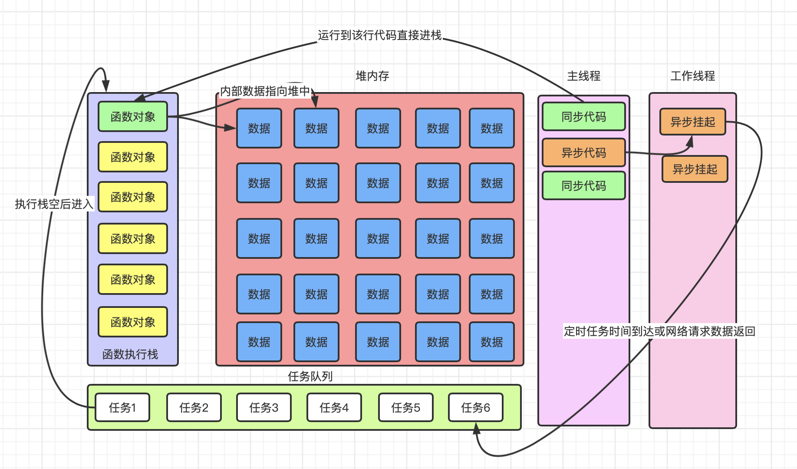

上图是JavaScript运行时的一个工作流程和内存划分的简要描述，我们根据图中可以得知主线程就是我们JavaScript执行代码的线程，主线程代码在运行时，会按照同步和异步代码将其分成两个去处，如果是同步代码执行，就会直接将该任务放在一个叫做“函数执行栈”的空间进行执行，执行栈是典型的【栈结构】（先进后出），程序在运行的时候会将同步代码按顺序入栈，将异步代码放到【工作线程】中暂时挂起，【工作线程】中保存的是定时任务函数、JS的交互事件、JS的网络请求等耗时操作。当【主线程】将代码块筛选完毕后，进入执行栈的函数会按照从外到内的顺序依次运行，运行中涉及到的对象数据是在堆内存中进行保存和管理的。当执行栈内的任务全部执行完毕后，执行栈就会清空。执行栈清空后，“事件循环”就会工作，“事件循环”会检测【任务队列】中是否有要执行的任务，那么这个任务队列的任务来源就是工作线程，程序运行期间，工作线程会把到期的定时任务、返回数据的http任务等【异步任务】按照先后顺序插入到【任务队列】中，等执行栈清空后，事件循环会访问任务队列，将任务队列中存在的任务，按顺序（先进先出）放在执行栈中继续执行，直到任务队列清空。

### 从代码片段开始分析

```javascript
function task1(){
 	console.log('第一个任务')
}
function task2(){
 	console.log('第二个任务')
}
function task3(){
 	console.log('第三个任务')
}
function task4(){
 	console.log('第四个任务')
}
task1()
setTimeout(task2,1000)
setTimeout(task3,500)
task4()

```

刚才的文字阅读可能在大脑中很难形成一个带动画的图形界面来帮助我们分析JavaScript的实际运行思路，接下来我们将这段代码肢解之后详细的研究一下。

**按照字面分析：**

按照字面分析，我们创建了四个函数代表4个任务，函数本身都是同步代码。在执行的时候会按照1，2，3，4进行解析，解析过程中我们发现任务2和任务3被setTimeout进行了定时托管，这样就只能先运行任务1和任务4了。当任务1和任务4运行完毕之后500毫秒后运行任务3，1000毫米后运行任务2。

那么他们在实际运行时又是经历了怎么样的流程来运行的呢？大概的流程我们以图解的形式分析一下。

**图解分析：**

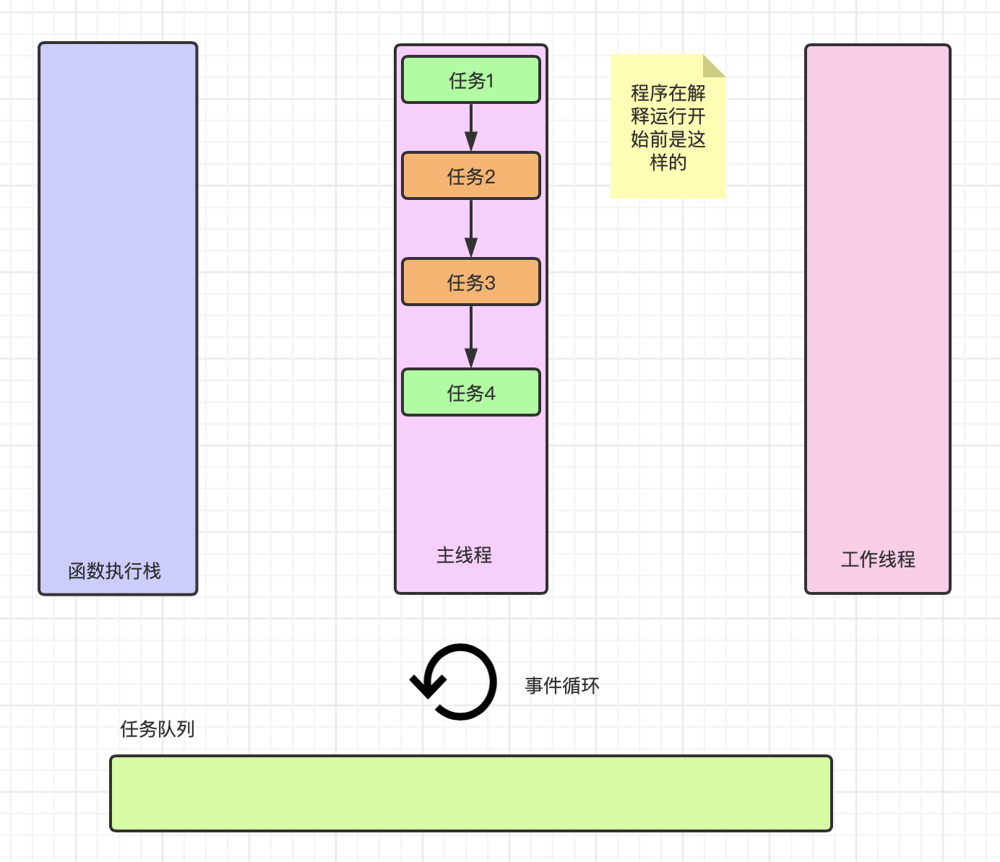

如上图，在上述代码刚开始运行的时候我们的主线程即将工作，按照顺序从上到下进行解释执行，此时执行栈、工作线程、任务队列都是空的，事件循环也没有工作。接下来我们分析下一个阶段程序做了什么事情。

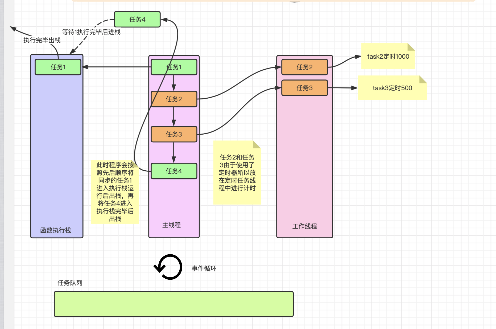

结合上图可以看出程序在主线程执行之后就将任务1、4和任务2、3分别放进了两个方向，任务1和任务4都是立即执行任务所以会按照1->4的顺序进栈出栈（这里由于任务1和4是平行任务所以会先执行任务1的进出栈再执行任务4的进出栈），而任务2和任务3由于是异步任务就会进入工作线程挂起并开始计时，并不影响主线程运行，此时的任务队列还是空置的。

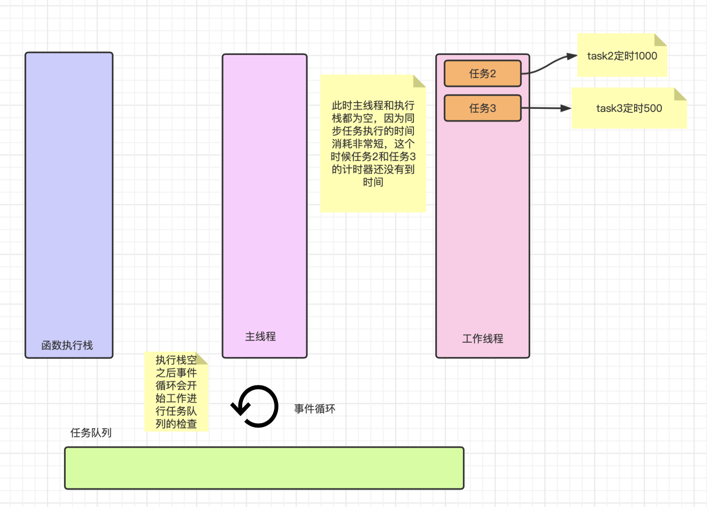

我们发现同步任务的执行速度是飞快的，这样一下执行栈已经空了，而任务2和任务3还没有到时间，这样我们的事件循环就会开始工作等待任务队列中的任务进入，接下来就是执行异步任务的时候了。

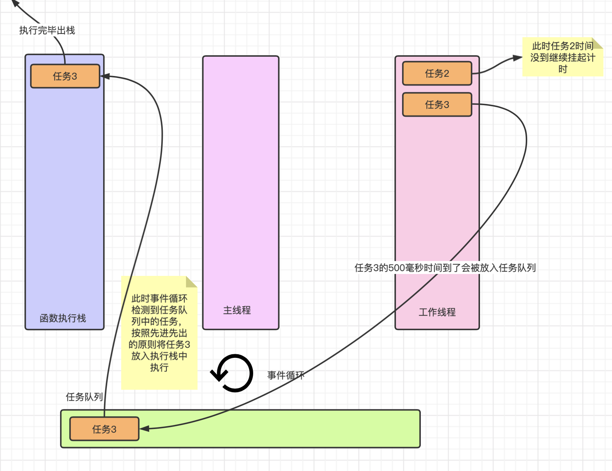

我们发现任务队列并不是一下子就会将任务2和任务三一起放进去，而是哪个计时器到时间了哪个放进去，这样我们的事件循环就会发现队列中的任务，并且将任务拿到执行栈中进行消费，此时会输出任务3的内容。

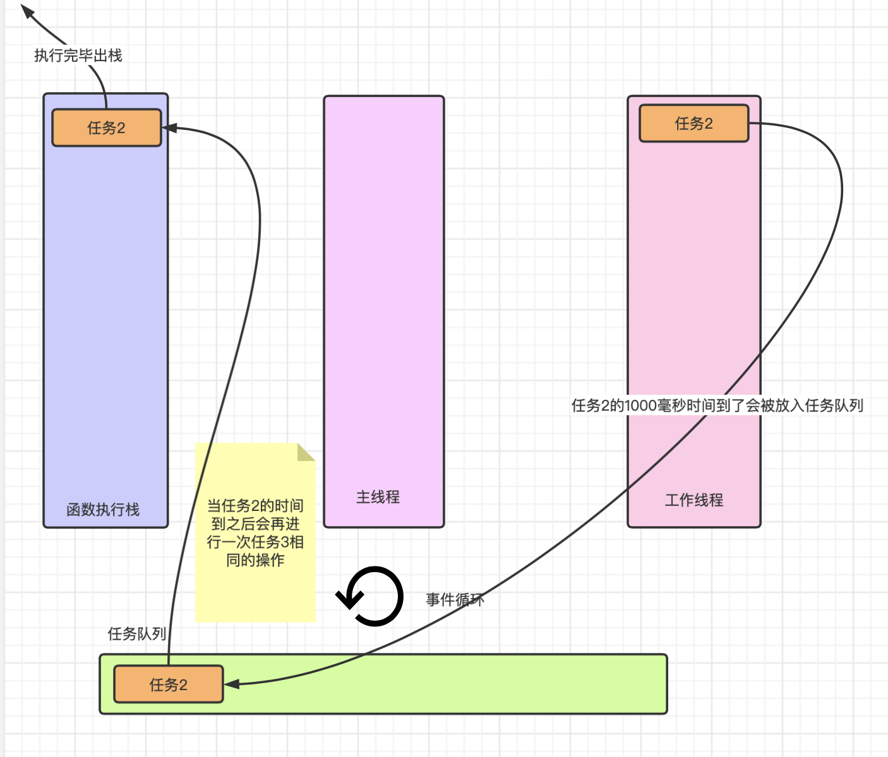

到这就是最后一次执行，当执行完毕后工作线程中没有计时任务，任务队列的任务清空程序到此执行完毕。

### 总结

我们通过图解之后脑子里就会更清晰的能搞懂异步任务的执行方式了，这里采用最简单的任务模型进行描绘复杂的任务在内存中的分配和走向是非常复杂的，我们有了这次的经验之后就可以通过观察代码在大脑中先模拟一次执行，这样可以更清晰的理解JS的运行机制。

### 关于执行栈

执行栈是一个栈的数据结构，当我们运行单层函数时，执行栈执行的函数进栈后，会出栈销毁然后下一个进栈下一个出栈，当有函数嵌套调用的时候栈中就会堆积栈帧，比如我们查看下面的例子：

```javascript
function task1(){
  console.log('task1执行')
  task2()
  console.log('task2执行完毕')
}
function task2(){
  console.log('task2执行')
  task3()
  console.log('task3执行完毕')
}
function task3(){
  console.log('task3执行')
}
task1()
console.log('task1执行完毕')

```

我们根据字面阅读就能很简单的分析出输出的结果会是

```js
/*
task1执行
task2执行
task3执行
task3执行完毕
task2执行完毕
task1执行完毕
*/
```

那么这种嵌套函数在执行栈中的操作流程是什么样的呢？

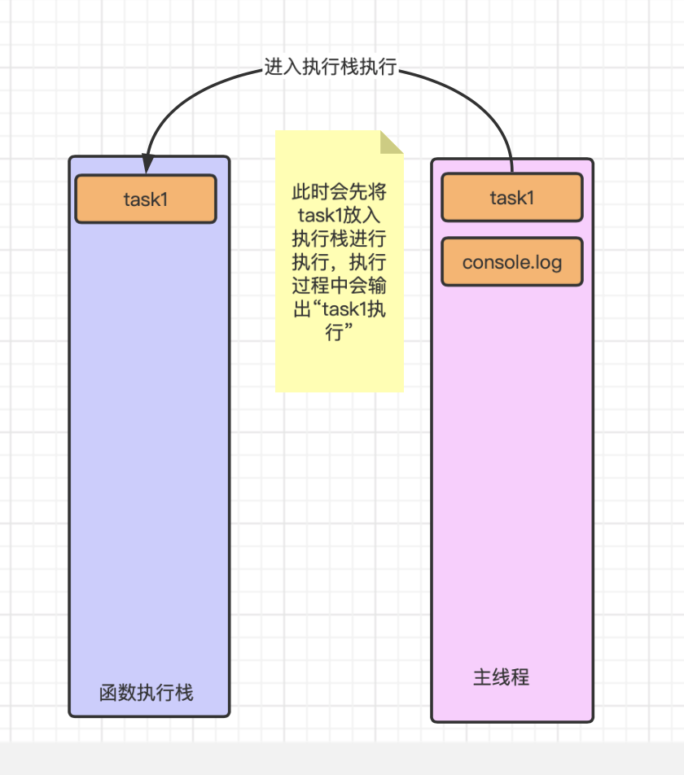

第一次执行的时候调用task1函数执行到console.log的时候先进行输出，接下来会遇到task2函数的调用会出现下面的情况：

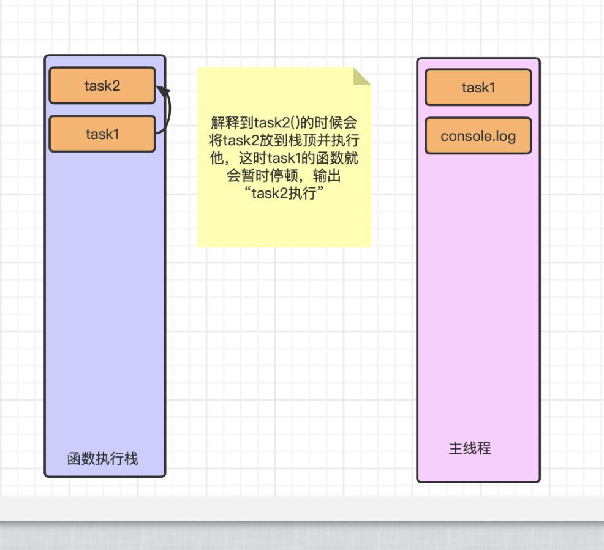

执行到此时检测到task2中还有调用task3的函数，那么就会继续进入task3中执行，如下图：

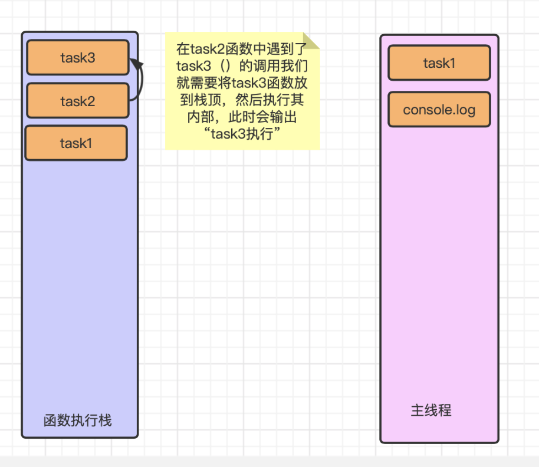

在执行完task3中的输出之后task3内部没有其他代码，那么task3函数就算执行完毕那么就会发生出栈工作。

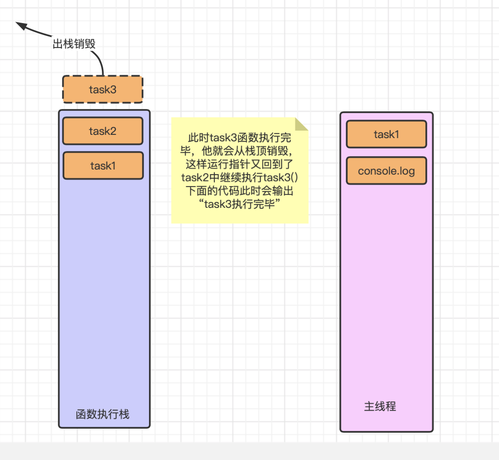

此时我们会发现task3出栈之后程序运行又会回到task2的函数中继续他的执行。接下来会发生相同的事情。

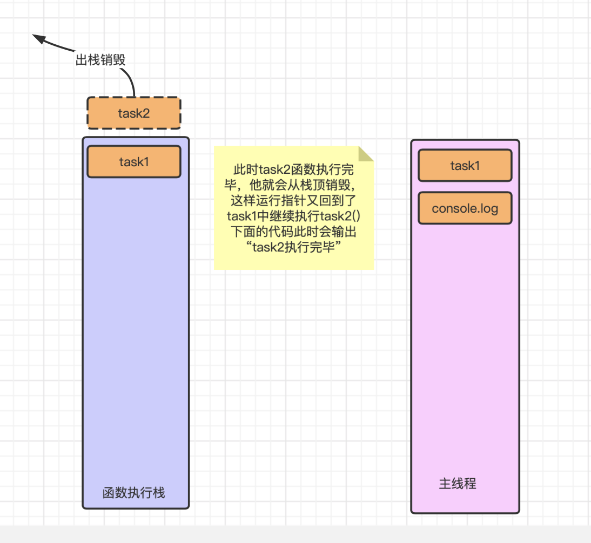

再之后就剩下task1自己了，他在task2销毁之后输出task2执行完毕后他也会随着出栈而销毁。

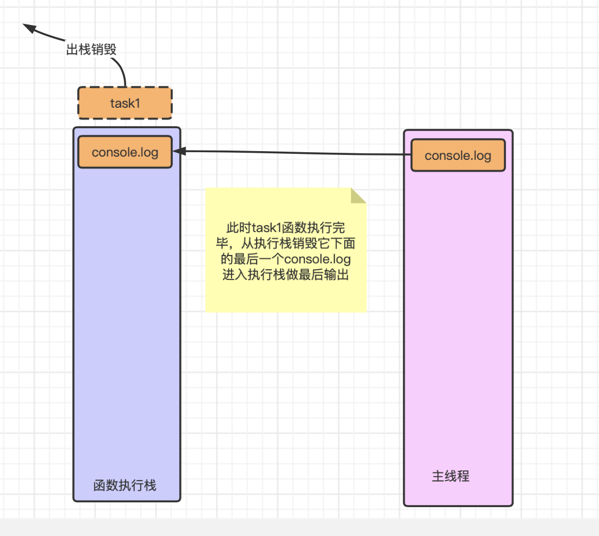

当task1执行完毕之后它随着销毁最后一行输出，就会进入执行栈执行并销毁，销毁之后执行栈和主线程清空。这个过程就会出现123321的这个顺序，而且我们在打印输出时，也能通过打印的顺序来理解入栈和出栈的顺序和流程。

### 关于递归

关于上面的执行栈执行逻辑清楚后，我们就顺便学习一下递归函数，递归函数是项目开发时经常涉及到的场景。我们经常会在未知深度的树形结构，或其他合适的场景中使用递归。那么递归在面试中也会经常被问到**风险问题**，如果了解了执行栈的执行逻辑后，递归函数就可以看成是在一个函数中嵌套n层执行，那么在执行过程中会触发大量的栈帧堆积，如果处理的数据过大，会导致执行栈的高度不够放置新的栈帧，而造成栈溢出的错误。所以我们在做海量数据递归的时候一定要注意这个问题。

**关于执行栈的深度：**

执行栈的深度根据不同的浏览器和JS引擎有着不同的区别，我们这里就Chrome浏览器为例子来尝试一下递归的溢出：

```javascript
var i = 0;
function task(){
  let index = i++
  console.log(`递归了${index}次`)
  task()
  console.log(`第${index}次递归结束`)
}

task()
```

我们发现在递归了11378次之后会提示超过栈深度的错误，也就是我们无法在Chrome或者其他浏览器做太深层的递归操作。

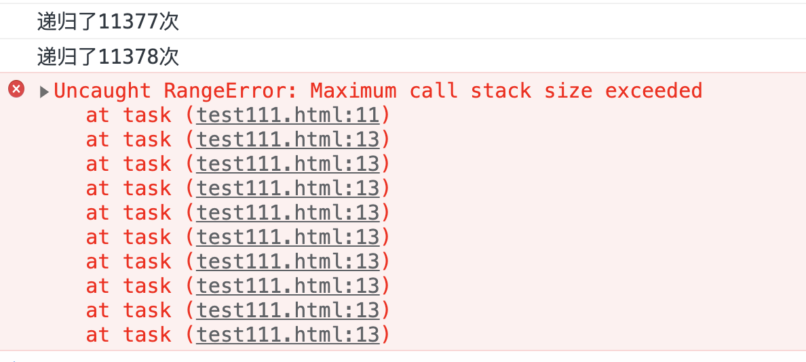


### 如何跨越递归限制

发现问题后，我们再考虑如何能通过技术手段跨越递归的限制。可以将代码做如下更改，这样就不会出现递归问题了。

```javascript
var i = 0;
function task(){
  let index = i++
  console.log(`递归了${index}次`)
  setTimeout(function(){
    task()
  })
  console.log(`第${index}次递归结束`)
}
task()
```

我们发现只是做了一个小小的改造，这样就不会出现溢出的错误了。这是为什么呢？

在了解原因之前我们先看控制台的输出，结合控制台输出我们发现确实超过了界限也没有报错。

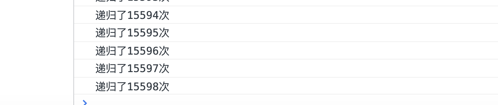

**图解原因：**

这个是因为我们这里使用了异步任务去调用递归中的函数，那么这个函数在执行的时候就不只使用栈进行执行了。

先看没有异步流程时候的执行图例：

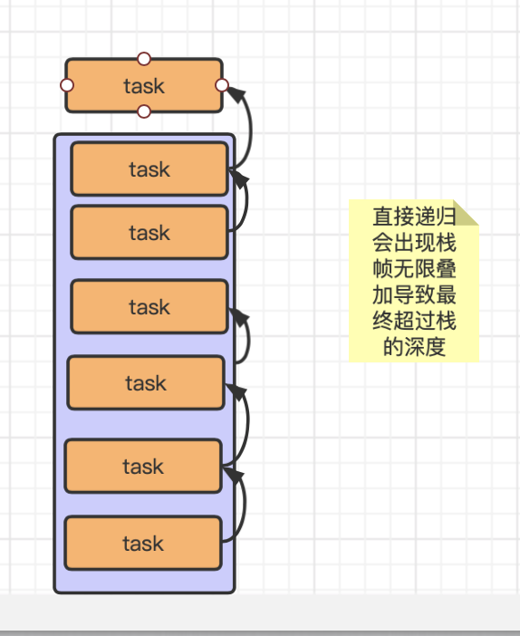

再看有了异步任务的递归：

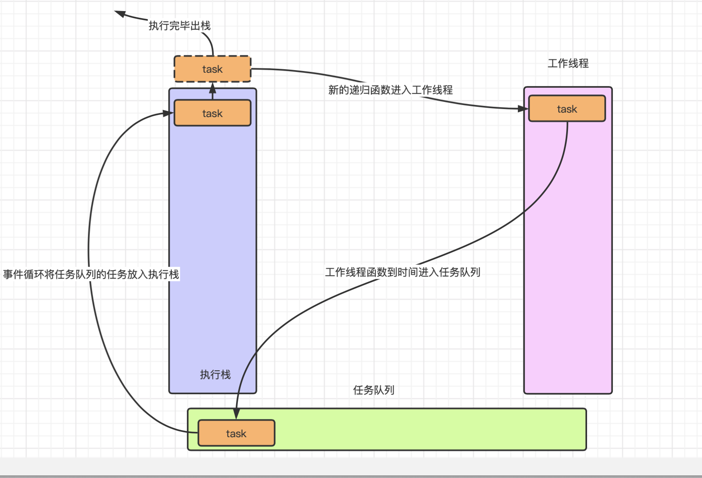

有了异步任务之后我们的递归就不会叠加栈帧了，因为放入工作线程之后该函数就结束了，可以出栈销毁，那么在执行栈中就永远都是只有一个任务在运行，这样就防止了栈帧的无限叠加，从而解决了无限递归的问题，不过异步递归的过程是无法保证运行速度的，在实际的工作场景中，如果考虑性能问题，还需要使用while循环等解决方案，来保证运行效率的问题，在实际工作场景中，尽量避免递归循环，因为递归循环就算控制在有限栈帧的叠加，其性能也远远不及指针循环。

## 3.宏任务和微任务

在明确了事件循环模型以及JavaScript的执行流程后，我们认识了一个叫做任务队列的容器，他的数据结构式队列的结构。所有除同步任务外的代码都会在工作线程中，按照他到达的时间节点有序的进入任务队列，而且任务队列中的异步任务又分为【宏任务】和【微任务】。

### 举个例子：

在了解【宏任务】和【微任务】前，还是哪生活中的实际场景举个例子：

比如在去银行办理业务时，每个人都需要在进入银行时找到取票机进行取票，这个操作会把来办理业务的人按照取票的顺序排成一个有序的队列。假设银行只开通了一个办事窗口，窗口的工作人员会按照排队的顺序进行叫号，到达号码的人就可以前往窗口办理业务，在第一个人办理业务的过程中，第二个以后的人都需要进行等待。这个场景与JavaScript的异步任务队列执行场景是一模一样的，如果把每个办业务的人当作JavaScript中的每一个异步的任务，那么取号就相当于将异步任务放入任务队列。银行的窗口就相当于【函数执行栈】，在叫号时代表将当前队列的第一个任务放入【函数执行栈】运行。这时可能每个人在窗口办理的业务内容各不相同，比如第一个人仅仅进行开卡的操作，这样银行工作人员就会为其执行开卡流程，这就相当于执行异步任务内部的代码。如果第一个人的银行卡开通完毕，银行的工作人员不会立即叫第二个人过来，而是会询问第一个人，“您是否需要为刚才开通的卡办理一些增值业务，比如做个活期储蓄。”，这时相当于在原始开卡的业务流程中临时追加了一个新的任务，按照JavaScript的执行顺序，这个人的新任务应该回到取票机拿取一张新的号码，并且在队尾重新排队，这样工作的话办事效率就会急剧下降。所以银行实际的做法是在叫下一个人办理业务前，如果前面的人临时有新的业务要办理，工作人员会继续为其办理业务，直到这个人的所有事情都办理完毕。

从取卡到办理追加业务完成的这个过程，就是微任务的实际体现。在JavaScript运行环境中，包括主线程代码在内，可以理解为所有的任务内部都存在一个微任务队列，在每下一个宏任务执行前，事件循环系统都会先检测当前的代码块中是否包含已经注册的微任务，并将队列中的微任务优先执行完毕，进而执行下一个宏任务。所以实际的任务队列的结构是这样的，如图：

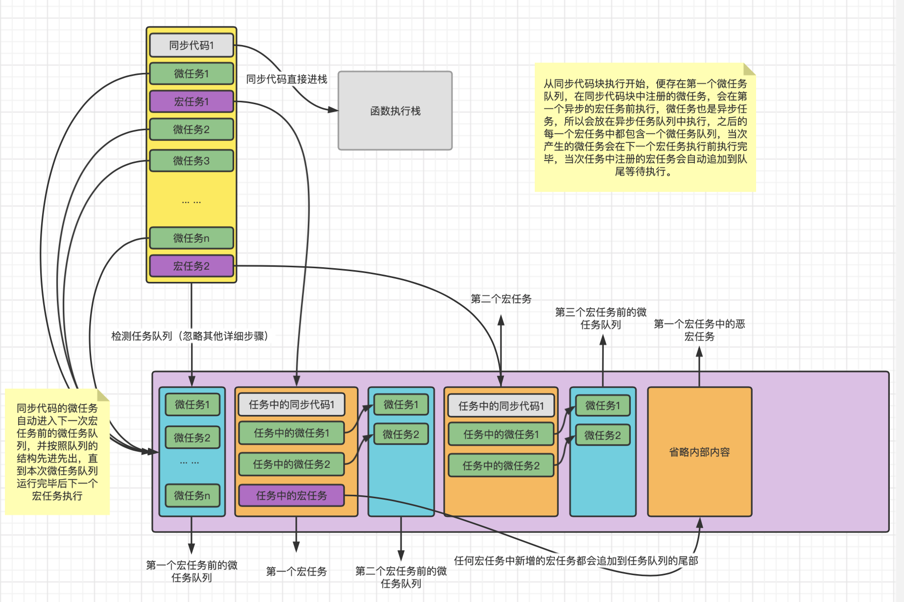

### 宏任务与微任务的介绍

由上述内容得知JavaScript中存在两种异步任务，一种是宏任务一种是微任务，他们的特点如下：

**宏任务**：

宏任务是JavaScript中最原始的异步任务，包括setTimeout、setInterval、AJAX等，在代码执行环境中按照同步代码的顺序，逐个进入工作线程挂起，再按照异步任务到达的时间节点，逐个进入异步任务队列，最终按照队列中的顺序进入函数执行栈进行执行。

**微任务**：

微任务是随着ECMA标准升级提出的新的异步任务，微任务在异步任务队列的基础上增加了【微任务】的概念，每一个宏任务执行前，程序会先检测其中是否有当次事件循环未执行的微任务，优先清空本次的微任务后，再执行下一个宏任务，每一个宏任务内部可注册当次任务的微任务队列，再下一个宏任务执行前运行，微任务也是按照进入队列的顺序执行的。

**总结**：

在JavaScript的运行环境中，代码的执行流程是这样的：

1. 默认的同步代码按照顺序从上到下，从左到右运行，运行过程中注册本次的微任务和后续的宏任务：
2. 执行本次同步代码中注册的微任务，并向任务队列注册微任务中包含的宏任务和微任务
3. 将下一个宏任务开始前的所有微任务执行完毕
4. 执行最先进入队列的宏任务，并注册当次的微任务和后续的宏任务，宏任务会按照当前任务队列的队尾继续向下排列 

### 常见的宏任务和微任务划分

### 宏任务

| #                       | 浏览器 | Node |
| :---------------------- | :----: | :--: |
| `I/O`                   |   ✅    |  ✅   |
| `setTimeout`            |   ✅    |  ✅   |
| `setInterval`           |   ✅    |  ✅   |
| `setImmediate`          |   ❌    |  ✅   |
| `requestAnimationFrame` |   ✅    |  ❌   |


*有些地方会列出来`UI Rendering`，说这个也是宏任务，可是在读了[HTML规范文档](https://html.spec.whatwg.org/multipage/webappapis.html#event-loop-processing-model)以后，发现这很显然是和微任务平行的一个操作步骤*
*`requestAnimationFrame`姑且也算是宏任务吧，`requestAnimationFrame`在[MDN的定义](https://developer.mozilla.org/zh-CN/docs/Web/API/Window/requestAnimationFrame)为，下次页面重绘前所执行的操作，而重绘也是作为宏任务的一个步骤来存在的，且该步骤晚于微任务的执行*

### 微任务

| #                            | 浏览器 | Node |
| :--------------------------- | :----: | :--: |
| `process.nextTick`           |   ❌    |  ✅   |
| `MutationObserver`           |   ✅    |  ❌   |
| `Promise.then catch finally` |   ✅    |  ✅   |

## 经典笔试题

**代码输出顺序问题1**

```javascript
setTimeout(function() {console.log('timer1')}, 0)
 
requestAnimationFrame(function(){
    console.log('UI update')
})
 
setTimeout(function() {console.log('timer2')}, 0)
 
new Promise(function executor(resolve) {
    console.log('promise 1')
    resolve()
    console.log('promise 2')
}).then(function() {
    console.log('promise then')
})
 
console.log('end')
```

解析：

本案例输出的结果为：猜对我就告诉你，先思考，猜对之后结合运行结果分析。

按照同步先行，异步靠后的原则，阅读代码时，先分析同步代码和异步代码，Promise对象虽然是微任务，但是new Promise时的回调函数是同步执行的，所以优先输出promise 1 和 promise 2。

在resolve执行时Promise对象的状态变更为已完成，所以then函数的回调被注册到微任务事件中，此时并不执行，所以接下来应该输出end。

同步代码执行结束后，观察异步代码的宏任务和微任务，在本次的同步代码块中注册的微任务会优先执行，参考上文中描述的列表，Promise为微任务，setTimeout和requestAnimationFrame为宏任务，所以Promise的异步任务会在下一个宏任务执行前执行，所以promise then是第四个输出的结果。

接下来参考setTimeout和requestAnimationFrame两个宏任务，这里的运行结果是多种情况。如果三个宏任务都为setTimeout的话会按照代码编写的顺序执行宏任务，而中间包含了一个requestAnimationFrame，这里就要学习一下他们的执行时机了。setTimeout是在程序运行到setTimeout时立即注册一个宏任务，所以两个setTimeout的顺序一定是固定的timer1和timer2会按照顺序输出。而requestAnimationFrame是请求下一次重绘事件，所以他的执行频率要参考浏览器的刷新率。

参考如下代码：

```javascript
let i = 0;
let d = new Date().getTime()
let d1 = new Date().getTime()
function loop(){
  d1 = new Date().getTime()
  i++
  //当间隔时间超过1秒时执行
  if((d1-d)>=1000){
    d = d1
    console.log(i)
    i = 0
    console.log('经过了1秒')
  }
  requestAnimationFrame(loop)
}
loop()
```

该代码在浏览器运行时，控制台会每间隔1秒进行一次输出，输出的i就是loop函数执行的次数，如下图：

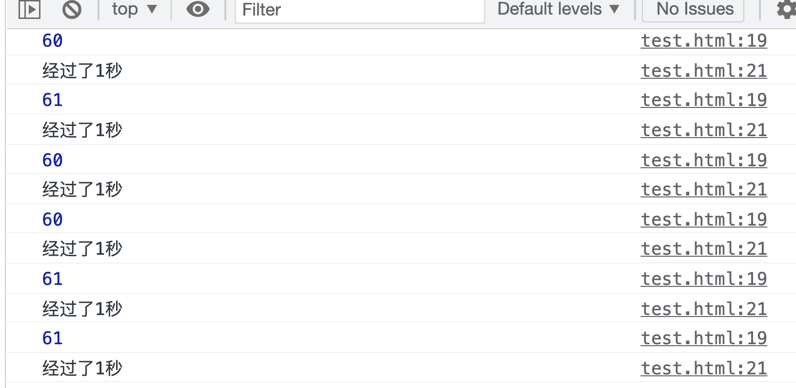

这个输出意味着requestAnimationFrame函数的执行频率是每秒钟60次左右，他是按照浏览器的刷新率来进行执行的，也就是当屏幕刷新一次时该函数就会触发一次，相当于运行间隔是16毫秒左右。

继续参考下列代码：

```javascript
let i = 0;
let d = new Date().getTime()
let d1 = new Date().getTime()

function loop(){
  d1 = new Date().getTime()
  i++
  if((d1-d)>=1000){
    d = d1
    console.log(i)
    i = 0
    console.log('经过了1秒')
  }
  setTimeout(loop,0)
}
loop()
```

该代码结构与上面的案例类似，循环是采用setTimeout进行控制的，所以参考运行结果，如图：

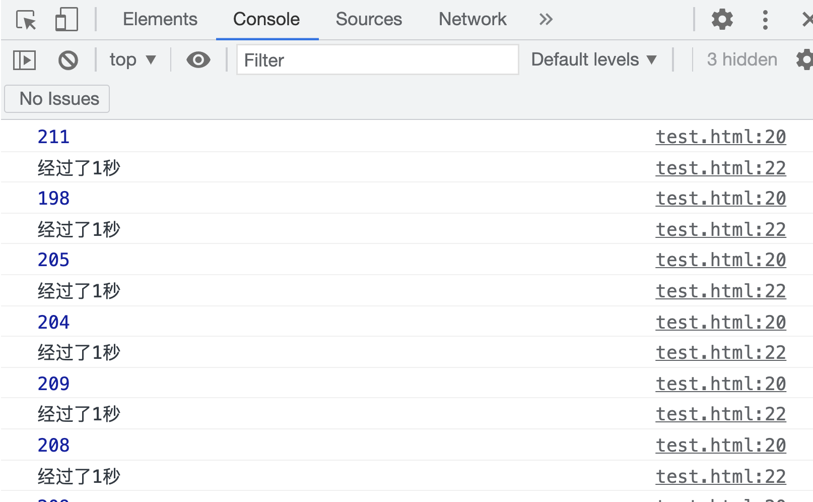

根据运行结果得知，setTimeout(fn,0)的执行频率是每秒执行200次左右，所以他的间隔是5毫秒左右。

由于这两个异步的宏任务出发时机和执行频率不同，会导致三个宏任务的触发结果不同，如果我们打开网页时，恰好赶上5毫秒内执行了网页的重绘事件，requestAnimationFrame在工作线程中就会到达触发时机优先进入任务队列，所以此时会输出：UI update->timer1->timer2。

而当打开网页时上一次的重绘刚结束，下一次重绘的触发是16毫秒后，此时setTimeout注册的两个任务在工作线程中就会优先到达触发时机，这时输出的结果是:timer1->timer2->UI update。

所以此案例的运行结果如下2图所示：

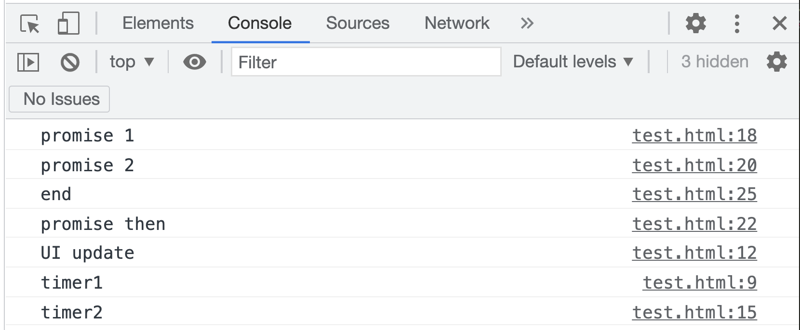

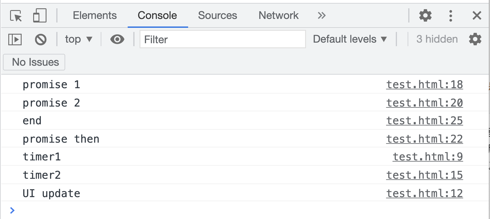


**代码输出顺序问题2**

```javascript
document.addEventListener('click', function(){
    Promise.resolve().then(()=> console.log(1));
    console.log(2);
})
 
document.addEventListener('click', function(){
    Promise.resolve().then(()=> console.log(3));
    console.log(4);
})
```

解析：仍然是猜对了告诉你哈～，先运行一下试试吧。

这个案例代码简单易懂，但是很容易引起错误答案的出现。由于该事件是直接绑定在document上的，所以点击网页就会触发该事件，在代码运行时相当于按照顺序注册了两个点击事件，两个点击事件会被放在工作线程中实时监听触发时机，当元素被点击时，两个事件会按照先后的注册顺序放入异步任务队列中进行执行，所以事件1和事件2会按照代码编写的顺序触发。

这里就会导致有人分析出错误答案：2，4，1，3。

为什么不是2，4，1，3呢？由于事件执行时并不会阻断JS默认代码的运行，所以事件任务也是异步任务，并且是宏任务，所以两个事件相当于按顺序执行的两个宏任务。

这样就会分出两个运行环境，第一个事件执行时，console.log(2);是第一个宏任务中的同步代码，所以他会立即执行，而Promise.resolve().then(()=> console.log(1));属于微任务，他会在下一个宏任务触发前执行，所以这里输出2后会直接输出1.

而下一个事件的内容是相同道理，所以输出顺序为：2，1，4，3。

## 总结

关于事件循环模型今天就介绍到这里，在NodeJS中的事件循环模型和浏览器中是不一样的，本文是以浏览器的事件循环模型为基础进行介绍，事件循环系统在JavaScript异步编程中占据的比重是非常大的，在工作中可使用场景也是众多的，掌握了事件循环模型就相当于，异步编程的能力上升了一个新的高度。

