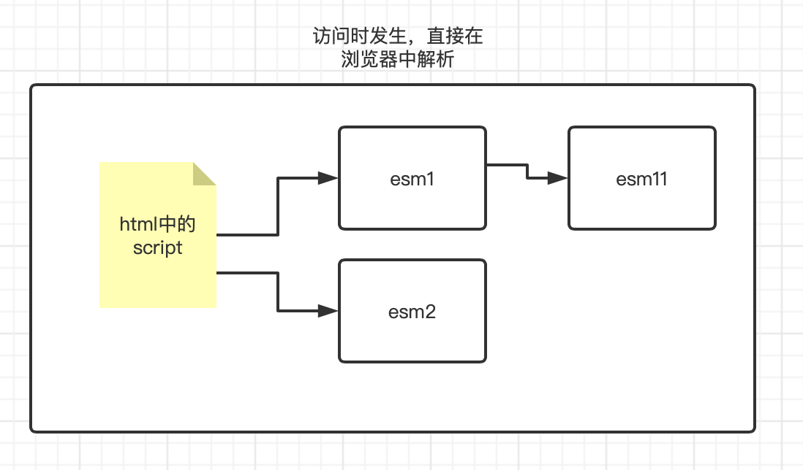
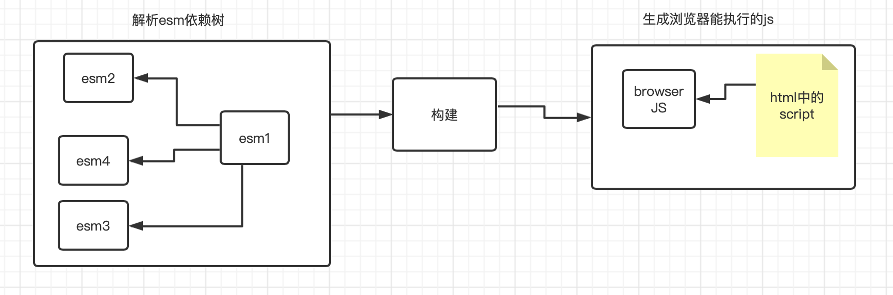
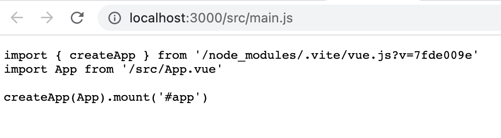
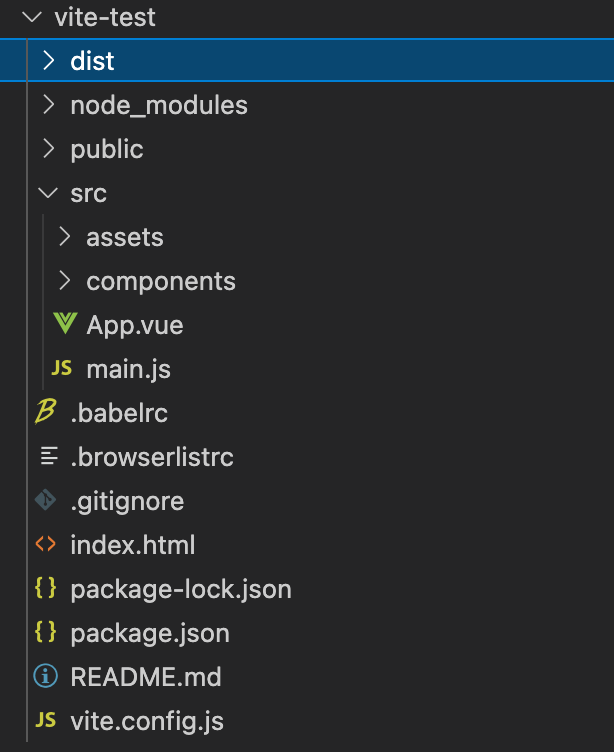

## 1.企业级rollup构建工具应用介绍

### 1.1 什么是rollup

#### 概述

Rollup 是一个 JavaScript 模块打包器，可以将小块代码编译成大块复杂的代码，例如 library 或应用程序。Rollup 对代码模块使用新的标准化格式，这些标准都包含在 JavaScript 的 ES6 版本中，而不是以前的特殊解决方案，如 CommonJS 和 AMD。ES6 模块可以使你自由、无缝地使用你最喜爱的 library 中那些最有用独立函数，而你的项目不必携带其他未使用的代码。ES6 模块最终还是要由浏览器原生实现，但当前 Rollup 可以使你提前体验。

#### 为什么(Why)

如果你将项目拆分成小的单独文件中，这样开发软件通常会很简单，因为这通常会消除无法预知的相互影响(remove unexpected interaction)，以及显著降低了所要解决的问题的复杂度(complexity of the problem)，并且可以在项目最初时，就简洁地编写小的项目（不一定是标准答案。不幸的是，JavaScript 以往并没有将此功能作为语言的核心功能。

#### Tree-shaking

除了使用 ES6 模块之外，Rollup 还静态分析代码中的 import，并将排除任何未实际使用的代码。这允许您架构于现有工具和模块之上，而不会增加额外的依赖或使项目的大小膨胀。

例如，在使用 CommonJS 时，*必须导入(import)完整的工具(tool)或库(library)对象*。

```
// 使用 CommonJS 导入(import)完整的 utils 对象
var utils = require( 'utils' );
var query = 'Rollup';
// 使用 utils 对象的 ajax 方法
utils.ajax( 'https://api.example.com?search=' + query ).then( handleResponse );
```

但是在使用 ES6 模块时，无需导入整个 `utils` 对象，我们可以只导入(import)我们所需的 `ajax` 函数：

```
// 使用 ES6 import 语句导入(import) ajax 函数
import { ajax } from 'utils';
var query = 'Rollup';
// 调用 ajax 函数
ajax( 'https://api.example.com?search=' + query ).then( handleResponse );
```

因为 Rollup 只引入最基本最精简代码，所以可以生成轻量、快速，以及低复杂度的 library 和应用程序。因为这种基于显式的 `import` 和 `export` 语句的方式，它远比「在编译后的输出代码中，简单地运行自动 minifier 检测未使用的变量」更有效。

### 1.2 与webpack的区别

rollup与webpack都是基于JavaScript依赖系统的一个打包构建工具，他们的共同点很多，都是通过解析JavaScript的依赖树将代码输出为指定版本的JavaScript，供浏览器或者node环境执行。不同的是rollup相对webpack更轻量，其构建的代码并不会像webpack一样被注入大量的webpack内部结构，而是尽量的精简保持代码原有的状态。它同样支持tree-shaking、依赖解析等能力，不过rollup的生态并没有webpack工具强大，目前它仍然是一个小众的打包构建工具，他也可以与webpack或gulp整合形成混合打包构建的能力，在vue3的推出的时间节点，下一代的打包构建工具vite横空出世，由于vite是基于rollup实现的打包构建能力，所以rollup才被更多的人认识和学习。

### 1.3 rollup的快速上手

由于rollup与webpack有着相同的使用场景所以rollup的学习路径与webpack非常类型，不同的是rollup并没有官方的devServer工具，而且vite在devServer环境中也并不是按照webpack的依赖解析模式进行开发环境构建的，所以本课程我们以prod环境介绍rollup，在vite环节中进一步介绍devServer与webpack体系的区别。

#### rollup的helloWorld

1. 在开发工具中创建名为rollup-test的文件夹

2. 在控制台中打开文件夹并输入`npm init -y`初始化项目

   ```sh
   zhangyunpeng@zhangyunpengdeMacBook-Pro rollup-test % npm init -y
   Wrote to /Users/zhangyunpeng/Downloads/react-study/rollup-test/package.json:
   
   {
     "name": "rollup-test",
     "version": "1.0.0",
     "description": "",
     "main": "index.js",
     "scripts": {
       "test": "echo \"Error: no test specified\" && exit 1"
     },
     "keywords": [],
     "author": "",
     "license": "ISC"
   }
   ```

3. 在命令行工具中安装rollup核心库

   ```sh
   zhangyunpeng@zhangyunpengdeMacBook-Pro rollup-test % npm i rollup -D
   
   added 2 packages in 920ms
   ```

4. rollup的核心包既包括核心代码也包括cli指令工具集，所以他不需要像webpack或gulp一样安装webpack和webpack-cli

5. 在项目的根目录下创建rollup.config.js文件，在文件中初始化代码如下：

   ```js
   export default {
     //入口文件路径相当于webpack的entry
     input:'src/index.js',
     //出口文件配置，相当于webpack的output
     output:{
       file:'dist/index.js'
     }
   }
   ```

6. 在项目的根目录创建src文件夹，在文件夹中创建index.js文件，内容如下：

   ```js
   const str = 'hello rollup'
   console.log(str)
   ```

7. 最后在package.json中追加构建命令

   ```json
   {
     "scripts": {
       //通过rollup.config.js文件构建
       "build":"rollup --config rollup.config.js",
       "test": "echo \"Error: no test specified\" && exit 1"
     }
   }
   ```

8. 在命令行工具中执行`npm run build`

   ```sh
   zhangyunpeng@zhangyunpengdeMacBook-Pro rollup-test % npm run build
   
   > rollup-test@1.0.0 build
   > rollup --config rollup.config.js
   
   
   src/index.js → dist/index.js...
   created dist/index.js in 10ms
   ```

9. 此时在项目中会出现dist文件夹，文件夹内部会出现index.js文件，内容如下

   ```js
   const str = 'hello rollup';
   console.log(str);
   ```

10. 这就是最基本的构建流程

### 1.4关于output和input的配置

rollup与webpack相同的地方在于input与entry几乎一样，若想要配置多入口时input可以配置为对象，此时output就需要改造，具体代码如下

```js
export default {
  input:{
    index:'src/index.js'
  },
  output:{
    //当input配置为多入口时不可以使用file属性，改造成dir代表生成目录
    dir:'dist',
    sourcemap:true,
    //entryFileNames代表为每个入口文件设置名称
    entryFileNames:'[name].js',
  }
}
```

rollup与webpack最大的区别在于output可以配置相同entry的多种代码构建方案，在配置前首先在src目录中创建一个model.js文件并编写代码如下：

```javascript
export const user = {
  name:'张三',
  age:18
}
export const menu = [
  {id:'1',name:'系统菜单',level:1},
  {id:'2',name:'帮助文档',level:2}

]
export default {
  version:'1.0.0',
  getVersion:() => {
    return '1.0.0'
  },
  name:'model'
}
```

继续改造index.js文件：

```javascript
import { menu } from './model'
const str = 'hello rollup'
console.log(str)
menu.forEach(item => {
  console.log(item)
})
```

在进一步展示output的新能力前，可以运行构建命令

```sh
npm run build
```

会发现dist中生成的index.js内部代码如下：

```javascript
const menu = [
  {id:'1',name:'系统菜单',level:1},
  {id:'2',name:'帮助文档',level:2}

];

const str = 'hello rollup';
console.log(str);
menu.forEach(item => {
  console.log(item);
});
//# sourceMappingURL=index.js.map
```

通过观察生成代码便可以直观的发现，在rollup构建的过程中treeshaking就会正常生效，只导入需要的代码，其他代码会自动过滤掉。

接下来把output改造为如下

```js
export default {
  input:{
    index:'src/index.js'
  },
  output:[
    {
      dir:'dist',
      sourcemap:true,
      entryFileNames:'[name].esm.js',
      format:'esm'//代表使用ecma模块语法
    },
    {
      dir:'dist',
      sourcemap:true,
      entryFileNames:'[name].cjs.js',
      format:'cjs'//代码使用commonJS模块语法
    },
    {
      dir:'dist',
      sourcemap:true,
      entryFileNames:'[name].umd.js',
      format:'umd'//代表使用umd模块系统导出
    }
  ]
}
```

观察代码后会发现output可以定义为数组，通过一次构建便可以为input中的入口文件创建出不同模块系统的构建输出，通过format可以设置构建之后输出的模块语法，这里最常用的就是umd\esm\cjs

构建后生成的文件为

```js
//cjs的模块系统生成代码
'use strict';

const menu = [
  {id:'1',name:'系统菜单',level:1},
  {id:'2',name:'帮助文档',level:2}

];


const str = 'hello rollup';
console.log(str);
menu.forEach(item => {
  console.log(item);
});
//# sourceMappingURL=index.cjs.js.map

//esm模块系统生成的代码
const menu = [
  {id:'1',name:'系统菜单',level:1},
  {id:'2',name:'帮助文档',level:2}

];


const str = 'hello rollup';
console.log(str);
menu.forEach(item => {
  console.log(item);
});
//# sourceMappingURL=index.esm.js.map

//umd模块生成的代码
(function (factory) {
  typeof define === 'function' && define.amd ? define(factory) :
  factory();
})((function () { 'use strict';

  const menu = [
    {id:'1',name:'系统菜单',level:1},
    {id:'2',name:'帮助文档',level:2}

  ];
                 
  const str = 'hello rollup';
  console.log(str);
  menu.forEach(item => {
    console.log(item);
  });

}));
//# sourceMappingURL=index.umd.js.map
```

### 1.5 关于CommonJS的解析

刚才的案例中我们一直在使用ES6的模块系统进行对象导出，所以使用import {}可以结合tree-shaking进行按需加载，若将代码改造成require会变成什么后果呢？

```js
// import { menu } from './model'
const menu = require('./model')
const str = 'hello rollup'
console.log(str)
menu.forEach(item => {
  console.log(item)
})
```

构建后会发现无论format使用任何结果，生成的代码中的require部分都不会发生任何变化如下(以umd模式为例子)

```js
(function (factory) {
  typeof define === 'function' && define.amd ? define(factory) :
  factory();
})((function () { 'use strict';

  // import { menu } from './model'
  const menu = require('./model');
  const str = 'hello rollup';
  console.log(str);
  menu.forEach(item => {
    console.log(item);
  });

}));
//# sourceMappingURL=index.umd.js.map

```

通过案例会发现，我们使用的rollup默认支持的构建语法是ESM模块语法，他并不能识别并处理CommonJS的模块系统，他没有转换require也没有将引用的model文件生成到dist中，所以这里也是rollup和webpack的一个本质区别（webpack默认是基于CommonJS进行构建的工具）。想要让rollup支持CommonJS模块系统需要安装如下插件

```sh
npm i @rollup/plugin-node-resolve @rollup/plugin-commonjs -D
```

安装后将配置文件改造为如下效果

```js
import resolve from '@rollup/plugin-node-resolve'
import commonjs from '@rollup/plugin-commonjs'
export default {
  input:{
    index:'src/index.js'
  },
  output:[
    {
      dir:'dist',
      sourcemap:true,
      entryFileNames:'[name].esm.js',
      format:'esm'
    },
    {
      dir:'dist',
      sourcemap:true,
      entryFileNames:'[name].cjs.js',
      format:'cjs'
    },
    {
      dir:'dist',
      sourcemap:true,
      entryFileNames:'[name].umd.js',
      format:'umd',
      name:'index'//在构建umd模块时需要对模块命名，这里随便取一个
    }
  ],
  plugins:[
    resolve(),
    commonjs(),
  ]
}
```

改造后直接执行构建命令`npm run build`，会发现此时生成的构建文件中的require会被直接解析为他引用的目标文件内容（仍然以生成的umd包为例子），如下：

```js
(function (global, factory) {
	typeof exports === 'object' && typeof module !== 'undefined' ? module.exports = factory() :
	typeof define === 'function' && define.amd ? define(factory) :
	(global = typeof globalThis !== 'undefined' ? globalThis : global || self, global.index = factory());
})(this, (function () { 'use strict';

	function getAugmentedNamespace(n) {
	  var f = n.default;
		if (typeof f == "function") {
			var a = function () {
				return f.apply(this, arguments);
			};
			a.prototype = f.prototype;
	  } else a = {};
	  Object.defineProperty(a, '__esModule', {value: true});
		Object.keys(n).forEach(function (k) {
			var d = Object.getOwnPropertyDescriptor(n, k);
			Object.defineProperty(a, k, d.get ? d : {
				enumerable: true,
				get: function () {
					return n[k];
				}
			});
		});
		return a;
	}

	var src = {};

	const user = {
	  name:'张三',
	  age:18
	};
	const menu$1 = [
	  {id:'1',name:'系统菜单',level:1},
	  {id:'2',name:'帮助文档',level:2}

	];
	var model = {
	  version:'1.0.0',
	  getVersion:() => {
	    return '1.0.0'
	  },
	  name:'model'
	};

	var model$1 = /*#__PURE__*/Object.freeze({
		__proto__: null,
		user: user,
		menu: menu$1,
		'default': model
	});

	var require$$0 = /*@__PURE__*/getAugmentedNamespace(model$1);

	// import { menu } from './model'
	const menu = require$$0;
	const str = 'hello rollup';
	console.log(str);
	menu.forEach(item => {
	  console.log(item);
	});

	return src;

}));
//# sourceMappingURL=index.umd.js.map
```

### 1.6 集成babel

基本上手没问题后，下面的任务是兼容性问题，由于默认情况下rollup的构建目标为es6之后的语法标准，所以为了保证兼容性，开发者仍然希望rollup在构建的过程中对代码的兼容性进行完整的处理，所以这里需要学习如何通过rollup+babel构建项目：

1. 在项目中安装如下依赖：

   ```sh
   npm i @rollup/plugin-babel @babel/core @babel/preset-env -D
   ```

   ```sh
   npm i core-js -s
   ```

   

2. rollup提供了专门集成babel的插件系统，这里我们只需要学习babel的配置方式就可以，因为他默认提供了调用babel外置配置文件的功能。

3. 在项目中创建名为.babelrc的文件并输入如下代码

   ```json
   {
     "presets": [
       [
         //加载preset-env
         "@babel/preset-env",
         {
           //开启按需polyfill
           "useBuiltIns": "usage",
           //使用core-js3.x版本进行确实对象的补全
           "corejs":3
         }
       ]
     ]
   }
   ```

4. 在根目录下创建.browserslistrc文件并配置一个比较大的兼容范围

   ```sh
   > 0.1%
   last 10 versions
   ```

5. 在rollup.config.js文件中加入babel插件

   ```js
   import resolve from '@rollup/plugin-node-resolve'
   import commonjs from '@rollup/plugin-commonjs'
   import babel from '@rollup/plugin-babel'
   export default {
     input:{
       index:'src/index.js'
     },
     output:[
       {
         dir:'dist',
         sourcemap:true,
         entryFileNames:'[name].esm.js',
         format:'esm'
       },
       {
         dir:'dist',
         sourcemap:true,
         entryFileNames:'[name].cjs.js',
         format:'cjs'
       },
       {
         dir:'dist',
         sourcemap:true,
         entryFileNames:'[name].umd.js',
         format:'umd',
         name:'index'//在构建umd模块时需要对模块命名，这里随便取一个
       }
     ],
     plugins:[
       resolve(),
       commonjs(),
       babel()
     ]
   }
   ```

6. 改造src下的index.js文件

   ```js
   import { menu } from './model'
   // const menu = require('./model')
   const str = 'hello rollup'
   console.log(str)
   menu.forEach(item => {
     console.log(item)
   })
   Promise.resolve(menu).then(res => {
     console.log(res)
   })
   ```

7. 运行构建命令`npm run build`，随后会发现实际上生成的代码中所有的ES6以后的标准语法统一被自动转化为ES5的兼容写法，这样便可以兼容较早的Node已经Browser环境了。

### 1.7 支持网页调试

rollup本身并不支持devServer，不过可以为入口文件追加html模版页面用于生成的js调试，需要依赖

```sh
npm i @rollup/plugin-html -D
```

对配置文件增加配置：

```js
import resolve from '@rollup/plugin-node-resolve'
import commonjs from '@rollup/plugin-commonjs'
import babel from '@rollup/plugin-babel'
import html from '@rollup/plugin-html'
export default {
  input:{
    index:'src/index.js'
  },
  output:[
    {
      dir:'dist',
      sourcemap:true,
      entryFileNames:'[name].esm.js',
      format:'esm'
    },
    {
      dir:'dist',
      sourcemap:true,
      entryFileNames:'[name].cjs.js',
      format:'cjs'
    },
    {
      dir:'dist',
      sourcemap:true,
      entryFileNames:'[name].umd.js',
      format:'umd',
      name:'index'//在构建umd模块时需要对模块命名，这里随便取一个
    }
  ],
  plugins:[
    resolve(),
    commonjs(),
    html(),
    babel()
  ]
}
```

直接构建后会发现，项目中就会生成对应的html文件，不过该插件与webpack的html-webpack-plugin完全不同，我们没有定义template模版，他默认生成的模版为如下效果

```html

<!doctype html>
<html lang="en">
  <head>
    <meta charset="utf-8">
    <title>Rollup Bundle</title>
    
  </head>
  <body>
    <script src="index.umd.js" type="module"></script>
  </body>
</html>
```

这种方式对于html页面的编辑开发特别的不友好，所以可以通过查阅官方文档查看该插件的介绍，查阅后会发现他并没有读取template的能力，template属性的介绍如下：

`template`

Type: `Function`
Default: `internal function` Returns: `String`

Specifies a function that provides the rendered source for the HTML output. The function should be in the form of:

```
const template = ({ attributes, bundle, files, publicPath, title }) => { ... }
```

- `attributes`: Corresponds to the `attributes` option passed to the plugin
- `bundle`: An `Object` containing key-value pairs of `AssetInfo` or `ChunkInfo`
- `files`: An `Array` of `AssetInfo` or `ChunkInfo` containing any entry (`isEntry: true`) files, and any asset (`isAsset: true`) files in the bundle that will be emitted
- `publicPath`: Corresponds to the `publicPath` option passed to the plugin
- `title`: Corresponds to the `title` option passed to the plugin

By default this is handled internally and produces HTML in the following format:

```
<!DOCTYPE html>
<html ${attributes}>
  <head>
    ${metas}
    <title>${title}</title>
    ${links}
  </head>
  <body>
    ${scripts}
  </body>
</html>
```

Where `${links}` represents all `<link ..` tags for CSS and `${scripts}` represents all `<script...` tags for JavaScript files.

根据介绍我们会发现想要实现html-webpack-plugin的能力我们需要额外编程进行实现：

+ 在根目录下创建public文件夹并创建index.html文件

  ```html
  <!DOCTYPE html>
  <html lang="en">
  <head>
    <meta charset="UTF-8">
    <meta http-equiv="X-UA-Compatible" content="IE=edge">
    <meta name="viewport" content="width=device-width, initial-scale=1.0">
    <title>Document</title>
  </head>
  <body>
    你好啊
  </body>
  </html>
  ```

+ 由于解析html文件需要ast支持，所以我们引入gogocode

  ```sh
  npm i gogocode -D
  ```

+ 将配置文件改造成如下样子

  ```js
  import resolve from '@rollup/plugin-node-resolve'
  import commonjs from '@rollup/plugin-commonjs'
  import babel from '@rollup/plugin-babel'
  import html from '@rollup/plugin-html'
  import $ from 'gogocode'
  import fs from 'fs'
  export default {
    input:{
      index:'src/index.js'
    },
    output:[
      {
        dir:'dist',
        sourcemap:true,
        entryFileNames:'[name].esm.js',
        format:'esm'
      },
      {
        dir:'dist',
        sourcemap:true,
        entryFileNames:'[name].cjs.js',
        format:'cjs'
      },
      {
        dir:'dist',
        sourcemap:true,
        entryFileNames:'[name].umd.js',
        format:'umd',
        name:'index'//在构建umd模块时需要对模块命名，这里随便取一个
      }
    ],
    plugins:[
      resolve(),
      commonjs(),
      html({
        //设置生成的文件名
        fileName:'index.html',
        template(options){
          //读取template文件
          let template = fs.readFileSync('./public/index.html').toString()
          // console.log(str)
          //通过ast将内部代码的body后追加umd模式的依赖
          let ast = $(template,{parseOptions:{language:'html'}})
            .replace(
              `<body>$_$</body>`,
              `<body>$_$<script src="index.umd.js"></script></body>`
            ).replace(
              `<title></title>`,
              `<title>${options.title}</title>`
            )
          return ast.generate()
        }
      }),
      babel()
    ]
  }
  ```

+ 按照这种方式生成的index.html代码如下

  ```html
  <!doctype html>
  <html lang="en">
  <head>
    <meta charset="UTF-8"/>
    <meta http-equiv="X-UA-Compatible" content="IE=edge"/>
    <meta name="viewport" content="width=device-width, initial-scale=1.0"/>
    <title>Rollup Bundle</title>
  </head>
  <body>
    你好啊
  <script src="index.umd.js"></script></body>
  </html>
  ```

+ 我们发现这时我们便可以自由的定义网页内容，并且可以自定义script标签的生成规则

### 总结

关于rollup就总结到这里，通过对rollup的学习，我们可以很明确的发现他与webpack构建工具不同的地方，实际上rollup在构建JavaScript方面比webpack有更大的优势，第一点是构建速度明显快于webpack，第二点是其生成的代码量很小，第三点是其配置方式其实非常简单。不过在应用开发层面讲，如果开发一个Web应用webpack要比rollup有更大的优势，因为其天然继承了devServer以及hmr，这使得开发者可以快速的对应用进行调试开发，同时webpack自身庞大且成熟的生态体系也让他更加适合应用开发，所以最终总结的就是rollup更加适合插件开发，而webpack更加适合应用开发。

## 2.下一代打包构建工具vite

### 2.1 认识Vite

#### 总览

Vite（法语意为 "快速的"，发音 `/vit/`，发音同 "veet"）是一种新型前端构建工具，能够显著提升前端开发体验。它主要由两部分组成：

- 一个开发服务器，它基于 原生 ES 模块提供了 丰富的内建功能，如速度快到惊人的模块热更新（HMR）。
- 一套构建指令，它使用 Rollup打包你的代码，并且它是预配置的，可输出用于生产环境的高度优化过的静态资源。

Vite 意在提供开箱即用的配置，同时它的插件 API 和 JavaScript API带来了高度的可扩展性，并有完整的类型支持。

你可以在 为什么选 Vite 中了解更多关于项目的设计初衷。

#### 浏览器支持

- 默认的构建目标浏览器是能在 script 标签上支持原生 ESM 和 原生 ESM 动态导入。传统浏览器可以通过官方插件 @vitejs/plugin-legacy 支持 —— 查看 构建生产版本 章节获取更多细节。

### 2.2 vite的快速上手

vite的初始化非常简单，只需要在命令行工具中输入如下指令

```sh
npm init vite
```

按照提示即可创建项目，这里我们以vue项目为例创建一个基础项目(由于vite初始化时会创建项目名称所以不需要在项目文件夹内部初始化)

```sh
zhangyunpeng@zhangyunpengdeMacBook-Pro react-study % npm init vite      
Need to install the following packages:
  create-vite
Ok to proceed? (y) 
✔ Project name: … vite-test
✔ Select a framework: › vue
✔ Select a variant: › vue

Scaffolding project in /Users/zhangyunpeng/Downloads/react-study/vite-test...

Done. Now run:

  cd vite-test
  npm install
  npm run dev
```

创建完成后查看package.json

```json
{
  "name": "vite-test",
  "private": true,
  "version": "0.0.0",
  "scripts": {
    "dev": "vite",
    "build": "vite build",
    "preview": "vite preview"
  },
  "dependencies": {
    "vue": "^3.2.25"
  },
  "devDependencies": {
    "@vitejs/plugin-vue": "^2.3.1",
    "vite": "^2.9.5"
  }
}
```

通过`npm run dev`便可以启动devServer，通过`npm run build`便可以构建项目。

### 2.3 从现象看本质--vite的真面目

首先打开项目的vite.config.js文件，我们会发现如下代码

```js
import { defineConfig } from 'vite'
import vue from '@vitejs/plugin-vue'

export default defineConfig({
  plugins: [vue()]
})
```

根据这个配置文件的结构我们会发现他与我们使用的webpack或rollup的配置方式非常类似，那么vite也是基于基础脚手架封装而来的，这里通过在node_modules中寻找vite的项目代码可以了解到他的真面目。

所以接下来我们要通过命令行工具进入vite-test项目并输入`npm install`安装项目所需要的依赖。

在vite的项目目录下找到他的package.json可以很轻易的看到组成他的基础依赖：

```json
{
  "name": "vite",
  "version": "2.9.5",
  "license": "MIT",
  "author": "Evan You",
  "description": "Native-ESM powered web dev build tool",
  "bin": {
    "vite": "bin/vite.js"
  },
  "main": "dist/node/index.js",
  "types": "dist/node/index.d.ts",
  "files": [
    "bin",
    "dist",
    "client.d.ts",
    "src/client",
    "types"
  ],
  "engines": {
    "node": ">=12.2.0"
  },
  "repository": {
    "type": "git",
    "url": "git+https://github.com/vitejs/vite.git",
    "directory": "packages/vite"
  },
  "bugs": {
    "url": "https://github.com/vitejs/vite/issues"
  },
  "homepage": "https://github.com/vitejs/vite/tree/main/#readme",
  "scripts": {
    "dev": "rimraf dist && rollup -c -w",
    "build": "rimraf dist && npm run lint && run-s build-bundle build-types",
    "build-bundle": "rollup -c",
    "build-types": "run-s build-temp-types patch-types roll-types",
    "build-temp-types": "tsc --emitDeclarationOnly --outDir temp/node -p src/node",
    "ci-build": "rimraf dist && run-s build-bundle build-types",
    "patch-types": "ts-node scripts/patchTypes.ts",
    "roll-types": "api-extractor run && rimraf temp",
    "lint": "eslint --ext .ts src/**",
    "format": "prettier --write --parser typescript \"src/**/*.ts\"",
    "prepublishOnly": "npm run build"
  },
  "//": "READ CONTRIBUTING.md to understand what to put under deps vs. devDeps!",
  "dependencies": {
    "esbuild": "^0.14.27",
    "postcss": "^8.4.12",
    "resolve": "^1.22.0",
    "rollup": "^2.59.0"
  },
  "optionalDependencies": {
    "fsevents": "~2.3.2"
  },
  "devDependencies": {
    "@ampproject/remapping": "^2.1.2",
    "@babel/parser": "^7.17.9",
    "@babel/types": "^7.17.0",
    "@jridgewell/trace-mapping": "^0.3.4",
    "@rollup/plugin-alias": "^3.1.9",
    "@rollup/plugin-commonjs": "^21.0.3",
    "@rollup/plugin-dynamic-import-vars": "^1.4.2",
    "@rollup/plugin-json": "^4.1.0",
    "@rollup/plugin-node-resolve": "13.1.3",
    "@rollup/plugin-typescript": "^8.3.1",
    "@rollup/pluginutils": "^4.2.0",
    "@types/convert-source-map": "^1.5.2",
    "@types/cross-spawn": "^6.0.2",
    "@types/debug": "^4.1.7",
    "@types/estree": "^0.0.51",
    "@types/etag": "^1.8.1",
    "@types/less": "^3.0.3",
    "@types/micromatch": "^4.0.2",
    "@types/mime": "^2.0.3",
    "@types/node": "^16.11.26",
    "@types/resolve": "^1.20.1",
    "@types/sass": "~1.43.1",
    "@types/stylus": "^0.48.37",
    "@types/ws": "^8.5.3",
    "@vue/compiler-dom": "^3.2.31",
    "acorn": "^8.7.0",
    "cac": "6.7.9",
    "chokidar": "^3.5.3",
    "connect": "^3.7.0",
    "connect-history-api-fallback": "^1.6.0",
    "convert-source-map": "^1.8.0",
    "cors": "^2.8.5",
    "cross-spawn": "^7.0.3",
    "debug": "^4.3.4",
    "dotenv": "^14.3.2",
    "dotenv-expand": "^5.1.0",
    "es-module-lexer": "^0.10.5",
    "estree-walker": "^2.0.2",
    "etag": "^1.8.1",
    "fast-glob": "^3.2.11",
    "http-proxy": "^1.18.1",
    "json5": "^2.2.1",
    "launch-editor-middleware": "^2.3.0",
    "magic-string": "^0.26.1",
    "micromatch": "^4.0.5",
    "mrmime": "^1.0.0",
    "node-forge": "^1.3.1",
    "okie": "^1.0.1",
    "open": "^8.4.0",
    "periscopic": "^2.0.3",
    "picocolors": "^1.0.0",
    "postcss-import": "^14.1.0",
    "postcss-load-config": "^3.1.4",
    "postcss-modules": "^4.3.1",
    "resolve.exports": "^1.1.0",
    "rollup-plugin-license": "^2.6.1",
    "sirv": "^2.0.2",
    "source-map-js": "^1.0.2",
    "source-map-support": "^0.5.21",
    "strip-ansi": "^6.0.1",
    "terser": "^5.12.1",
    "tsconfck": "^1.2.2",
    "tslib": "^2.3.1",
    "types": "link:./types",
    "ws": "^8.5.0"
  },
  "peerDependencies": {
    "less": "*",
    "sass": "*",
    "stylus": "*"
  },
  "peerDependenciesMeta": {
    "sass": {
      "optional": true
    },
    "stylus": {
      "optional": true
    },
    "less": {
      "optional": true
    }
  }
}
```

通过依赖包的列表阅读，我们可以发现，vite脚手架的本质是通过rollup+esbuild混合形成的一个全新的脚手架，所以为什么vite号称是下一代的打包构建工具，主要体现在他从开发环境到生产环境的构建速度都能比webpack提升很多倍，原因就在于rollup和esbuild两个基础构建工具上。

### 2.4 vite为什么启动服务这么快？

使用`npm run dev`启动vite项目时会发现vite项目无论运行多大规模的前端项目，总能很快的打开devServer，并且非常快速的展示页面，在项目文件变更时他还能更快速的实现hmr。这些方面的“快”是很明显优于webpack的，为什么这么说呢？让我们查看一下vite的index.html文件。

```html
<!DOCTYPE html>
<html lang="en">
  <head>
    <meta charset="UTF-8" />
    <link rel="icon" href="/favicon.ico" />
    <meta name="viewport" content="width=device-width, initial-scale=1.0" />
    <title>Vite App</title>
  </head>
  <body>
    <div id="app"></div>
    <!-- type="module" 带来的性能优势-->
    <script type="module" src="/src/main.js"></script>
  </body>
</html>
```

由于vite的脚手架特性，可以在开发环境，通过type="module"的模式加载script代码，这样可以天然加载ESM模块在浏览器环境中。也就是说使用这个模式根本不需要通过任何的语法转化便可以实现ESM模块系统的依赖加载和代码运行。而webpack在运行项目时每次都要先通过模块树的关系图（参考webpack官网的示意图）来解析JavaScript关系，再通过汇总代码将输出的代码引入到html网页中。

**浏览器type="module"的加载方式**



**webpack的加载方式**



通过两种加载方式就可以明白为什么vite的devServer如此的快，主要原因还是加载模式上，这也得力于浏览器对ESM模块的支持，所以这种加载方式必须在支持type="module"的浏览器中运行。

### 2.5 仅仅靠type="module"够用吗？

上面介绍了type="module"的作用，不过浏览器定义的type="module"仅支持通过文件系统导入依赖，他并不支持从node_modules中发现并导入依赖的功能，所以若细心研究过type="module"的运行模式后再进入main.js时便会发现问题：

```js
import { createApp } from 'vue'
import App from './App.vue'

createApp(App).mount('#app')
```

该文件的加载模块都是node_module中的模块，并不是直接的文件系统，所以仅靠浏览器的能力并不能实现与项目的依赖包整合。那么vite是如何处理依赖加载的呢？

这时需要我们启动项目`npm run dev`，并访问下图地址



会发现实际运行时所有的访问地址都会被转化成文件系统，这样才能保证vite项目默认加载的都是ESM模块。

### 2.6 vite脚手架的常用配置

#### 路径解析和后缀解析

```js
import { defineConfig } from 'vite'
import vue from '@vitejs/plugin-vue'
import path from 'path'
export default defineConfig({
  plugins: [vue()],
  base:'',//配置publicPath
	resolve:{
		alias:{//配置路径解析
			'~':path.resolve(__dirname,'src')
		},
    //配置后缀识别
		extensions:['.vue','.js','.scss','.css','.json']
	}
})
```

将配置文件改造成如下效果后，项目中便可以实现webpack中的路径解析和后缀解析功能。

#### 低版本浏览器的兼容性处理

vite的兼容性处理依然需要通过babel解决，不过需要使用

```sh
npn i @vitejs/plugin-legacy -D
```

项目依然需要安装

```sh
npm i @babel/core @babel/preset-env -D
```

以及

```s
npm i core-js -s
```

最终版本的配置文件需为如下效果(同时在rollup中创建的.babelrc和.browserslistrc文件都需要创建)

```javascript
import { defineConfig } from 'vite'
import vue from '@vitejs/plugin-vue'
import path from 'path'
import legacy from '@vitejs/plugin-legacy'
export default defineConfig({
  plugins: [vue(),legacy({})],
  base:'',//配置publicPath
	resolve:{
		alias:{//配置路径解析
			'~':path.resolve(__dirname,'src')
		},
    //配置后缀识别
		extensions:['.vue','.js','.scss','.css','.json']
	}
})

```

以这种方式创建的项目结构如下



设置后构建时会出现如下构建日志

```sh
zhangyunpeng@zhangyunpengdeMacBook-Pro vite-test % npm run build

> hello-vite@0.0.0 build
> vite build

vite v2.8.0 building for production...
✓ 14 modules transformed.
dist/assets/index-legacy.a0a94203.js       3.32 KiB / gzip: 1.60 KiB
dist/assets/vendor-legacy.9da18b3f.js      57.74 KiB / gzip: 20.71 KiB
dist/assets/polyfills-legacy.4bb8184b.js   66.84 KiB / gzip: 27.57 KiB
dist/assets/logo.03d6d6da.png    6.69 KiB
dist/index.html                  1.73 KiB
dist/assets/index.40137589.js    1.95 KiB / gzip: 1.04 KiB
dist/assets/index.c8be967f.css   0.20 KiB / gzip: 0.17 KiB
dist/assets/vendor.7a930abf.js   50.54 KiB / gzip: 20.31 KiB
```

通过日志对比会发现每个文件都会出现带有legacy和不带legacy的两个版本，这个就是vite做的兼容性处理，这个处理主要解决的问题是当浏览器为新版本浏览器时，优先通过type="module"的方式加载依赖，当浏览器不支持type="module"时，仍然需要完成webpack处理的事情，这个事情就是将ESM的依赖构建成浏览器能正常运行的JS代码。

## 3.vite与webpack的区别与优势

### 3.1现实问题

在浏览器支持 ES 模块之前，JavaScript 并没有提供的原生机制让开发者以模块化的方式进行开发。这也正是我们对 “打包” 这个概念熟悉的原因：使用工具抓取、处理并将我们的源码模块串联成可以在浏览器中运行的文件。

时过境迁，我们见证了诸如 webpack、Rollup 和 Parcel等工具的变迁，它们极大地改善了前端开发者的开发体验。

然而，当我们开始构建越来越大型的应用时，需要处理的 JavaScript 代码量也呈指数级增长。包含数千个模块的大型项目相当普遍。我们开始遇到性能瓶颈 —— 使用 JavaScript 开发的工具通常需要很长时间（甚至是几分钟！）才能启动开发服务器，即使使用 HMR，文件修改后的效果也需要几秒钟才能在浏览器中反映出来。如此循环往复，迟钝的反馈会极大地影响开发者的开发效率和幸福感。

Vite 旨在利用生态系统中的新进展解决上述问题：浏览器开始原生支持 ES 模块，且越来越多 JavaScript 工具使用编译型语言编写。

### 3.2缓慢的服务器启动

当冷启动开发服务器时，基于打包器的方式启动必须优先抓取并构建你的整个应用，然后才能提供服务。

Vite 通过在一开始将应用中的模块区分为 **依赖** 和 **源码** 两类，改进了开发服务器启动时间。

- **依赖** 大多为在开发时不会变动的纯 JavaScript。一些较大的依赖（例如有上百个模块的组件库）处理的代价也很高。依赖也通常会存在多种模块化格式（例如 ESM 或者 CommonJS）。

  Vite 将会使用esbuild预构建依赖。Esbuild 使用 Go 编写，并且比以 JavaScript 编写的打包器预构建依赖快 10-100 倍。

- **源码** 通常包含一些并非直接是 JavaScript 的文件，需要转换（例如 JSX，CSS 或者 Vue/Svelte 组件），时常会被编辑。同时，并不是所有的源码都需要同时被加载（例如基于路由拆分的代码模块）。

  Vite 以 原生 ESM方式提供源码。这实际上是让浏览器接管了打包程序的部分工作：Vite 只需要在浏览器请求源码时进行转换并按需提供源码。根据情景动态导入代码，即只在当前屏幕上实际使用时才会被处理。

  

  

### 3.3缓慢的更新

基于打包器启动时，重建整个包的效率很低。原因显而易见：因为这样更新速度会随着应用体积增长而直线下降。

一些打包器的开发服务器将构建内容存入内存，这样它们只需要在文件更改时使模块图的一部分失活，但它也仍需要整个重新构建并重载页面。这样代价很高，并且重新加载页面会消除应用的当前状态，所以打包器支持了动态模块热重载（HMR）：允许一个模块 “热替换” 它自己，而不会影响页面其余部分。这大大改进了开发体验 —— 然而，在实践中我们发现，即使采用了 HMR 模式，其热更新速度也会随着应用规模的增长而显著下降。

在 Vite 中，HMR 是在原生 ESM 上执行的。当编辑一个文件时，Vite 只需要精确地使已编辑的模块与其最近的 HMR 边界之间的链失活（大多数时候只是模块本身），使得无论应用大小如何，HMR 始终能保持快速更新。

Vite 同时利用 HTTP 头来加速整个页面的重新加载（再次让浏览器为我们做更多事情）：源码模块的请求会根据 `304 Not Modified` 进行协商缓存，而依赖模块请求则会通过 `Cache-Control: max-age=31536000,immutable` 进行强缓存，因此一旦被缓存它们将不需要再次请求。

一旦你体验到 Vite 的神速，你是否愿意再忍受像曾经那样使用打包器开发就要打上一个大大的问号了。

### 3.4为什么生产环境仍需打包

尽管原生 ESM 现在得到了广泛支持，但由于嵌套导入会导致额外的网络往返，在生产环境中发布未打包的 ESM 仍然效率低下（即使使用 HTTP/2）。为了在生产环境中获得最佳的加载性能，最好还是将代码进行 tree-shaking、懒加载和 chunk 分割（以获得更好的缓存）。

要确保开发服务器和生产环境构建之间的最优输出和行为一致并不容易。所以 Vite 附带了一套 构建优化的构建命令，开箱即用。

### 3.5为何不用 ESBuild 打包？

虽然 `esbuild` 快得惊人，并且已经是一个在构建库方面比较出色的工具，但一些针对构建 *应用* 的重要功能仍然还在持续开发中 —— 特别是代码分割和 CSS 处理方面。就目前来说，Rollup 在应用打包方面更加成熟和灵活。尽管如此，当未来这些功能稳定后，我们也不排除使用 `esbuild` 作为生产构建器的可能。

## 4.次世代的构建能力提供者——esbuild

### 4.1Esbuild 是什么

ESbuild 是一个类似webpack构建工具。它的构建速度是 webpack 的几十倍。 

### 4.2为什么这么快 ？

1. js是单线程串行，esbuild是新开一个进程，然后多线程并行，充分发挥多核优势
2. go是纯机器码，肯定要比JIT快
3. 不使用 AST，优化了构建流程。（也带来了一些缺点，后面会说）

### 4.3esbuild 的缺点

esbuild 同样不是完美的（如果真有那么完美为什么还没有大面积使用呢？），为了保证 esbuild 的编译效率，esbuild 没有提供 AST 的操作能力。所以一些通过 AST 处理代码的 babel插件没有很好的方法过渡到 esbuild 中。所以，如果你的项目使用了 babel做兼容性处理, 或者一些自定义的 babel插件 。在目前来看是没有很好的迁移方案的。

### 4.4生产环境使用 esbuild 的可行性

先说结论，在生产环境下使用 esbuild 是可行的。像 snowpack , vite 等构建工具都已经是用了 esbuild 作为代码处理工具（不过强如他们，也没有真正敢完全使用esbuild进行构建处理）。如果你一定要使用，可以看看是否符合下面标准

1. 没有使用一些自定义的 babel-plugin
2. 不需要兼容一些低版本浏览器（esbuild 只能将代码转成 es6）

那你就可以大胆使用 esbuild为你的项目提效了