[TOC]

# 组件通信

### props

适用于父子组件通信

#### 父组件->子组件

父组件将需要传递的参数通过`key={xxx}`方式传递至子组件，子组件通过`this.props.key`获取参数.

```js
import React from 'react'
import Son from './son'
class Father extends React.Component {
  constructor(props) {
    super(props)
  }
  state = {
    info: '父组件',
  }
  handleChange = (e) => {
    this.setState({
      info: e.target.value,
    })
  }
  render() {
    return (
      <div>
        <input type='text' value={this.state.info} onChange={this.handleChange} />
        <Son info={this.state.info} />
      </div>
    )
  }
}
export default Father

// 子组件
import React from 'react'
interface IProps {
  info?: string
}
class Son extends React.Component<IProps> {
  constructor(props) {
    super(props)
  }
  render() {
    return (
      <div>
        <p>{this.props.info}</p>
      </div>
    )
  }
}
export default Son
```

#### 子组件->父组件

利用 props callback 通信，父组件传递一个 callback 到子组件，当事件触发时将参数放置到 callback 带回给父组件.

```js
// 父组件
import React from 'react'
import Son from './son'
class Father extends React.Component {
  constructor(props) {
    super(props)
  }
  state = {
    info: '',
  }
  callback = (value) => {
    // 此处的value便是子组件带回
    this.setState({
      info: value,
    })
  }
  render() {
    return (
      <div>
        <p>{this.state.info}</p>
        <Son callback={this.callback} />
      </div>
    )
  }
}
export default Father

// 子组件
import React from 'react'
interface IProps {
  callback: (string) => void
}
class Son extends React.Component<IProps> {
  constructor(props) {
    super(props)
    this.handleChange = this.handleChange.bind(this)
  }
  handleChange = (e) => {
    // 在此处将参数带回
    this.props.callback(e.target.value)
  }
  render() {
    return (
      <div>
        <input type='text' onChange={this.handleChange} />
      </div>
    )
  }
}
export default Son

```

### Context

适用于跨层级组件之间通信

```js
// context.js
import React from 'react'
const { Consumer, Provider } = React.createContext(null) //创建 context 并暴露Consumer和Provide
export { Consumer, Provider }

// 父组件
import React from 'react'
import Son from './son'
import { Provider } from './context'
class Father extends React.Component {
  constructor(props) {
    super(props)
  }
  state = {
    info: 'info from father',
  }
  render() {
    return (
      <Provider value={this.state.info}>
        <div>
          <p>{this.state.info}</p>
          <Son />
        </div>
      </Provider>
    )
  }
}
export default Father

// 子组件
import React from 'react'
import GrandSon from './grandson'
import { Consumer } from './context'
class Son extends React.Component {
  constructor(props) {
    super(props)
  }
  render() {
    return (
      <Consumer>
        {(info) => (
          // 通过Consumer直接获取父组件的值
          <div>
            <p>父组件的值:{info}</p>
            <GrandSon />
          </div>
        )}
      </Consumer>
    )
  }
}
export default Son

// 孙子组件
import React from 'react'
import { Consumer } from './context'
class GrandSon extends React.Component {
  constructor(props) {
    super(props)
  }
  render() {
    return (
      <Consumer>
        {(info) => (
          // 通过 Consumer 中可以直接获取组父组件的值
          <div>
            <p>组父组件的值:{info}</p>
          </div>
        )}
      </Consumer>
    )
  }
}
export default GrandSon

```

特别注意

> 如果需要消费多个 Context,则 React 需要使每一个 consumer 组件的 context 在组件树中成为一个单独的节点。

```js
// provider

  <Context1.Provider value={this.state.info}>
    <Context2.Provider value={this.state.theme}>
      <div>
        <p>{this.state.info}</p>
        <p>{this.state.theme}</p>
        <Son />
      </div>
    </Context2.Provider>
  </Context1.Provider>

 // consumer
 
 <Context1.Consumer>
    {(info: string) => (
      // 通过Consumer直接获取父组件的值
      <Context2.Consumer>
        {(theme: string) => (
          <div>
            <p>父组件info的值:{info}</p>
            <p>父组件theme的值:{theme}</p>
          </div>
        )}
      </Context2.Consumer>
    )}
  </Context1.Consumer>

```

> 很多优秀的 React 组件的核心功能都通过 Context 来实现的，比如 react-redux 和 react-router 等，所以掌握 Context 是必须的。

### OnRef

OnRef 的原理很简单，本质上就是通过 props 将子组件的组件实例（也是我们常说的 this）当作参数，通过回调传到父组件，然后在父组件就可以拿到子组件的实例，拿到了它的实例就可以调用它的方法（为所欲为）了。

```js
// 父组件
import React from 'react'
import Son from './son'
import { Button } from 'antd'

class Father extends React.Component {
  child: any
  constructor(props) {
    super(props)
  }
  sonRef = (ref) => {
    this.child = ref // 在这里拿到子组件的实例
  }
  clearSonInput = () => {
    this.child.clearInput()
  }
  render() {
    return (
      <div>
        <Son onRef={this.sonRef} />
        <Button type='primary' onClick={this.clearSonInput}>
          清空子组件的input
        </Button>
      </div>
    )
  }
}
export default Father

// 子组件
import React from 'react'
import { Button } from 'antd'

interface IProps {
  onRef: any
}

class Son extends React.Component<IProps> {
  constructor(props) {
    super(props)
  }
  componentDidMount() {
    this.props.onRef(this) // 在这将子组件的实例传递给父组件this.props.onRef()方法
  }
  state = {
    info: 'son',
  }
  handleChange = (e) => {
    this.setState({
      info: e.target.value,
    })
  }
  clearInput = () => {
    this.setState({
      info: '',
    })
  }
  render() {
    return (
      <div>
        <div>{this.state.info}</div>
        <input type='text' onChange={this.handleChange} />
      </div>
    )
  }
}
export default Son

```

### ref

`ref`是`react`提供给我们的一个属性,通过它，我们可以访问 `DOM` 节点或者组件.

```js
// 父组件
import React from 'react'
import Son from './son'
import { Button } from 'antd'

class Father extends React.Component {
  son: any
  constructor(props) {
    super(props)
    this.son = React.createRef() // 在此处创建ref
  }
  clearSonInput = () => {
    const { current } = this.son // 注意，这里必须通过 this.son.current拿到子组件的实例
    current.clearInput()
  }
  render() {
    return (
      <div>
        <Son ref={this.son} />
        <Button type='primary' onClick={this.clearSonInput}>
          清空子组件的input
        </Button>
      </div>
    )
  }
}
export default Father

// 子组件
import React from 'react'
import { Button } from 'antd'

class Son extends React.Component {
  constructor(props) {
    super(props)
  }
  state = {
    info: 'son',
  }
  handleChange = (e) => {
    this.setState({
      info: e.target.value,
    })
  }
  clearInput = () => {
    this.setState({
      info: '',
    })
  }
  render() {
    return (
      <div>
        <div>{this.state.info}</div>
        <input type='text' onChange={this.handleChange} />
      </div>
    )
  }
}
export default Son

```

> 值得注意的是，我们必须通过 `this.childRef.current`才能拿到子组件的实例。
>  使用 ref 常见的场景有管理焦点，文本选择或媒体播放、触发强制动画、集成第三方 DOM 库等。

### 第三方工具

#### events(发布订阅)

这种方式适用于没有任何嵌套关系的组件通信。其原理就是使用事件订阅。即是一个发布者，一个或者多个订阅者。 使用之前需要先安装:

```js
yarn add events

// event.ts
import { EventEmitter } from 'events'
export default new EventEmitter()

// 发布者 通过emit事件触发方法，发布订阅消息给订阅者
import React from 'react'
import Son1 from './son1'
import Son2 from './son2'
import { Button } from 'antd'
import emitter from './event'

class Father extends React.Component {
  son: any
  constructor(props) {
    super(props)
  }
  handleClick = () => {
    //emit事件触发方法,通过事件名称找对应的事件处理函数info，将事件处理函数作为参数传入
    emitter.emit('info', '我是来自father的 info')
  }
  render() {
    return (
      <div>
        <Button type='primary' onClick={this.handleClick}>
          点击按钮发布事件
        </Button>
        <Son1 />
        <Son2 />
      </div>
    )
  }
}
export default Father

// 订阅者1
// 通过emitter.addListener(事件名称,函数名)方法，进行事件监听(订阅)。
// 通过emitter.removeListener(事件名称,函数名)方法 ，进行事件销毁(取消订阅)

import React from 'react'
import { Button } from 'antd'
import emitter from './event'

class Son1 extends React.Component {
  constructor(props) {
    super(props)
  }
  state = {
    info: '',
  }
  componentDidMount() {
    // 在组件挂载完成后开始监听
    emitter.addListener('info', (info) => {
      this.setState({
        info: 'Son1收到消息--' + info,
      })
    })
  }

  componentWillUnmount() {
    // 组件销毁前移除事件监听
    emitter.removeListener('info', (info) => {
      this.setState({
        info: 'Son1即将移除事件监听--' + info,
      })
    })
  }
  render() {
    return (
      <div>
        <div>{this.state.info}</div>
      </div>
    )
  }
}
export default Son1

// 订阅者2
import React from 'react'
import { Button } from 'antd'
import emitter from './event'

class Son2 extends React.Component {
  constructor(props) {
    super(props)
  }
  state = {
    info: '',
  }
  componentDidMount() {
    // 在组件挂载完成后开始监听
    emitter.addListener('info', (info) => {
      this.setState({
        info: 'Son2收到消息--' + info,
      })
    })
  }

  componentWillUnmount() {
    // 组件销毁前移除事件监听
    emitter.removeListener('info', (info) => {
      this.setState({
        info: 'Son2即将移除事件监听--' + info,
      })
    })
  }
  render() {
    return (
      <div>
        <div>{this.state.info}</div>
      </div>
    )
  }
}
export default Son2

```

## 路由

随着前端工程的复杂度越来越高，所以路由管理在现在的前端工程中，也是一个值得注意的点，`vue`提供了`vue-router`来管理路由。相似的，`react`则提供了`react-router`来管理路由。

### `react-router`

`react-router` 包含 `3` 个，分别为`react-router`、`react-router-dom` 和 `react-router-native`。

`react-router`提供最基本的路由功能，但是实际使用的时候我们不会直接安装 `react-router`，而是根据应用运行的环境来选择安装 `react-router-dom`和`react-router-native`。因为`react-router-dom` 和 `react-router-native` 都依赖 `react-router`，所以在安装时，`react-router` 也会⾃自动安装。

其中`react-router-dom` 在浏览器器中使⽤，而`react-router-native`在 `react-native` 中使用。

在 react-router 里面，一共有 3 种基础组件，他们分别是

- 路由组件(router components) 比如 `<BrowserRouter>` 和 `<HashRouter>`
- 路由匹配组件(route matchers components) 比如 `<Route>` 和 `<Switch>`
- 导航组件(navigation components) 比如 `<Link>`, `<NavLink>`, 和 `<Redirect>`

### 路由组件

对于 web 项目，react-roruter-dom 提供了 `<BrowserRouter>` 和 `<HashRouter>`两个路由组件。

- `BrowserRouter`：浏览器的路由方式，也就是使用 `HTML5` 提供的 [`history API`](https://link.juejin.cn?target=https%3A%2F%2Fdeveloper.mozilla.org%2Fzh-CN%2Fdocs%2FWeb%2FAPI%2FHistory) ( pushState , replaceState 和 popstate 事件) 来保持 `UI` 和 `url` 的同步。这种方式在`react`开发中是经常使用的路由方式，但是在打包后，打开会发现访问不了页面，所以需要通过配置 `nginx` 解决或者后台配置代理。
- `HashRouter`：在路径前加入#号成为一个哈希值，`Hash` 模式的好处是，再也不会因为我们刷新而找不到我们的对应路径，但是链接上面会有`#/`。在`vue`开发中，经常使用这种方式。

要使用路由组件，我们只需要确保它是在根组件使用，我们应该将`<App />`包裹在路由组件下面：

```
import { BrowserRouter } from 'react-router-dom';
...
<BrowserRouter>
    <App />
</BrowserRouter>
...
复制代码
```

### 匹配组件

有两种路由匹配组件：`<Route>` 和 `<Switch>`

这两个路由匹配组件通常在一起使用，在`<Switch>`里面包裹多个`<Route>`，然后它会逐步去比对每个`<Route>`的`path`属性 和浏览器当前`location`的`pathname`是否一致，如果一致则返回内容，否则返回`null`。

```
<Switch>
  <Route exact path='/' component={Home} />
  {/* 如果当前的URL是`/about`,即 location = { pathname: '/about' } ,那么About组件就应该被渲染，其余的Route就会被忽略 */
  <Route path='/about' component={About} />
  <Route path='/contact' component={Contact} />
</Switch>
复制代码
```

值得注意 ⚠️ 的是： `<Route path={xxx}>` 只会匹配 `URL`的开头，而不是整个 URL。简单的来说就是它不是精确匹配 ，例如`<Route path ='/'>` 和`<Route path ='/about'>` 它永远都只能匹配到`<Route path ='/'>`,他们开头都有'/'。
 在这里我们有两种解决方法：

- 将此`<Route path='/'>`放在`<Switch>`的最后一个位置
- 另一种解决方案是添加'exact' 实现精确匹配： `<Route exact='/'>`

所以`<Switch>`组件只会 `render` 第一个匹配到的路由，像上面我们说的，如果没有设置 `path`，则一定会匹配，我们可以用来实现 404 的功能:

```
<Switch>
  <Route exact path='/' component={Home} />
  <Route path='/about' component={About} />
  <Route path='/contact' component={Contact} />
  {/* 当上面的组件都没有匹配到的时候, 404页面 就会被 render */}
  <Route render={() => <div> 404页面 </div>} />
</Switch>
复制代码
```

### 导航组件

导航组件有`<Link>`, `<NavLink>`, 和 `<Redirect>`。

当我们使用`<Link>`的时候，在 html 页面会被渲染为一个`a`标签:

```
<Link to='/'>Home</Link>
// <a href='/'>Home</a>
复制代码
```

`<NavLink>`是一种特殊的`<Link>` ，当`<NavLink>`中的地址和浏览器地址匹配成功的时候，会添加一个 style 样式，如下：

```
<NavLink to='/about' activeClassName='active'>
  About
</NavLink>
复制代码
```

在 html 页面当中，它会被渲染为:

```
<a href='/about' className='active'>
  About
</a>
复制代码
```

但是有时你可能想要强制跳转到某个页面，比如未登录不能进入首页，这个时候你可以使用`<Redirect>`

```
<Redirect to='/login' />
复制代码
```

## 状态管理

前端工程的复杂度越来越高，状态管理也是一个很重要的点。在 react 生态中，现在最火的状态管理方案就是`redux`。

### redux

我们都知道，react 是单向的数据流，数据几乎都是通过 props 依次从上往下传:


> 图片来自 [When do I know I’m ready for Redux?](https://link.juejin.cn?target=https%3A%2F%2Fmedium.com%2Fdailyjs%2Fwhen-do-i-know-im-ready-for-redux-f34da253c85f)

一个组件的状态有两种方式改变：

- 来自父组件的 props 改变了，那么这个组件也会重新渲染
- 自身有 state，自身的 state 可以通过`this.setstate`方法改变

现在假如我们组件树的层级比较深，有很多子组件需要共享状态，那么我们只能通过状态提升来改变状态，将状态提升到顶级父组件改变，当顶级父组件的状态改变了，那么旗下的所有子节点都会重新渲染：


当出现这种情况当时候，你就该使用`redux`了。那么使用`redux`之后，就会变成这样：


以上 gif 动图很生动的展示了 redux 解决的问题，下面我们来介绍一下 redux 相关的知识点：

#### Store

在 redux 里面，只有一个`Store`，整个应用需要管理的数据都在这个`Store`里面。这个`Store`我们不能直接去改变，我们只能通过返回一个新的`Store`去更改它。`redux`提供了一个`createStore`来创建`state`

```
import { createStore } from 'redux'
const store = createStore(reducer)
复制代码
```

#### action

这个 `action` 指的是视图层发起的一个操作，告诉`Store` 我们需要改变。比如用户点击了按钮，我们就要去请求列表，列表的数据就会变更。每个 `action` 必须有一个 `type` 属性，这表示 `action` 的名称，然后还可以有一个 `payload` 属性，这个属性可以带一些参数，用作 `Store` 变更：

```
const action = {
  type: 'ADD_ITEM',
  payload: 'new item', // 可选属性
}
复制代码
```

上面这个例子就定义了一个名为`ADD_ITEM`的`Action`，它还携带了一个`payload`的参数。 `Redux` 可以用 `Action Creator` 批量来生成一些 `Action`。

#### reducer

在上面我们定义了一个`Action`,但是`Action`不会自己主动发出变更操作到`Store`，所以这里我们需要一个叫`dispatch`的东西，它专门用来发出`action`，不过还好，这个`dispatch`不需要我们自己定义和实现，`redux`已经帮我们写好了，在`redux`里面，`store.dispatch()`是 `View`发出 `Action` 的唯一方法。

```
store.dispatch({
  type: 'ADD_ITEM',
  payload: 'new item', // 可选属性
})
复制代码
```

当 `dispatch` 发起了一个 `action` 之后，会到达 `reducer`，那么这个 `reducer` 用来干什么呢？顾名思义，这个`reducer`就是用来计算新的`store`的，`reducer`接收两个参数：当前的`state`和接收到的`action`，然后它经过计算，会返回一个新的`state`。(前面我们已经说过了，不能直接更改`state`，必须通过返回一个新的`state`来进行变更。)

```
const reducer = function(prevState, action) {
  ...
  return newState;
};
复制代码
```

这个 `reducer` 是一个纯函数。纯函数的意思是说，对于相同的输入，只会有相同的输出，不会影响外部的值，也不会被外部的值所影响。纯函数属于函数式编程的概念，如果你想了解更多纯函数的概念，请看[这里 ](https://link.juejin.cn?target=https%3A%2F%2Fllh911001.gitbooks.io%2Fmostly-adequate-guide-chinese%2Fcontent%2Fch3.html%23%E8%BF%BD%E6%B1%82%E2%80%9C%E7%BA%AF%E2%80%9D%E7%9A%84%E7%90%86%E7%94%B1)

可以看到，我们在创建`store`的时候，我们在`createStore`里面传入了一个`reducer`参数，在这里，我们就是为了，每次`store.dispatch`发送一个新的`action`,`redux`都会自动调用`reducer`，返回新的`state`。

那么当项目特别大特别复杂的时候，`state` 肯定是非常大的一个对象，所以我们需要写很多个 `reducer`，那么在这里，我们就需要把 `reducer` 进行拆分。每个 `reducer` 只负责管理 `state` 的一部分数据。那么我们如何统一对这些 `reducer` 进行管理呢？`redux` 给我们提供了 `combineReducers` 方法，顾名思义，就是将所有的子 `reducer` 合成一个 `reducer`，方便我们管理。

```
import { combineReducers } from 'redux'
import listReducer from './listReducer/reducers'
import detailReducer from './detailReducer/reducers'
import aboutReducer from './aboutReducer/reducers'

const rootReducer = combineReducers({
  listReducer,
  detailReducer,
  aboutReducer,
})
export default rootReducer
复制代码
```

#### 中间件

熟悉`koa`的朋友们，应该知道中间件的概念。中间件的意思简单理解就是，在某两个操作之间，我们需要进行某些操作。那么在 redux,我们为什么要引入中间件呢？到目前为止，我们来捋一下我们刚刚已经进行的步骤：

1. 创建 store

```
import { createStore } from 'redux'
const store = createStore(reducer)
复制代码
```

1. 发出 action

```
store.dispatch({
  type: 'ADD_ITEM',
  payload: 'new item', // 可选属性
})
复制代码
```

1. reducer 计算返回新的 state

```
const reducer = function(prevState, action) {
  ...
  return newState;
};
复制代码
```

我们发现，我们这次发起的变更，都是同步操作，那么问题来了。假如我们`state`里面有一个列表：`list`，用户根据在`view`上面点击了一些筛选条件，发起请求，然后变更`state`里面`list`的值。在这里，有异步请求，但是我们变更 redux 的过程都是同步的，显然是不支持异步的，所以这里就用到中间件了。那么我们应该将异步请求放在以上哪个步骤去执行呢？显然第 1 步和第 3 步不可能，其中第 1 步只是在创建 `store`，第 3 步 `reducer` 是纯函数，根本不可能加入异步操作。所以我们很自然的想到，就是在 `store.dispatch` 的之后，到达`reducer`之前进行异步操作：

```
store.dispatch = function(prevAction) async{
  console.log("发请求啦");
  // 异步操作执行完成之后才派发action
  const list = await getList();
  // 把 list 放到action里面
  const newAction = {
    type: prevAction.type,
    payload:list
  }
  store.dispatch(newAction);
};
复制代码
```

就是给`store.dispatch`再包裹一层，这就是中间件的原理。 redux 常见的中间件有`redux-thunx`、`redux-promise`、`redux-saga`。相关的详细用法在这里不再赘述(下面会介绍`dva-core`的用法)。 redux 应用中间件的方法：

```
import { applyMiddleware, createStore } from 'redux'
import myMiddleware from './myMiddleware'

const store = createStore(reducer, applyMiddleware(myMiddleware))
复制代码
```

#### 通知变更

那么到这一步了，我们变更了 `state`，下一步是将变更通知给 `view` 了。在 redux 里面，提供了`store.subscribe(listener)`这个方法,这个方法传入一个`listener`,比如在 `react` 里面，`listener`可以是`this.setState(xxx)`,每当 `redux` 里面的`state`改变了，通过`store.subscribe(listener)`我们的页面也会重新渲染。意思是我们每个页面都得手动去`store.subscribe(listener)`，这也太麻烦了吧，对吧。

### `react-redux` 和 `redux`

为了解决上述的痛点问题，更好的将 `redux` 和 `react` 结合，官方给我们提供了`react-redux`这个包（可能你到现在脑子有点乱了，我刚开始也是）。那么现在，我们需要明确一个概念：`redux` 和 `react` 是两个八竿子不着的人。`redux` 只是一个状态管理框架，`react` 只是一个前端应用框架。`redux` 可以用于前端任何框架，例如 `vue`，甚至纯 `javaScript` 都可以。后来 `react-redux` 出现了，他把 `redux` 和 `react` 撮合在一起了，于是他们两强强联合，风云合璧，所向披靡，好了不扯了。说了这么多就是想说明 `react-redux` 这个包的作用。

在详细说明`react-redux`的作用之前，我们先介绍以下知识点： `react-redux`将 react 组件划分为`容器组件`和`展示组件`，其中

- 展示组件：只是负责展示 UI，不涉及到逻辑的处理，数据来自父组件的`props`;
- 容器组件：负责逻辑、数据交互，将 state 里面的数据传递给`展示组件`进行 UI 呈现

容器组件是`react-redux`提供的，也就是说，我们只需要负责展示组件，`react-redux`负责状态管理。

我们知道，`redux`提供了一个大的`state`。这里我们需要面对两个问题，第一个问题，如何让我们`react`项目里面的所有组件都能够拿到`state`？；第二个，每当`state`变更之后，组件如何收到变更信息？

##### `Provider`

针对第一个问题，`react-redux`提供了`Provider`组件。用这个`Provider`包裹根组件，将`redux`导出的`state`，作为参数往下面传

```
import React from "react";

import { Provider } from "react-redux";
import App from "./App";
import { store } from "./store"; // 这个store由redux导出
···
<Provider store={store}>
  <App />
</Provider>;
···
return
复制代码
```

这样所有的组件都能拿到`state`了。这个 Provider 组件原理就是通过`react`的`Context`来实现的，我们可以看看源码:

```
....
const Context = context || ReactReduxContext;
return <Context.Provider value={contextValue}>{children}</Context.Provider>;
....
复制代码
```

这里的`contextValue`就包裹了我们传入的`store`，很明显，它创建了 Context，通过`<Context.Provider value={contextValue}>{children}</Context.Provider>`这种方式将我们传入的`store`提供给了`react`所有组件。

##### `connect`

在上面我们知道怎么将 redux 暴露出来的 state 提供给 react 组件的，那么接下来，我们在某个子组件里面如何收到 state 的变更呢？`react-redux`给我们提供了`connect`方法。这个方法可以传入两个可选参数:`mapStateToProps`和`mapDispatchToProps`，然后会返回一个容器组件，这个组件可以自动监听到 `state` 的变更，将 `state` 的值映射为组件的 `props` 参数，之后我们可以直接通过 `this.props` 取到 `state` 里面的值。

```
const mapStateToProps = (state) => ({
  goodsList: state.goodsList,
  totalCount: state.totalCount,
});

export default connect(
  mapStateToProps, // 可选
// mapDispatchToProps, // 可选
(GoodsList);
复制代码
```

`mapStateToProps`就是将 state 的值映射为组件的`props`，`mapDispatchToProps`就是将`store.dispatch`映射为`props`。如果我们不传`mapDispatchToProps`的话，`connect`会自动将 `dispatch` 注入到 `props` 里面，我们在组件里可以直接通过`this.props.dispatch`发起一个`action`给`reducer`。

### `connected-react-router` 和 `redux`

当我们在项目中同时用了`react-router` 和 `redux`的时候，我们可以把他们两个深度整合。我们想要在`store`里面拿到`router`，甚至可以操作`router`，还可以记录`router`的改变。例如我们把用户是否登录的状态存在`redux`里面，在登录之后会进行页面的跳转。正常的操作是我们在发起请求之后，得到一个状态，此时我们需要`dispatch`一个`action`去改变`redux`的状态，同时我们需要进行路由的跳转，类似于这样:`store.dispatch(replace('/home'))`。想要实现这种深度整合，我们需要用到 `connected-react-router`和`history`两个库。

首先需要`history`生成`history`对象，结合`connected-react-router`的`connectRouter`生成`routerReducer`，同时利用`connected-react-router`的`routerMiddleware`实现`dispatch action`导航，也就是我们刚刚说的`store.dispatch(replace('/home'))`:

```
// APP.tsx
const createHistory = require('history').createBrowserHistory
export const history = createHistory()

// reducer/index.ts
const routerReducer = connectRouter(history)
const routerMiddlewareForDispatch = routerMiddleware(history)
const middleware = [routerMiddlewareForDispatch]
复制代码
```

接着利用`redux`的`combineReducers`将我们自己的`reducer`和`routerReducer`合并起来，组成`rootReducer`，然后利用 `createStore`创建`store`并暴露出去:

```
// reducer/index.ts
export default function geneGrateSotore(history: any) {
  const routerReducer = connectRouter(history)
  const routerMiddlewareForDispatch = routerMiddleware(history)
  const middleware = [routerMiddlewareForDispatch]
  //合并routerReducer
  const rootRuder = combineReducers({
    info: infoRuder,
    router: routerReducer,
  })

  const store = createStore(rootRuder, applyMiddleware(...middleware))
  return store
}
复制代码
```

最后我们在`App.tsx`导入刚刚我们创建的这个方法，生成`store`,接着将我们创建的`history`对象传入`connected-react-router`的`ConnectedRouter`组件作为`props`，并用它包裹我们的`Router`组件:

```
// App.tsx
import React from 'react'
import { Provider } from 'react-redux'
import { ConnectedRouter } from 'connected-react-router'
import geneGrateSotore from './store'
import Router from './router'
import './App.css'

const createHistory = require('history').createBrowserHistory
const history = createHistory()
const store = geneGrateSotore(history)

const f: React.FC = () => {
  return (
    <Provider store={store}>
      <ConnectedRouter history={history}>
        <Router></Router>
      </ConnectedRouter>
    </Provider>
  )
}

export default f
复制代码
```

这样我们就将`connected-react-router` 和 `redux`整合起来了。现在当我们在`View`利用`Link`进行路由跳转的时候，会通过`react-router-dom`进行路由跳转，并且也会通过`connected-react-router`发起一个`action`去更新`redux state`里面的`router`对象，以记录路由的变化。同时现在我们在状态管理的时候，也可以直接通过`connected-react-router`提供的`push`、`replace`等方法了，他们是从 `redux` 出发，也就是说先发起一个`action`，然后再进行路由跳转。

### 小结一下

看了上面的这些东西，是不是感觉脑子贼乱，什么`react`、`redux`、`react-redux`、`react-router`、`react-router-dom`、`connected-react-router`，这些概念是真的多，我刚开始接触的时候直接看懵逼。。所以 react 的可组合性比 vue 高很多，所以说 vue 真的是自动挡、react 是手动挡。但是我们只需记住，前端的一切概念，都是纸老虎而已。静下心来捋一捋，很快就理解了。好了，现在来看看这个图：


结合上面介绍的知识点，把思路捋顺，咱们再继续 💪

### dva

通过上面的这些工具，我们已经可以搭建一个很棒的基于`react`和`redux`的工程。如果单纯使用`redux`，当项目越来越大的时候，我们的`redux`的操作也会变得繁杂，代码和文件的组织会变得臃肿,我们就必须把`action`、`reducer`、`createActions`、`actionType`等等文件放在不同的目录下面，当我们需要使用的时候，就要打开文件目录去翻半天，我们需要在这些文件里面不停切换，简直抓狂。所以我们不禁会想：要是所有的操作都放在一个文件该多好！没错，它来了。它就是`dva`。

> dva 首先是一个基于 redux 和 redux-saga 的数据流方案，然后为了简化开发体验，dva 还额外内置了 react-router 和 fetch，所以也可以理解为一个轻量级的应用框架。

因为我们前面已经自己组织了`react-router`，所以我们只使用`dva-core`,有了这个，我们就可以将 `reducers`, `effects` 等等组织在一个`model`文件里面了。以前我们组织代码的方式是`createAction.ts`、`actionType.ts`、`reducer/xxx.ts`,但是通过`dva`，我们就可以把这些都写在一个文件里面。接下来我们来看看如何配置`dva-core`:

首先我们需要通过`dva create`暴露一个`dva app`:

```
// dva/index.tsx

import React from 'react'
import { create } from 'dva-core'
import { Provider } from 'react-redux'

export default function(options: any) {
  const app = create(options)
  options.models.forEach((model: any) => app.model(model))
  app.start()
  const store = app._store
  app.start = (container: any) => {
    return () => <Provider store={store}>{container}</Provider>
  }
  app.getStore = () => store

  return app
}
复制代码
```

上面的 `options` 即是我们的 `model` 文件。然后我们需要利用这个 `app` 重新配置我们的 `store`:

```
/// store/index.ts
import { connectRouter, routerMiddleware } from 'connected-react-router'
import dva from './dva'
import models from '../models'

export default function geneGrateSotore(history: any) {
  const routerReducer = connectRouter(history)
  const routerMiddlewareForDispatch = routerMiddleware(history)
  const app = dva({
    models,
    initState: {},
    extraReducers: { router: routerReducer },
    onAction: [routerMiddlewareForDispatch],
  })
  return app
}
复制代码
```

然后一样的，我们在`App.tsx`使用它即可:

```
import React from 'react'
import { ConnectedRouter } from 'connected-react-router'
import geneGrateSotore from './store'
import Router from './router'
import './App.css'

const createHistory = require('history').createBrowserHistory
const history = createHistory()
const app = geneGrateSotore(history)
const f: React.FC = app.start(
  <ConnectedRouter history={history}>
    <Router />
  </ConnectedRouter>
)

export default f
复制代码
```

这和之前配置 `redux` 对比起来，我们已经省了很多的文件了，我们的 `store` 文件清净多了。下面我们要来编写`model`文件了。例如有个模块叫`model1`:

```
// model/model1.ts
export const namespace = 'model1'
interface IDvaState {
  info1: string
}
const state: IDvaState = {
  info1: 'init info1',
}
const model1 = {
  namespace,
  state,
  effects: {
    *changeInfo1({ payload }, { put }) {
      try {
        const { text } = payload
        yield put({
          type: 'setState',
          payload: { info1: text },
        })
        // eslint-disable-next-line no-empty
      } catch (error) {}
    },
  },
  reducers: {
    setState(state: IDvaState, { payload }) {
      return { ...state, ...payload }
    },
  },
}

export default [model1]
复制代码
```

这个文件可能有的小伙伴一下子看不明白，接下来我们来一起捋一捋。

- `namespace`: 命名空间(我们组件可以通过这个 `namespace` 拿到我们的 `model`,从而取值和进行操作)
- `state`:这个就是我们需要管理的状态(存放状态的地方)
- `effects`：一些操作，我们可以把同步操作和异步操作都放到`effects`里面,简单来说就是我们的业务逻辑。这里会详细介绍，咱们先明白它是做什么的
- `reducers`: `reducer`这个概念就是跟`redux`的`reducer`是同一个意思(返回一个`newState`，更新`state`) 好了有了上面这些概念，接下来我们来看看如何把组件和`model`联系起来。

```
// home.tsx

import React, { Component } from 'react'
import { connect } from 'react-redux'
import { Button } from 'antd'
import { namespace } from '../models/model1'

interface Iprops {
  info1: string
  dispatch: any
}

export class Home extends Component<Iprops> {
  changeFormHome = () => {
    const { dispatch } = this.props
    dispatch({
      type: `${namespace}/changeInfo1`,
      payload: {
        text: '从Home改变的info1',
      },
    })
  }
  render() {
    console.log(this.props.info1)
    return (
      <div>
        <p>我是home页</p>
        <p>{this.props.info1}</p>
        <Button onClick={this.changeFormHome}> home点击更改redux</Button>
      </div>
    )
  }
}

const mapStateToProps = (model: any) => ({
  info1: model[namespace].info1,
})

export default connect(mapStateToProps)(Home)
复制代码
```

看了上面的代码，你是不是瞬间理解了，咱们还是通过`react-redux`的`connect`来获取`model`的，只不过我们通过`namespace`指定了具体是哪个`model`。到目前为止，咱们已经知道，组件如何从`model`里面取值。那么我们在组件里面如何改变 `model`里面的 `state` 呢？

现在我们的`home.tsx`页面上有一个按钮，点击这个按钮会`dispatch`一个`action`:

```
...
 dispatch({
      type: `${namespace}/changeInfo1`,
      payload: {
        text: '从Home改变的info1',
      },
    })
...
复制代码
```

可以看到，这个 action 的 type 为我们的`model/effects/changeInfo1`。看到这里相信你已经理解得差不多了，对的，就是通过 `dispatch` 一个和 `effects` 里面的一个同名方法，即可找到 `effects` 对应的方法。
 接下来到`effect`对应的`changeInfo1`看看是如何改变 state。

```
...
 *changeInfo1({ payload }, { put }) {
      try {
        const { text } = payload
        yield put({
          type: 'setState',
          payload: { info1: text },
        })
        // eslint-disable-next-line no-empty
      } catch (error) {}
    }
...

复制代码
```

我们通过 `put` ,发起了一个`action`,到最终的`reducer`，其中的`payload`来自我们传入的`text`，然后`state`被修改了，同时页面也刷新了:


除了`put`,还有`call`(用于发起异步请求)、`select`(用于取出 `state` 里面的值)，都是`redux-saga`提供的，这里不过多叙述，具体使用的方法请查阅[redux-saga](https://link.juejin.cn?target=https%3A%2F%2Fredux-saga-in-chinese.js.org%2F)文档。

我这里整理了两个图，对比`redux`和`dva`的流程操作：


简单总结一下：`dva` 把 `action -> reducer` 拆分成了，`action -> model(reducer, effect)`我们在写业务的时候，再也不用到处去找我们的`reducer`、`action`了。`dva`真的给我们提供了极大的便利。

## 生命周期(新旧对比)

### 旧版生命周期

旧版生命周期 指的是 React 16.3 及其之前的版本。


请看下面两段代码

```
// 父组件
import React, { Component } from 'react'

class Parent extends Component {
  static defaultProps = {
      info:'parent info'
  }
  constructor(props){
    super();
    //初始化默认的状态对象
    this.state = {
      name:'parent life'
    };
    console.log('1. constructor 初始化 props 和 state')

  }
  componentWillMount(){
    console.log('2. componentWillMount 组件将要挂载')
  }
  //一般在componentDidMount执行副作用，如异步请求
  componentDidMount() {
    console.log('4. componentDidMount 组件挂载完成')
    this.fetch() //异步请求
  }
  shouldComponentUpdate(nextProps,nextState){
    console.log('5. shouldComponentUpdate 询问组件是否需要更新, 返回true则更新，否则不更新')
    return true;
  }
  componentWillUpdate(nextProps, nextState){
    console.log('6. componentWillUpdate 组件将要更新')
  }
  componentDidUpdate(prevProps, prevState)){
    console.log('7. componentDidUpdate 组件更新完毕')
  }
  changeName = ()=>{
      this.setState({number:this.state.number})
  };
  render() {
    console.log('3.render渲染')
    return (
      const { info } = this.props
      const { name } = this.state
      <div>
        <p>{this.props.info}:{this.state.name}</p>
        <button onClick={this.changeName}>更改name</button>
        <Son parentName={name}>
      </div>
    )
  }
}
export default Parent

// 子组件
import React, { Component } from 'react'
class Son extends Component {
  constructor(props) {
    super(props)
    this.state = {
      info: 'son info',
    }
  }
  componentWillUnmount() {
    console.log('Son componentWillUnmount 组件将要挂载')
  }
  //调用此方法的时候会把新的属性对象和新的状态对象传过来
  shouldComponentUpdate(nextProps, nextState) {
    if (nextProps.parentName !== 'parent info') {
      return true
    } else {
      return false
    }
  }
  //componentWillReceiveProp 组件收到新的属性对象
  componentWillReceiveProps() {
    console.log('1.Son组件 componentWillReceiveProps')
  }
  render() {
    console.log(' 2.Son组件 render')
    return (
      <div>
        <p>{this.props.parentName}</p>
      </div>
    )
  }
}
export default Son
复制代码
```

> react 父子组件的渲染顺序遵循`洋葱模型`

### 新版生命周期


### static getDerivedStateFromProps

- `static getDerivedStateFromProps(nextProps,prevState)`：接收父组件传递过来的 `props` 和组件之前的状态，返回一个对象来更新 `state` 或者返回 `null` 来表示接收到的 `props` 没有变化，不需要更新 state.
- 该生命周期钩子的作用： 将父组件传递过来的 props 映射 到子组件的 `state` 上面，这样组件内部就不用再通过 `this.props.xxx` 获取属性值了，统一通过 `this.state.xxx` 获取。映射就相当于拷贝了一份父组件传过来的 `props` ，作为子组件自己的状态。注意：子组件通过 `setState` 更新自身状态时，不会改变父组件的 `props`
- 配合 `componentDidUpdate`，可以覆盖 `componentWillReceiveProps` 的所有用法
- 该生命周期钩子触发的时机：

1. 在 React 16.3.0 版本中：在组件实例化、接收到新的 `props` 时会被调用
2. 在 React 16.4.0 版本中：在组件实例化、接收到新的 `props` 、组件状态更新时会被调用

```
	// 根据新的属性对象派生状态对象
  // nextProps:新的属性对象 prevState:旧的状态对象
  static getDerivedStateFromProps(nextprops, state) {
    console.log('props',nextprops);
    // 返回一个对象来更新 state 或者返回 null 来表示接收到的 props 不需要更新 state
    if (nextProps.parentName !== 'parent info') {
      return {
        info: nextprops.parentName,
        // 注意：这里不需要把组件自身的状态也放进来
      };
    }
    return null;
  }
复制代码
```

### getSnapshotBeforeUpdate

- `getSnapshotBeforeUpdate(prevProps`, `prevState`)：接收父组件传递过来的 `props` 和组件之前的状态，此生命周期钩子必须有返回值，返回值将作为第三个参数传递给 `componentDidUpdate`。必须和 `componentDidUpdate` 一起使用，否则会报错。
- 该生命周期钩子触发的时机 ：被调用于 `render` 之后、更新 `DOM` 和 `refs` 之前
- 该生命周期钩子的作用： 它能让你在组件更新 `DOM` 和 `refs` 之前，从 `DOM` 中捕获一些信息（例如滚动位置）
- 配合 `componentDidUpdate`, 可以覆盖 `componentWillUpdate` 的所有用法
- demo：每次组件更新时，都去获取之前的滚动位置，让组件保持在之前的滚动位置

```
 getSnapshotBeforeUpdate() {
    // 返回更新内容的高度
    return this.wrapper.current.scrollHeight;
  }
componentDidUpdate(prevProps, prevState, prevScrollHeight) {// 在这里拿到高度
    this.wrapper.current.scrollTop =
      this.wrapper.current.scrollTop +
      (this.wrapper.current.scrollHeight - prevScrollHeight);
  }
复制代码
```

### 版本迁移

- `componentWillMount`，`componentWillReceiveProps`，`componentWillUpdate` 这三个生命周期因为经常会被误解和滥用，所以被称为 不安全（不是指安全性，而是表示使用这些生命周期的代码，有可能在未来的 `React` 版本中存在缺陷，可能会影响未来的异步渲染） 的生命周期。
- React 16.3 版本：为不安全的生命周期引入别名 `UNSAFE_componentWillMount`，`UNSAFE_componentWillReceiveProps` 和 `UNSAFE_componentWillUpdate`。（旧的生命周期名称和新的别名都可以在此版本中使用）
- React 16.3 之后的版本：为 `componentWillMount`，`componentWillReceiveProps` 和 `componentWillUpdate` 启用弃用警告。（旧的生命周期名称和新的别名都可以在此版本中使用，但旧名称会记录 DEV 模式警告）。

> 此段总结均来自[你真的了解 React 生命周期吗](https://juejin.cn/post/6844904021233238024)

## 性能优化

我们都知道，react 是数据驱动视图的变化，即是通过`reder`来渲染视图，当数据(即状态)变化时，我们的页面就应当重新渲染。但是应用复杂之后就会出现这种情况：一个父组件 A 下面包含了多个子组件 B、C、D。假如 B、C 组件用到了父组件 A 的某个属性，子组件 D 却没有用到这个属性，当父组件的这个属性改变的时候，他下面的子组件 B、C 组件重新渲染，但是子组件 D 本不需要重新渲染，但是他没办法，他也被重新渲染了。这就造成了性能浪费了。说这么多，不如我们来看个例子：

```
// 父组件
import React, { Component } from 'react'
import { Button } from 'antd'
import Son1 from './son1'
import Son2 from './son2'
import Son3 from './son3'

interface Istate {
  info1: string
  info2: string
}
export class Parent extends Component<Istate> {
  state: Istate = {
    info1: 'info1',
    info2: 'info2',
  }
  info1Change = () => {
    this.setState({
      info1: 'info1被改变了...',
    })
  }
  render() {
    return (
      <div>
        <p>父组件</p>
        <Button onClick={this.info1Change}> 点击更改info1</Button>
        <Son1 info1={this.state.info1} />
        <Son2 info2={this.state.info2} />
      </div>
    )
  }
}

export default Parent

// 子组件1
import React, { Component } from 'react'

interface Iprops {
  info1: string
}

class Son1 extends Component<Iprops> {
  render() {
    console.log('son1重新渲染了....')
    return (
      <div>
        <p>我是son1</p>
        <p>{this.props.info1}</p>
      </div>
    )
  }
}
export default Son1

// 子组件2
import React, { Component } from 'react'

interface Iprops {
  info2: string
}

class Son2 extends Component<Iprops> {
  render() {
    console.log('son2重新渲染了....')
    return (
      <div>
        <p>我是son2</p>
        <p>{this.props.info2}</p>
      </div>
    )
  }
}
export default Son2
复制代码
```

上面这个例子，父组件提供了两个值：`info1` 和 `info2`，其中 `Son1` 组件只用到了 `info1`，`Son2` 组件只用到了 `info2`。我们在父组件中，点击了按钮改变了 `info1` 的值，父组件必须重新渲染，因为它自身状态改变了，`Son1` 也应该重新渲染，因为它依赖于 `info1`，而 `Son2` 是否应该重新渲染呢？按道理，它不应该重新渲染，因为 `info2` 没有改变，但是当我们每次点击按钮改变 `info1` 的时候，`Son1` 和`Son2` 都重新渲染了，这就明显存在问题了。

### shouldComponentUpdate

在上面 👆 生命周期章节，我们讲到了`shouldComponentUpdate`这个生命周期钩子，它接收两个参数，一个是下一次的 `props` 和下一次的 `state`，在这里，我们拿到下一次的 `props`(`nextProps`)和当前的 `props` 进行比较，根据我们的场景，返回一个 `bool` 变量，返回 `true`，则表示要更新当前组件，返回 `false` 则表示不更新当前组件。

```
import React, { Component } from 'react'

interface Iprops {
  info2: string
}

class Son2 extends Component<Iprops> {
  // 利用生命周期 shouldComponentUpdate 进行比较
  shouldComponentUpdate(nextProps: Iprops, nextState: any) {
    if (nextProps.info2 === this.props.info2) return false
    return true
  }
  render() {
    console.log('son2重新渲染了....')
    return (
      <div>
        <p>我是son2</p>
        <p>{this.props.info2}</p>
      </div>
    )
  }
}
export default Son2
复制代码
```

当我们再次点击按钮更改`info1`的值，发现`Son2`就不会再重新渲染了。

### PureComponet

`react`为我们提供了`PureComponet`的语法糖，用它也可以用作组件是否渲染的比较。它的原理就是内部实现了`shouldComponentUpdate`。让我们用`PureComponet`来改造一下刚刚的`Son2`组件:

```
import React, { PureComponent } from 'react'

interface Iprops {
  info2: string
}

class Son2 extends PureComponent<Iprops> {
  render() {
    console.log('son2重新渲染了....')
    return (
      <div>
        <p>我是son2</p>
        <p>{this.props.info2}</p>
      </div>
    )
  }
}
export default Son2
复制代码
```

再次点击按钮改变`info1`的值，发现`Son2`也不会渲染了。

虽然`PureComponent`帮我们很好的实现了`shouldComponentUpdate`，但是它也是有缺点的。它只能用作对象的浅层比较，也就是它只会进行一层比较，当我们的数据是嵌套的对象或者数组的时候，它就无法比较了。所以`PureComponent`最好只用于`展示型组件`。

除了以上缺点以外，`PureComponent`还有一些另外值得我们注意的地方：

当我们给`PureComponent`包裹的子组件传入一个`立即执行函数`的时候，父组件的状态改变的时候，这个子组件始终会重新渲染：

```
<Son2 info2={this.state.info2} change={() => {}} />
复制代码
```

这个问题的出现是因为 `change` 这个函数每次都会执行，所以导致 `Son2` 组件每次都会重新渲染。这个问题的解决方法很简单，有两种方法：

- 第一种，将这个立即执行函数，抽取到类方法上，并且在`constructor` bind `this`:

```
constructor(props: any) {
    super(props)
    this.change = this.change.bind(this)
  }

  state: Istate = {
    info1: 'info1',
    info2: 'info2',
  }
  info1Change = () => {
    this.setState({
      info1: 'info1被改变了...',
    })
  }
  change() {}
  render() {
    return (
      <div>
        <p>父组件</p>
        <Button onClick={this.info1Change}> 点击更改info1</Button>
        <Son1 info1={this.state.info1} />
        <Son2 info2={this.state.info2} change={this.change} />
      </div>
    )
  }

复制代码
```

- 第二种，利用箭头函数将立即函数抽取成类属性：

```
state: Istate = {
    info1: 'info1',
    info2: 'info2',
  }
  info1Change = () => {
    this.setState({
      info1: 'info1被改变了...',
    })
  }
  change = () => {}
  render() {
    return (
      <div>
        <p>父组件</p>
        <Button onClick={this.info1Change}> 点击更改info1</Button>
        <Son1 info1={this.state.info1} />
        <Son2 info2={this.state.info2} change={this.change} />
      </div>
    )
  }
复制代码
```

### Memo

刚刚我们介绍了`PureComponent`，但是这只是用于`class`组件，当我们用函数组件时，`react` 也给我们提供了一种方式：`memo`

```
import React, { memo } from 'react'
interface Iprops {
  info2: string
}
const Son3: React.FC<Iprops> = (props) => {
  console.log('son3重新渲染了....')
  return (
    <div>
      <p>我是Son3</p>
      <p>{props.info2}</p>
    </div>
  )
}

export default memo(Son3)
复制代码
```

不过使用 memo 的时候也有`PureComponent`的限制，我们仍然需要注意。

看到了这里，肯定很多同学都在问，hooks 哪去了？别急呢，马上就来 👇

## hooks

随着`react 16.8`版本的出现，`hooks`也问世了。`hooks`解决了`class`组件饱受诟病的众多问题，比如绑定`this`的问题、组件的逻辑复用的问题等等。其实起初我对`hooks`并不十分感冒，因为那个时候笔者连`class`写法都还没掌握，再学个这玩意简直徒增烦恼。后来没办法，团队里的小伙伴都开始使用`hooks`，所以我也被动学习了一波。这不写不知道，一写就真香！！！所以赶紧学起来吧

### useState

记住一个点，`useState`返回两个参数，一个是`state`(也就是我们的`state`)、一个是用于更新`state`的函数。其实你叫啥名都行，不过咱们为了给 hooks 一个标志，大多采用如下写法：

```
const [name, setName] = useState(initState)
复制代码
```

好了，掌握这个就行了，我们来使用一下：(别忘记了，我们现在只需要写函数式组件了哦)

```
import React, { useState } from 'react'
import { Button } from 'antd'

const Home: React.FC<Iprops> = ({ dispatch, goodsList }) => {
  const [info, setInfo] = useState('init info')
  return (
    <div>
      <p>{info}</p>
      <Button onClick={() => setinfo('改变info')}> 点击更改info</Button>
    </div>
  )
}
export default Home
复制代码
```

当我们初次进入 `home` 页面时，页面上会显示 `info` 的初始值：`init info`，然后当我们点击按钮，调用 `setInfo`,然后 `info` 的值就被改变了。就是这么简单。

### useEffect

`useEffect` 其实只比复杂了那么一点。它合成了 `calss` 组件中的`componentDidMount`、`componentDidUpdate`、 `componentWillUnmount`。 我们很容易就明白，它是用来执行副作用的，最最常见的副作用就是异步请求。

下面我们用它来实现`class`组件的`componentDidMount`的用法:

```
const Home: React.FC<Iprops> = ({ dispatch, goodsList }) => {
  // 获取商品列表
  const getList = () => {
    dispatch({
      type: `${namespace}/getGoodsList`,
    })
  }
  useEffect(() => {
    getList() // 调用方法发起异步请求
  }, [])

  return (
    <div style={{ marginTop: '5px', marginLeft: '400px', marginRight: '400px' }}>
      <div style={{ display: 'flex', flexDirection: 'row', justifyContent: 'space-around' }}>
        {goodsList.map((item, index) => {
          return <Card hoverable style={{ width: 240 }} cover={}></Card>
        })}
      </div>
    </div>
  )
}

const mapStateToProps = (model) => ({
  goodsList: model[namespace].goodsList,
})

export default connect(mapStateToProps)(Home)
复制代码
```

上面的`getList`就是咱们发起异步请求的方法，我们在`useEffect`里面使用了它，同时我们还传入了一个`[]`,就表示我们只需在页面初始化的时候发起请求，这样使用就相当于`class`组件的`componentDidMount`。

接下来我们再来实现`class`组件的`componentDidUpdate`的用法:

```
import React, { useState, useEffect } from 'react'
import { connect } from 'react-redux'
import { Button, Card } from 'antd'
import { namespace } from '../models/model1'

interface Iprops {
  goodsList: any[]
  dispatch: any
}

const Home: React.FC<Iprops> = ({ dispatch, goodsList }) => {
  const [info, setInfo] = useState('init info')

  // 获取商品列表
  const getList = () => {
    dispatch({
      type: `${namespace}/getGoodsList`,
    })
  }
  useEffect(() => {
    getList()
  }, [info])

  return (
    <div style={{ marginTop: '5px', marginLeft: '400px', marginRight: '400px' }}>
      <p>我是home页</p>
      <p>{info}</p>
      <Button onClick={() => setInfo('改变info')}> 点击更改info</Button>

      <div style={{ display: 'flex', flexDirection: 'row' }}>
        {goodsList.map((item, index) => {
          return <Card hoverable style={{ width: 240 }} cover={}></Card>
        })}
      </div>
    </div>
  )
}

const mapStateToProps = (model) => ({
  goodsList: model[namespace].goodsList,
})

export default connect(mapStateToProps)(Home)
复制代码
```

看上面，我们希望点击按钮时改变 `info` 时，它会自动再去发起请求，从而刷新页面(也就是说，`goodsList` 的数据依赖于 `info`)。可以看见，我们这里还是利用了`useEffect`的第二个参数，只不过这次我们传入的是`[info]`，意思就是告诉`useEffect`，如果 `info` 的值发生改变了，就去发起请求。这相当于我们在`class`组件的`componentDidMount`钩子。

接下来还有最后一个`class`组件的`componentWillUnmount`的用法了。这个就更简单了，我们只需要在`useEffect` `return` 一个回调函数，就可以用来清除上一次副作用留下的副作用了:

```
....
 useEffect(() => {
    getList()
    return () => dispatch({ type: `${namespace}/clearData` })
  }, [])
....

复制代码
```

### useRef

这个`hook`更简单了，它就是用来拿到子组件的实例的，相当于`class`组件的`React.createRef()`：

```
import React, { useState, useEffect, useRef } from 'react'
import { connect } from 'react-redux'
import { Button, Card } from 'antd'
import { namespace } from '../models/model1'
import Son from './components/son'

interface Iprops {
  goodsList: any[]
  dispatch: any
}

const Home: React.FC<Iprops> = ({ dispatch, goodsList }) => {
  const sonRef = useRef(null) // 在这里新建一个子组件的ref
  const [info, setInfo] = useState('init info')

  // 获取商品列表
  const getList = () => {
    conson.log(sonRef.current) // 在这里就可以通过sonRef拿到子组件
    dispatch({
      type: `${namespace}/getGoodsList`,
    })
  }
  useEffect(() => {
    getList()
  }, [info])

  return (
    <div>
      <p>我是home页</p>
      <p>{info}</p>
      <Button onClick={() => setInfo('改变info')}> 点击更改info</Button>
      <div style={{ display: 'flex', flexDirection: 'row' }}>
        {goodsList.map((item, index) => {
          return <Card hoverable style={{ width: 240 }} cover={}></Card>
        })}
      </div>
      <Son />
    </div>
  )
}

const mapStateToProps = (model) => ({
  goodsList: model[namespace].goodsList,
})

export default connect(mapStateToProps)(Home)
复制代码
```

### useContext

`useContext`这个`hook`的作用也很简单，它可以让我们在函数组件中使用`Context`，而且它还解决了以前我们需要利用`Consumer`包裹组件的问题：

```
// context.js
import React from 'react'
const { Provider, Consumer } = React.createContext(null) //创建 context 并暴露Provider和Consumer
export { Provider, Consumer }

// 父组件
import React from 'react'
import Son from './son'
import { Provider } from './context'
class Father extends React.Component {
  constructor(props) {
    super(props)
  }
  state = {
    info: 'info from father',
  }
  render() {
    return (
      <Provider value={this.state.info}>
        <div>
          <Son />
        </div>
      </Provider>
    )
  }
}
export default Father
复制代码
```

在 `class` 组件里面，我们要想拿到 Context 里面的值，必须通过 `Consumer` 包裹组件：

```
// 子组件
import React from 'react'
import { Consumer } from './context'
class Son extends React.Component {
  constructor(props) {
    super(props)
  }
  render() {
    return (
      <Consumer>
        {(info) => (
          // 通过Consumer直接获取父组件的值
          <div>
            <p>父组件的值:{info}</p>
          </div>
        )}
      </Consumer>
    )
  }
}
export default Son
复制代码
```

有了 `useContext`，就只需要这样:

```
// 子组件
import React from 'react'
funcion Son() {
  const info = useContext(Context)
  render() {
    return (
       <p>父组件的值:{info}</p>
    )
  }
}
export default Son
复制代码
```

我们可以看到上面直接使用 `React.useContext(Context)` 就可以获得 `context`，而在之前的版本中需要像这样才能获取 `<Consumer>({vlaue} => {})</Consumer>` ，这极大的简化了代码的书写。

### useMemo

先来看看官网给出的用法：

```
const memoizedValue = useMemo(() => computeExpensiveValue(a, b), [a, b])
复制代码
```

根据官网的解释和这个用法可以看出，在 `a` 和 `b` 的变量值不变的情况下，`memoizedValue`的值不变。即是：`useMemo`函数的第一个入参函数不会被执行，从而达到节省计算量的目的（有点像`vue`的计算属性）。那它有什么用呢？通常来说可以用作性能优化的手段。我们来看一个例子：

```
// 父组件
import React, { useState } from 'react'
import { Input } from 'antd'
import Son1 from './son1'

interface Iprops {}

const Home: React.FC<Iprops> = () => {
  const [info, setInfo] = useState('')
  const [visible, setVisible] = useState(true)

  const onVisible = () => {
    setVisible((visible) => !visible)
  }
  const changeInfo = (e: React.ChangeEvent<HTMLInputElement>) => {
    const value = e.target.value
    setInfo(value)
  }

  return (
    <div style={{ marginTop: '5px', marginLeft: '400px', marginRight: '400px' }}>
      <p>{info}</p>
      <Input onChange={(e) => changeInfo(e)}></Input>
      <Son1 onVisible={onVisible} />
    </div>
  )
}

export default Home

// 子组件
import React from 'react'
import { Button } from 'antd'

interface Iprops {
  onVisible: () => void
}
const Son1: React.FC<Iprops> = ({ onVisible }) => {
  console.log('我被重新渲染了....')
  return (
    <div>
      <Button onClick={() => onVisible()}>button</Button>
    </div>
  )
}
export default Son1
复制代码
```

在父组件中，有个`Input`输入框,每次输入新的值，父组件的`info`的值就会发生改变，同时我们发现子组件每次都会重新渲染，即使我们子组件没用到`info`的值，那是因为`setInfo`导致父组件重新渲染了，也导致`onVisible`每次都变成一个新的值，所以引起子组件重新渲染。那么有的同学就会说，可以利用`React.memo`，我们来试一试:

```
import React, { memo } from 'react'
import { Button } from 'antd'

interface Iprops {
  onVisible: () => void
}
const Son1: React.FC<Iprops> = ({ onVisible }) => {
  console.log('我被重新渲染了....')
  return (
    <div>
      <Button onClick={() => onVisible()}>button</Button>
    </div>
  )
}
export default memo(Son1)
复制代码
```

然后我们随便在输入框输入新的值，我们发现，子组件仍然会重新渲染，为什么呢？那是因为这里的`props.onVisible`是一个函数，它是一个引用类型的值，当父组件重新渲染`onVisible` 这个函数也会重新生成,这样引用地址变化就导致对比出新的数据,子组件就会重新渲染。所以我们需要缓存`onVisible`这个函数，即是：我们只需要创建一遍这个函数，以后父组件重新渲染的时候，`onVisible`的值仍然是第一次渲染的值，这样子组件才不会重新渲染。这个时候我们就用到了`useMemo`：

```
import React, { useState } from 'react'
import { Input } from 'antd'
import Son1 from './son1'

interface Iprops {}

const Home: React.FC<Iprops> = () => {
  const [info, setInfo] = useState('')
  const [visible, setVisible] = useState(true)

  const onVisible = useMemo(() => {
    return () => {
      setVisible((visible) => !visible)
    }
  }, [])
  const changeInfo = (e: React.ChangeEvent<HTMLInputElement>) => {
    const value = e.target.value
    setInfo(value)
  }

  return (
    <div style={{ marginTop: '5px', marginLeft: '400px', marginRight: '400px' }}>
      <p>{info}</p>
      <Input onChange={(e) => changeInfo(e)}></Input>
      <Son1 onVisible={onVisible} />
    </div>
  )
}

export default Home
复制代码
```

可以看到，我们利用`useMemo`将`onVisible`缓存起来了,我们在`useMemo`的第二个参数传入了一个`[]`，表明它只会在渲染时执行一次，这里的用法跟`useEffect`一样，`[]`传入依赖项，当依赖项改变时，我们缓存的值才会重新计算。再次在输入框输入新的值，我们发现子组件不渲染了。

> `useMemo` 一般用于计算比较复杂的场景

### useCallback

如果掌握了`useMemo`，那掌握 `useCallback`简直不在话下。我们先来看看定义:

```
const memoizedCallback = useCallback(() => {
  doSomething(a, b)
}, [a, b])
复制代码
```

在 `a`和`b` 的变量值不变的情况下，`memoizedCallback` 的引用不变。即：`useCallback` 的第一个入参函数会被缓存，从而达到渲染性能优化的目的。是不是跟`useMemo`很像？`useMemo`是缓存值，`useCallback`一个是缓存函数的引用。也就是说 `useCallback(fn, [deps])` 相当于 `useMemo(() => fn, [deps])`。我们现在用 `useCallback` 来改造一下刚刚上面 👆 那个例子:

```
....
const Home: React.FC<Iprops> = () => {
  const [info, setInfo] = useState('')
  const [visible, setVisible] = useState(true)

  // const onVisible = useMemo(() => {
  //   return () => {
  //     setVisible((visible) => !visible)
  //   }
  // }, [])
  const onVisible = useCallback(() => {
    setVisible(visible => !visible)
  }, [])
  const changeInfo = (e: React.ChangeEvent<HTMLInputElement>) => {
    const value = e.target.value
    setInfo(value)
  }

  return (
    <div style={{ marginTop: '5px', marginLeft: '400px', marginRight: '400px' }}>
      <p>{info}</p>
      <Input onChange={(e) => changeInfo(e)}></Input>
      <Son1 onVisible={onVisible} />
    </div>
  )
}

export default Home
复制代码
```

我相信你肯定已经看懂了，什么？没看懂？那再看一遍！

### 自定义 hook

借助于`react`提供的基础`hook`,我们通常也可以自定义`hook`，`react`规定我们自定义`hook`时，必须以`use`开头。我们来尝试自定义一个控制对话框的`hook`:

```
import { useState } from 'react'

type returnd = [boolean, (visible?: boolean) => void]

const useVisible = (initVisible = false): returnd => {
  const [visible, setVisible] = useState(initVisible)
  function onVisible(value?: boolean) {
    const newValue = value === undefined ? !visible : value
    setVisible(newValue)
  }
  return [visible, onVisible]
}

export default useVisible
复制代码
```

首先我们利用`useState`声明了`visible`和`setVisible`,然后我们定义了`onVisible`这个函数用来更改`visible`，接着我们返回`[visible, onVisible]`。然后我们来看看如何使用：

```
import { Button, Modal } from 'antd'
import useVisible from '../hooks/useVisible'

const Home: React.FC = () => {
  const [visible, setVisible] = useVisible(false)

  const modalShow = (value: boolean) => {
    setVisible(value)
  }

  return (
    <div style={{ marginTop: '5px', marginLeft: '400px', marginRight: '400px' }}>
      <Button type='primary' onClick={() => modalShow(true)}>
        Open Modal
      </Button>
      <Modal title='Basic Modal' visible={visible} onOk={() => modalShow(false)} onCancel={() => modalShow(false)}>
        <p>Some contents...</p>
        <p>Some contents...</p>
        <p>Some contents...</p>
      </Modal>
    </div>
  )
}

export default Home
复制代码
```

就像我们使用其他`hook`一样方便。我们在写业务(搬砖)的过程中，我们可以尝试去将一些可复用的逻辑或者操作封装为我们自己的`hook`，这才是`hooks`的强大之处。

## 项目配置

我们在开发`react`的时候，不免需要一些配置，例如别名、跨域等等。`vue`给我们提供了一个`vue.config.js`用于配置，那么`react`项目呢？我们需要用到`react-app-rewired`和`customize-cra`:

```
yarn add react-app-rewired -D
yarn add customize-cra -D
复制代码
```

安装完之后，我们需要更改一下我们的`package.json`文件：

```
....
  "scripts": {
    "start": "react-app-rewired start",
    "build": "react-app-rewired build",
    "test": "react-app-rewired test --env=jsdom",
    "eject": "react-scripts eject"
  },
....
复制代码
```

接着我们需要在项目的根目录新建一个`config-overrides.js`文件。接下来我们对项目进行一些配置：

```
/* config-overrides.js */

const path = require('path')
const { override, addWebpackResolve, fixBabelImports, overrideDevServer } = require('customize-cra')
const { addReactRefresh } = require('customize-cra-react-refresh')
// 配置开发环境跨域
const devServerConfig = () => (config) => {
  return {
    ...config,
    port: 3000,
    proxy: {
      '/mock/158/airi': {
        target: 'https://api.guaik.org',
        changeOrigin: true,
        secure: false,
      },
    },
  }
}

module.exports = {
  webpack: override(
    // 热加载
    addReactRefresh(),
    // 配置路径别名
    addWebpackResolve({
      alias: {
        '@': path.resolve(__dirname, 'src'),
      },
    }),
    // antd 按需加载
    fixBabelImports('import', {
      libraryName: 'antd',
      libraryDirectory: 'es',
      style: true,
    })
  ),
  devServer: overrideDevServer(devServerConfig()),
}
复制代码
```

更多的配置请查看这里:[customize-cra](https://link.juejin.cn?target=https%3A%2F%2Fgithub.com%2Farackaf%2Fcustomize-cra%2Fblob%2Fmaster%2Fapi.md)

## 总结

`react` 的知识点真的很多，对不？本文只是一个入门概览，还有很多很多的知识点，希望小伙伴们通过这篇文章对 `react` 有个大致了解，这篇文章也可以作为面试复习基础知识的笔记，笔者花了两周时间，整理了这样一篇`react`入门的文章,写到这里已经凌晨 1 点，如果你觉得这篇文章对你有所帮助，那就点个赞吧 ❤️

## 参考

1、[medium.com/dailyjs/whe…](https://link.juejin.cn?target=https%3A%2F%2Fmedium.com%2Fdailyjs%2Fwhen-do-i-know-im-ready-for-redux-f34da253c85f)

2、[juejin.cn/post/684490…](https://juejin.cn/post/6844903742672748558)

3、[juejin.cn/post/684490…](https://juejin.cn/post/6844903998139400200)

4、[juejin.cn/post/684490…](https://juejin.cn/post/6844903985338400782)

5、[github.com/monsterooo/…](https://link.juejin.cn?target=https%3A%2F%2Fgithub.com%2Fmonsterooo%2Fblog%2Fissues%2F37)

6、[github.com/monsterooo/…](https://link.juejin.cn?target=https%3A%2F%2Fgithub.com%2Fmonsterooo%2Fblog%2Fissues%2F28)

作者：觉非
链接：https://juejin.cn/post/6844904183934484494
来源：稀土掘金
著作权归作者所有。商业转载请联系作者获得授权，非商业转载请注明出处。


相信很多人跟我之前一样，看到`源码`两个字觉得触不可及，觉得离自己还很遥远，是需要非常多年的工作经验的大佬才能触及到的领域。就在去年我改变了这个想法，当时被`react`的几个生命周期执行顺序弄的睡不着觉，为什么有些时候`生命周期`的执行事与愿违？又为什么`数组`中必须要加上`key`属性？为啥在`render`中不能写`setState`等等问题......在一系列的问题中，我终于还是打开了那份久违的源码，并且`Ctrl + F`慢慢探索了起来。

直到今天，趁着二季度业务结束忙里偷闲总结出这份不看源码也能让你看懂的`渲染原理`。因为有些地方需要承上启下，所以文本分为两大部分讲解，一部分是`首次挂载渲染`原理，另一部分是`更新和卸载`原理，很多地方非常抽象，希望大家仔细阅读，不然容易脱节。废话不多话，开车！！

# 正文

在开始之前，需要一些前置知识才能帮助我们更好的理解整个渲染过程。首先就是`生命周期(16版本之后)`，为什么要讲一下生命周期？跟渲染原理有关系吗？当然有，如果你不理解渲染原理的话，更新一个嵌套很深的组件你甚至连`父与子`生命周期执行的先后顺序都不知道。本文直接对照`16`版本之后的`新生命周期`进行讲解，就不讲解老版本了。

## 初探-生命周期

顾名思义，跟人生一样，`生命周期`就是一个组件从`诞生`到`销毁`的过程。`React`在组件的`生命周期`中注册了一系列的`钩子函数`，支持开发者在其中注入代码，并在适当的时机运行。这里指的`生命周期`仅针对于`类组件`中的`钩子函数`。因为`生命周期`不是本文的重点，所以`Hooks`中的新增的`钩子函数`在本文中均不涉及，可以以后出个`Hooks`原理篇。

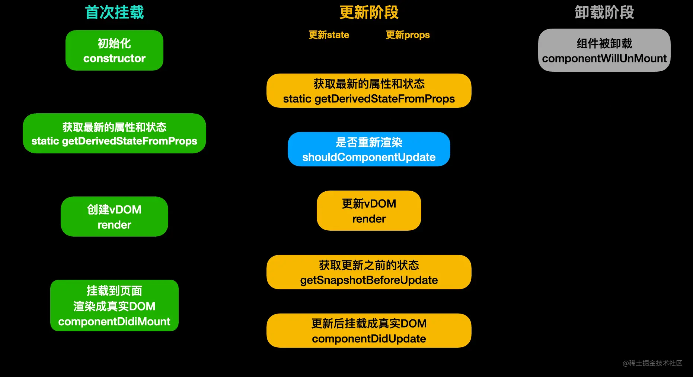

从图中可以看到，我把`生命周期`分为了`挂载阶段`、`更新阶段`、`卸载阶段`三个阶段。同时，在`挂载阶段`和`更新阶段`都会运行`getDerivedStateFromProps`和`render`，卸载阶段很好理解，只有一个`componentWillUnMount`，在卸载组件之前做一些事情，通常用来`清除定时器等副作用操作`。那么`挂载阶段`和`更新阶段`中的生命周期我们来逐一看下每个运行点及作用。

### 1. constructor

在同一个类组件对象只会运行一次。所以经常来做一些`初始化`的操作。同一个组件对象被多次创建，它们的`construcotr`互不干扰。

**注意：在`construcotr`中要尽量避免（最好禁止）使用`setState`。** 我们都知道使用`setState`会造成页面的重新渲染，但是在`初始化`阶段，页面都还没有将`真实DOM`挂载到页面上，那么重新渲染的又有什么意义呢。除`异步`的情况，比如`setInterval`中使用`setState`是没问题的，因为在执行的时候页面早已`渲染完成`。但也最好不要，容易一些引起奇怪的问题。

```js
    constructor(props) {
        super(props);

        this.state = {
            num: 1
        };

        //不可以，直接Warning
        this.setState({
            num: this.state.num + 1
        });

        //可以使用，但不建议
        setInterval(()=>{
            this.setState({
                num: this.state.num + 1
            });
        }, 1000);
    }

```

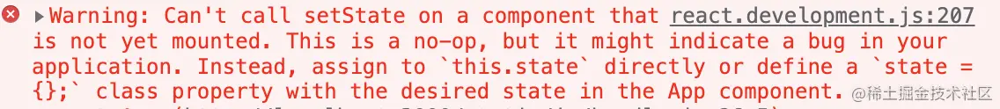

### 2. 静态属性 static getDerivedStateFromProps

该方法是一个`静态属性`，在`16`版本之前不存在，在新版`生命周期`中主要用来取代`componentWillMount`和`componentWillReceiveProps`，因为这两个`老生命周期`方法在一些开发者不规范的使用下极容易产生一些`反模式`的bug。因为是`静态方法`，所以你在其中根本拿不到`this`，更不可能调用`setState`。

该方法在`挂载阶段`和`更新阶段`都会运行。它有两个参数`props`和`state`当前的`属性值`和`状态`。它的返回值会合并掉当前的`状态（state）`。如果返回了非`Object`的值，那么它啥都不会做，如果返回的是`Object`，那么它将会跟当前的状态合并，可以理解为**Object.assign**[1]。通常情况下，几乎不怎么使用该方法。

```js
    /**
     * 静态方法，首次挂载和更新渲染都会运行该方法
     * @param {*} props 当前属性
     * @param {*} state 当前状态
     */
    static getDerivedStateFromProps(props, state){
        // return 1; //没用
        return {
            num: 999,   //合并到当前state对象
        };
    }

```

### 3. `render`

最重要的`生命周期`，没有之一。用来生成`虚拟节点（vDom）`树。该方法只要遇到需要重新渲染都会运行。同样的，在`render`中也严禁使用`setState`，因为会导致无限`递归`重新渲染导致`爆栈`。

```
    render() {
        //严禁使用！！！
        this.setState({
            num: 1
        })
        return (
            <>{this.state.num}</>
        )
    }

```

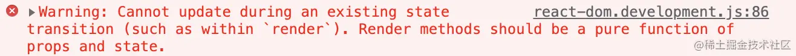

### 4. `componentDidMount`

该方法只会运行一次，在`首次渲染`时页面将`真实DOM`挂载完毕之后运行。通常在这里做一些`异步操作`，比如开启定时器、发起网络请求、获取`真实DOM`等。在该方法中，可以大胆使用`setState`，因为页面已经渲染完成。执行完该`钩子函数`后，组件正式进入到`活跃`状态。

```js
    componentDidMount(){
        // 初始化或异步代码...
        this.setState({});

        setInterval(()=>{});

        document.querySelectorAll("div");
    }

```

### 5. 性能优化 `shouldComponentUpdate`

在原理图`更新阶段`中可以看到，执行完`static getDerivedStateFromProps`后，会执行该`钩子函数`。该方法通常用来做`性能优化`。它的`返回值（boolean）`决定了是否要进行渲染`更新`。该方法有两个参数`nextProps`和`nextState`表示此次更新（下一次）的`属性`和`状态`。通常我们会将当前值与此次要更新的值做比较来决定是否要进行重新渲染。

在`React`中，官方给我们实现好了一个基础版的优化组件`PureComponent`，就是一个`HOC`高阶组件，内部实现就是帮我们用`shouldComponentUpdate`做了浅比较优化。如果安装了`React`代码提示的插件，我们可以直接使用`rpc` + `tab键`来生成模版。**注意：继承了`PureComponent`后不需要再使用`shouldComponentUpdate`进行优化。**

```js
    /**
     * 决定是否要进行重新渲染
     * @param {*} nextProps 此次更新的属性
     * @param {*} nextState 此次更新的状态
     * @returns {boolean}
     */
    shouldComponentUpdate(nextProps, nextState){
        // 伪代码，如果当前的值和下一次的值相等，那么就没有更新渲染的必要了
        if(this.props === nextProps && this.state === nextState){
            return false;
        }
        return true;
    }

```

### 6. `getSnapshotBeforeUpdate`

如果`shouldComponentUpdate`返回是`true`，那么就会运行`render`重新生成`虚拟DOM树`来进行对比更新，该方法运行在`render`后，表示`真实DOM`已经构建完成，但还没有`渲染`到页面中。可以理解为更新前的`快照`，通常用来做一些附加的DOM操作。

比如我突然想针对具有某个`class`的真实元素做一些事情。那么就可以在此方法中获取元素并修改。该函数有两个参数`prevProps`和`prevState`表示此次更新前的`属性`和`状态`，该函数的`返回值（snapshot）`会作为`componentDidUpdate`的第三个参数。

```js
    /**
     * 获取更新前的快照，通常用来做一些附加的DOM操作
     * @param {*} prevProps 更新前的属性
     * @param {*} prevState 更新前的状态
     */
    getSnapshotBeforeUpdate(prevProps, prevState){
        // 获取真实DOM在渲染到页面前做一些附加操作...
        document.querySelectorAll("div").forEach(it=>it.innerHTML = "123");
        
        return "componentDidUpdate的第三个参数";
    }

```

### 7. `componentDidUpdate`

该方法是`更新阶段`最后运行的`钩子函数`，跟`getSnapshotBeforeUpdate`不同的是，它的运行时间点是在`真实DOM`挂载到页面后。通常也会使用该方法来操作一些`真实DOM`。它有三个参数分别是`prevProps`、`prevState`、`snapshot`，跟Snapshot`钩子函数`一样，表示更新前的`属性`、`状态`、`Snapshot`钩子函数的返回值。

```js
    /**
     * 通常用来获取真实DOM做一些操作
     * @param {*} prevProps 更新前的属性
     * @param {*} prevState 更新前的状态
     * @param {*} snapshot  getSnapshotBeforeUpdate的返回值
     */
    componentDidUpdate(prevProps, prevState, snapshot){
        document.querySelectorAll("div").forEach(it=>it.innerHTML = snapshot);
    }

```

### 8. `componentWillUnmount`

如开头提到的，该`钩子函数`属于卸载阶段中唯一的方法。如果组件在`渲染`的过程中被卸载了，`React`会报出`Warning：Can't perform a React state update on an unmounted component`的警告，所以通常在组件被卸载时做`清除副作用的操作`。

```js
    componentWillUnmount(){
        // 组件被卸载前清理副作用...
        clearInterval(timer1);
        clearTimeout(timer2);
        this.setState = () => {};
    }

```

到这里，`React生命周期`中每一个`钩子函数`的作用以及运行时间点就已经全部了解了，斯国一！等在下文中提到的时候也有一个大致的印象。大家可以先喝口水休息一下～


## React element（初始元素）

先来认识下第一个概念，就是`React element`，what？当我伞兵？我还不知道什是`element`？别激动，这里的元素不是指`真实DOM`中的元素，而是通过`React.createElement`创建的`类似`真实DOM的元素。比如我们在开发中通过语法糖`jsx`写出来的`html`结构都是`React element`，为了跟`真实DOM`区分开来，本文就统称为`React初始元素`。

为什么要有一个`初始元素`的概念？我们都知道通过`jsx`编写的`html`不可能直接`渲染`到页面上，肯定是经历了一系列的`复杂`的处理最后生成`真实DOM`挂载到页面上。那么到底是怎么样的一个过程？在我们认识一些概念之后才能更深入的理解整个过程。先看看平时写的代码哪些是`初始元素`。

```js
import React, { PureComponent } from 'react'

//创建的是React初始元素
const A = React.createElement("div");
//创建的是React初始元素
const B = <div>123</div>

export default class App extends PureComponent {
    render() {
        return (
            //创建的是React初始元素
            <div>
                {A}
                {B}
            </div>
        )
    }
}

```

## `React vDom`（虚拟节点）

前面提到`React`在渲染过程中要做很多事情，所以不可能直接通过`初始元素`直接渲染。还需要一个东西就是`虚拟节点`。在本文中不涉及`React Fiber`的概念，将`vDom`树和`Fiber`树统称为`虚拟节点`。有了`初始元素`后，`React`就会根据`初始元素`和`其他可以生成虚拟节点的东西`生成`虚拟节点`。**请记住：`React`一定是通过`虚拟节点`来进行渲染的。** 接下来就是重点，除了`初始元素`能生成`虚拟节点`以外，还有哪些可能生成`虚拟节点`？总共有多少种`节点`类型？

### 1. DOM节点（`ReactDomComponent`）

> 此DOM非彼DOM，这里的DOM指的是`虚拟DOM节点`。当初始元素的`type`属性为`字符串`的时候`React`就会创建`虚拟DOM节点`。例如我们前面使用`jsx`直接书写的`const B = `。它的属性就是`"div"`，可以打印出来看一下。

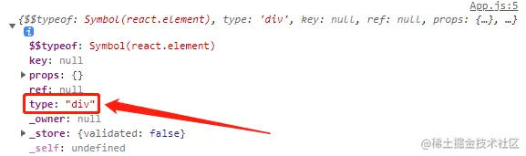

### 2. 组件节点（ReactComposite）

> 当`初始元素`的`type`属性为`函数`或是`类`的时候，`React`就会创建`虚拟组件节点`。

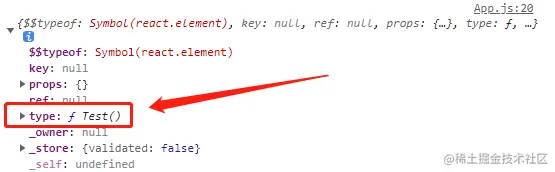

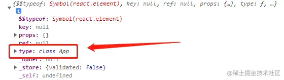

### 3. 文本节点（`ReactTextNode`）

> 顾名思义，直接书写`字符串`或者`数字`，`React`会创建为`文本节点`。比如我们可以直接用`ReactDOM.render`方法直接渲染`字符串`或`数字`。

```js
import ReactDOM from 'react-dom/client';

const root = ReactDOM.createRoot(document.getElementById('root'));
//root.render('一头猪');   //创建文本节点
root.render(123465);      //创建文本节点

```

### 4. 空节点（`ReactEmpty`）

> 我们平时写`React`代码的时候经常会写三目表达式`{this.state.xxx ?  : false}`用来进行条件渲染，只知道为`false`就不会渲染，那么到底是怎么一回事？其实遇到字面量`null`、`false`、`true`、`undefined`在`React`中均会被创建为一个`空节点`。在渲染过程中，如果遇到`空节点`，那么它将什么都不会做。

```js
import ReactDOM from 'react-dom/client';

const root = ReactDOM.createRoot(document.getElementById('root'));
//root.render(false);      //创建空节点
//root.render(true);       //创建空节点
//root.render(null);       //创建空节点
root.render(undefined);    //创建空节点

```

### 5. 数组节点（`ReactArrayNode`）

> 什么？`数组`还能渲染？当然不是直接`渲染`数组本身啦。当`React`遇到`数组`时，会创建`数组节点`。但是不会直接进行`渲染`，而是将数组里的每一项拿出来，根据`不同的节点类型`去做相应的事情。**所以`数组`里的每一项只能是这里提到的`五个节点类型`**。不信？那放个对象试试。

```js
import React from 'react';
import ReactDOM from 'react-dom/client';

const root = ReactDOM.createRoot(document.getElementById('root'));

function FuncComp(){
    return (
        <div>组件节点-Function</div>
    )
}

class ClassComp extends React.Component{
    render(){
        return (
            <div>组件节点-Class</div>
        ) 
    }
}

root.render([
    <div>DOM节点</div>,  //创建虚拟DOM节点
    <ClassComp />,       //创建组件节点
    <FuncComp />,        //创建组件节点
    false,               //创建空节点
    "文本节点",           //创建文本节点
    123456,              //创建文本节点
    [1,2,3],             //创建数组节点
    // {name: 1}         //对象不能生成节点，所以会报错
]);

```

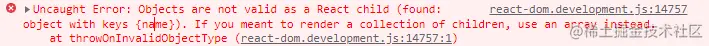

## 真实DOM（UI）

> 通过`document.createElement`创建的元素就是`真实DOM`。了解完`初始元素`、`虚拟节点`以及`真实DOM`这几个重要的概念后，就可以进入到`原理`的学习了。**再次强调：`React`的工作是通过`初始元素或可以生成虚拟节点的东西`生成`虚拟节点`然后针对不同的`节点类型`去做不同的事情最终生成`真实DOM`挂载到页面上！所以为什么对象不能直接被`渲染`，因为它生成不了`虚拟节点`。**（实际上是`ReactDOM`库进行渲染，为了减少混淆本文中就直接说`React`）


## 首次渲染阶段

如上图所示，`React`首先根据`初始元素`先生成`虚拟节点`，然后做了一系列操作后最终渲染成真实的`UI`。生成`虚拟节点`的过程上面已经讲过了，所以这里说的是根据不同的`虚拟节点`它到底做了些什么处理。

### 1. 初始元素-DOM节点

对于`初始元素`的`type`属性为字符串时，React会通过`document.createElement`创建`真实DOM`。因为`初始元素`的`type`为字符串，所以直接会根据`type`属性创建不同的`真实DOM`。创建完`真实DOM`后会立即设置该`真实DOM`的所有`属性`，比如我们直接在`jsx`中可以直接书写的`className`、`style`等等都会作用到`真实DOM`上。

```jsx
//jsx语法：React初始元素
const B = <div className="wrapper" style={{ color: "red" }}>
    <p className="text">123</p>
</div>

```

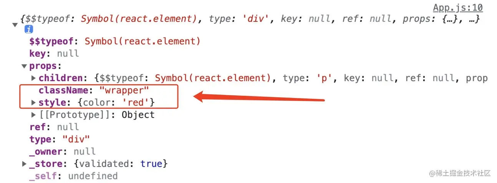

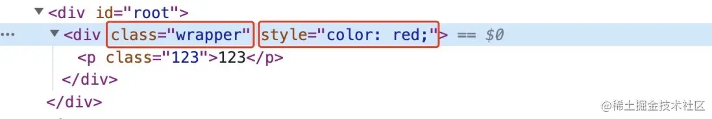

当然我们的`html结构`肯定不止一层，所以在设置完属性后`React`会根据`children`属性进行`递归遍历`。根据不同的`节点类型`去做不同的事情，同样的，如果`children`是`初始元素`，创建`真实DOM`、设置属性、然后检查是否有子元素。重复此步骤，一直到最后一个元素为止。遇到其他`节点类型`会做以下事情。⬇️

### 2. 初始元素-组件节点

前面提到的，如果`初始元素`的`type`属性是一个`class类`或者`function函数`时，那么会创建一个`组件节点`。所以针对`类`或`函数`组件，它的处理是不同的。

- **函数组件**

对于`函数组件`会直接调用函数，将函数的`返回值`进行递归处理（看看是什么`节点类型`，然后去做对应的事情，**所以一定要返回能生成`虚拟节点`的东西**），最终生成一颗`vDOM`树。

- **类组件**

对于`类组件`而言会相对麻烦一些。但前面有了`生命周期`的铺垫，结合图中`挂载阶段`来看这里理解起来就很方便了。

1. 首先创建类的`实例`（调用`constructor`）。
2. 调用`生命周期`方法`static getDerivedStateFromProps`。
3. 调用`生命周期`方法`render`，根据`返回值`递归处理。跟函数组件处理`返回值`一样，最终生成一颗`vDom`树。
4. 将该组件的`生命周期`方法`componentDidMount`加入到`执行队列`中等待真实DOM挂载到页面后执行（**注意：前面说了`render`是一个递归处理，所以如果一个组件存在`父子`关系的时候，那么肯定要等`子组件`渲染完`父组件`才能走出`render`，所以`子组件`的`componentDidMount`一定是比父组件`先入队列`的，肯定先运行！**）。

### 3. 文本节点

针对`文本节点`，会直接通过`document.createTextNode`创建`真实`的文本节点。

### 4. 空节点

如果生成的是`空节点`，那么它将什么`都不会做`！对，就是那么简单，啥都不做。

### 5. 数组节点

就像前面提到的一样，`React`不会直接渲染数组，而是将里面的`每一项`拿出来遍历，根据不同的`节点类型`去做不同的事，直到`递归`处理完数组里的每一项。（这里留个问题，为什么在`数组`里我们要写`key`？）

### 一图胜千言

当处理完了所有的`节点`后，我们的`vDom`树和`真实DOM`也创建好了，`React`会将`vDom`树保存起来，方便后续使用。然后将创建好的`真实DOM`都挂载到页面上。至此，`首次渲染`的阶段就全部结束了。有点懵？没事，正常，我们举个例子。

```js
import React from 'react';
import ReactDOM from 'react-dom/client';
const root = ReactDOM.createRoot(document.getElementById('root'));

/**
 * 组件节点-类组件
 */
class ClassSon extends React.Component {

    constructor(props){
        super(props);
        console.log("444 ClassSon constructor");
    }

    static getDerivedStateFromProps(props, state){
        console.log("555 ClassSon getDerivedStateFromProps");
        return {};
    }

    componentDidMount(){
        console.log("666 ClassSon componentDidMount");
    }

    render() {
        return (
            <div className="func-wrapper">
                <span>
                    textNode22
                    {undefined}
                </span>
                {[false, "textNode33", <div>textNode44</div>]}
            </div>
        )
    }
}

/**
 * 组件节点-类组件
 */
class ClassComp extends React.Component {

    constructor(props){
        super(props);
        console.log("111 ClassComp constructor");
    }

    static getDerivedStateFromProps(props, state){
        console.log("222 ClassComp getDerivedStateFromProps");
        return {};
    }

    componentDidMount(){
        console.log("333 ClassComp componentDidMount");
    }
    
    render() {
        return (
            <div className="class-wrapper">
                <ClassSon />
                <p>textNode11</p>
                {123456789}
            </div>
        )
    }
}

root.render(<ClassComp />);


```

从代码结构来看，渲染的是`ClassComp`类组件，类组件内包含了一个`函数组件`以及一些其他可以生成`虚拟节点`的东西，同样的，`函数组件`内也是一些可以生成`虚拟节点`的结构。因为用图表示比较复杂，时间可能会有点久（gif很大已压缩...，显示有点小的话麻烦`右键新标签打开`看好了）


从图中可以看到，在`ClassComp`首次挂载运行`render`的过程中，发现了`ClassSon`组件，然后又开始了一个新的`类组件`节点的渲染过程。要等到`ClassSon`和其他兄弟节点渲染完后`ClassComp`的`render`才算完成。所以`ClassSon`的`componentDidMount`一定是先进队列的。所以控制台执行顺序一定是`111`、`222`、`444`、`555`、`666`、`333`。到这里，`首次挂载`的所有过程就结束了。再喝口水休息一下～

## 更新和卸载

挂载完成后组件进入`活跃`状态，等待数据的更新进行重新渲染。那么到底有几种场景会触发更新？整个过程又是怎么样的，有哪些需要注意的地方？

### 更新的场景

- **组件更新（`setState`）**

最常见的，我们经常用`setState`来重新设置组件的`状态`进行重新渲染（本文不涉及`Hooks`概念，不讲`useState`）。使用`setState`只会更新调用此方法的类。不会涉及到兄弟节点以及父级节点。影响范围仅仅是自己的`子节点`。结合文章最前面的`生命周期`图看，步骤如下：

1. 运行当前类组件的`生命周期`静态方法`static getDerivedStateFromProps`。根据返回值合并当前组件的状态。
2. 运行当前类组件的`生命周期`方法`shouldComponentUpdate`。如果该方法返回的`false`。直接终止更新流程！
3. 运行当前类组件的`生命周期`方法`render`，得到一个新的`vDom`树，进入新旧两棵树的`对比更新`。
4. 将当前类组件的`生命周期`方法`getSnapshotBeforeUpdate`加入执行队列，等待将来执行。
5. 将当前类组件的`生命周期`方法`componentDidUpdate`加入执行队列，等待将来执行。
6. 重新生成`vDom`树。
7. 根据`vDom`树更新`真实DOM`.
8. 执行队列，此队列存放的是更新过程中所有新建类组件的`生命周期`方法`componentDidMount`。
9. 执行队列，此队列存放的是更新过程涉及到原本存在的类组件的`生命周期`方法`getSnapshotBeforeUpdate`。
10. 执行队列，此队列存放的是更新过程涉及到原本存在的类组件的`生命周期`方法`componentDidUpdate`。
11. 执行队列，此队列存放的是更新过程中所有卸载的类组件的`生命周期`方法`componentWillUnMount`。

- **根节点更新（`ReactDOM.createRoot().render`）**

在`ReactDOM`的新版本中，已经不是直接使用`ReactDOM.render`进行更新了，而是通过`createRoot(要控制的DOM区域)`的返回值来调用`render`，无论我们在嵌套多少的组件里去调用`控制区域.render`，都会直接触发`根节点`的`对比更新`。一般不会这么操作。如果触发了根节点的更新，那么后续步骤是上面`组件更新`的`6-11`步。

### 对比更新过程（`diff`）

知道了两个更新的场景以及会运行哪些`生命周期`方法后，我们来看一下具体的过程到底是怎么样的。所谓`对比更新`就是将`新vDom`树跟之前首次渲染过程中保存的`老vDom`树对比发现差异然后去做一系列操作的过程。那么问题来了，如果我们在一个`类组件`中重新渲染了，`React`怎么知道在产生的新树中它的层级呢？难道是给`vDom`树全部挂上一个不同的标识来遍历寻找更新的哪个组件吗？当然不是，我们都知道`React`的`diff`算法将之前的复杂度`O(n^3)`降为了`O(n)`。它做了以下几个假设：

1. 假设此次更新的节点层级不会发生移动（直接找到旧树中的位置进行对比）。
2. 兄弟节点之间通过`key`进行唯一标识。
3. 如果新旧的`节点类型`不相同，那么它认为就是一个新的结构，比如之前是`初始元素div`现在变成了`初始元素span`那么它会认为整个结构全部变了，无论嵌套了多深也会全部`丢弃`重新创建。

### key的作用

如果前面copy了文中的代码例子就会发现在使用`数组节点`的时候，如果里面有`初始元素`，并且没有给`初始元素`添加`key`那么它会警告`Warning: Each child in a list should have a unique "key" prop.`。那么`key`值到底是干嘛用的呢？其实`key`的作用非常简单，仅仅是为了通过`旧节点`，寻找对应的`新节点`进行对比提高`节点`的复用率。我们来举个例子，假如现在有五个`兄弟节点`更新后变成了四个`节点`。

**未添加key**

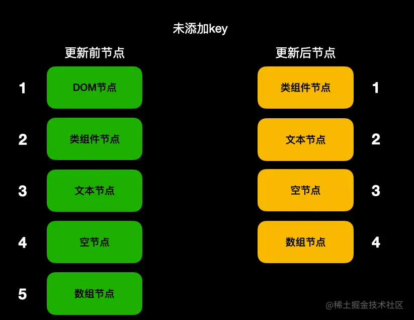

**添加了key**


看完两张图会发现如果有`key`的话在`其他节点`未变动的情况下复用了之前的所有`节点`。所以请尽量保持同一层级内`key`的`唯一性`和`稳定性`。这就是为什么不要用`Math.random`作为`key`的原因，跟没写一样。

### 找到对比目标-节点类型一致

经过假设和一系列的操作找到了需要对比的目标，如果发现`节点类型`一致，那么它会根据不同的节点类型做不同的事情。

**1. 初始元素-DOM节点**

如果是`DOM节点`，`React`会直接重用之前的`真实DOM`。将这次变化的`属性`记录下来，等待将来完成更新。然后遍历其`子节点`进行递归`对比更新`。

```js
import React, { PureComponent } from 'react'

export default class App extends PureComponent {
    state = {
        flag: true
    }
    
    render() {
        console.log("render了");
        return (
            <div className={this.state.flag ? "wrapper" : "flagFlase"}>
                <button onClick={()=>{
                    this.setState({
                        flag: !this.state.flag
                    });
                    console.log("属性名变了吗现在？", document.querySelector(".wrapper").className);
                }}>更新</button>
            </div>
        )
    }
}

```

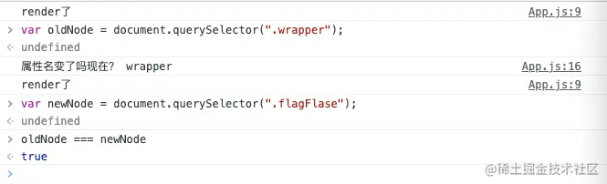

**2. 初始元素-组件节点**

- **函数组件**

如果是`函数组件`，`React`仅仅是重新调用`函数`拿到新的`vDom`树，然后递归进行`对比更新`。

- **类组件**

针对`类组件`，`React`也会重用之前的`实例对象`。后续步骤如下：

1. ```
   运行`生命周期`静态方法`static getDerivedStateFromProps`。将返回值合并当前状态。
   ```

2. ```
   运行`生命周期`方法`shouldComponentUpdate`，如果该方法返回`false`，终止当前流程。
   ```

3. ```
   运行`生命周期`方法`render`，得到新的`vDom`树，进行新旧两棵树的递归`对比更新`。
   ```

4. ```
   将`生命周期`方法`getSnapshotBeforeUpdate`加入到队列等待执行。
   ```

5. ```
   将`生命周期`方法`componentDidUpdate`加入到队列等待执行。
   ```

```js
import React, {Component} from 'react'

export default class App extends Component {

    static getDerivedStateFromProps(props, state){
        console.log("111 getDerivedStateFromProps");
        return {};
    }

    shouldComponentUpdate(){
        console.log("222 shouldComponentUpdate");
        return true;
    }

    getSnapshotBeforeUpdate(){
        console.log("444 getSnapshotBeforeUpdate");
        return null;
    }

    componentDidUpdate(){
        console.log("555 getSnapshotBeforeUpdate")
    }

    render() {
        console.log("333 render");
        return (
            <div className={"wrapper"}>
                <button onClick={()=>{
                    this.setState({});
                }}>更新</button>
            </div>
        )
    }
}

```

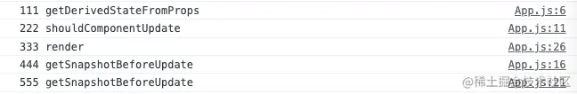

**3. 文本节点**

对于文本节点，同样的`React`也会重用之前的`真实文本节点`。将新的文本记录下来，等待将来统一更新（设置`nodeValue`）。

```
import React, { PureComponent } from 'react'

export default class App extends PureComponent {

    state = {
        text: "文本节点"
    }

    render() {
        return (
            <div className="wrapper">
                {this.state.text}
                <button onClick={()=>{
                    this.setState({
                        text: "新文本节点"
                    })
                }}>更新</button>
            </div>
        )
    }
}


```

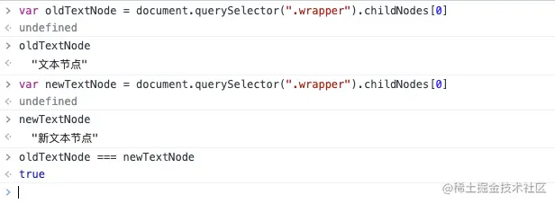

**4. 空节点**

如果节点的类型都是`空节点`，那么`React`啥都不会做。

**5. 数组节点**

首次挂载提到的，`数组节点`不会直接渲染。在更新阶段也一样，遍历每一项，进行`对比更新`，然后去做不同的事。

### 找到对比目标-节点类型不一致

如果找到了对比目标，但是发现`节点类型`不一致了，就如前面所说，`React`会认为你连类型都变了，那么你的`子节点`肯定也都不一样了，就算`一万个`子节点，并且他们都是没有变化的，只有最外层的`父节点`的`节点类型`变了，照样会全部进行`卸载`重新创建，与其去一个个递归查看`子节点`，不如直接全部`卸载`重新新建。

```js
import React, { PureComponent } from 'react'

export default class App extends PureComponent {

    state = {
        flag: true,
    }

    render() {
        console.log("重新渲染render");
        
        if (this.state.flag) {
            return <span className="wrapper">
                <button onClick={() => {
                    this.setState({
                        flag: !this.state.flag
                    })
                }}>更新</button>
            </span>
        }

        return (
            <div className="wrapper">
                <button onClick={() => {
                    this.setState({
                        flag: !this.state.flag
                    })
                }}>更新</button>
            </div>
        )
    }
}

```

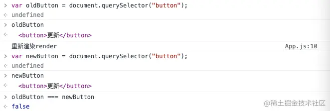

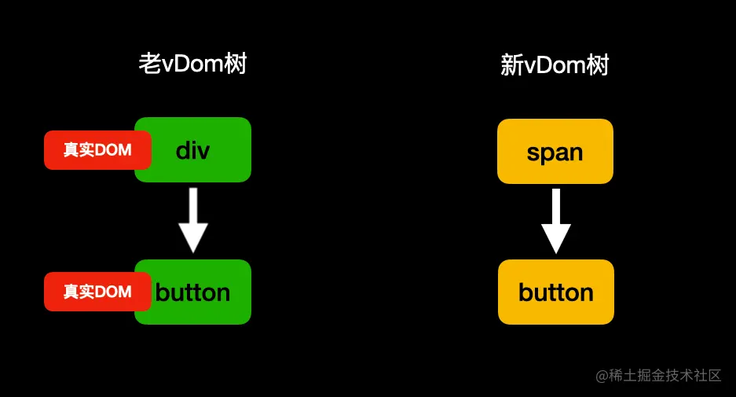


### 未找到对比目标

如果未找到对比的目标，跟`节点类型`不一致的做法类似，那么对于多出的节点进行`挂载流程`，对于旧节点进行卸载直接弃用。如果其包含子节点进行`递归卸载`。对于`初始类组件节点`会多一个步骤，那就是运行`生命周期`方法`componentWillUnmount`。**注意：尽量保持结构的稳定性，如果未添加`key`的情况下，兄弟节点更新位置前后错位一个那么后续全部的比较都会`错位`导致找不到对比目标从而进行`卸载`新建流程，对性能大打折扣。**

```js
import React, { PureComponent } from 'react'

export default class App extends PureComponent {

    state = {
        flag: true,
    }

    render() {
        console.log("重新渲染render");
        if (this.state.flag) {
            return <div className="wrapper">
                <span>123</span>
                <button onClick={() => {
                    this.setState({
                        flag: !this.state.flag
                    })
                }}>更新</button>
            </div>
        }

        return (
            <div className="wrapper">
                <button onClick={() => {
                    this.setState({
                        flag: !this.state.flag
                    })
                }}>更新</button>
            </div>
        )
    }
}

```


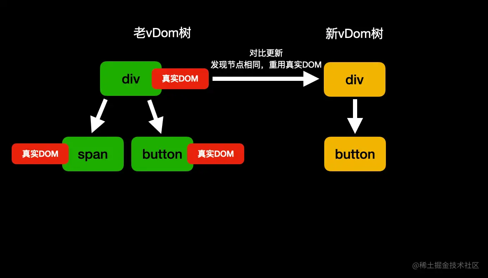

从图中可以看到，哪怕经过条件渲染前后`button`理论上没有任何变化的情况下，照样没有重用之前的`真实DOM`，如果在`button`之后还有`一万个`兄弟节点，那么也全部都找不到对比目标从而进行`卸载`重新创建流程。所以在进行`条件渲染`显示隐藏时，官方推荐以下做法：

1. ```
   控制`style：visibility`来控制显示隐藏。
   ```

2. ```
   在隐藏时给一个`空节点`来保证对比前后能找到同一位置。不影响后续`兄弟节点`的比较。
   ```

```js
this.state.flag ? <div></div> : false

```

## 来点栗子加深印象

**1. 是否重用了真实DOM**

```js
import React, { PureComponent } from 'react'

export default class App extends PureComponent {

    state = {
        flag: true,
    }

    render() {
        console.log("重新render！");

        if(this.state.flag){
            return <div className="flag-true">
                <button onClick={()=>{
                    this.setState({
                        flag: !this.state.flag
                    })
                }}>更新</button>
            </div>

        }
        return (
            <div className="flag-false">
                 <button onClick={()=>{
                    this.setState({
                        flag: !this.state.flag
                    })
                }}>更新</button>
            </div>
        )
    }
}

```

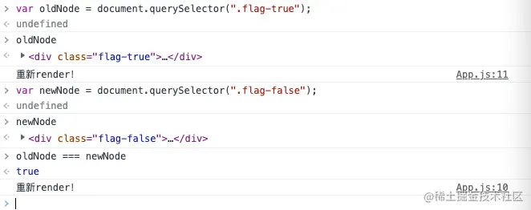

尽管从代码结构看起来像是返回了两个不同的`DOM`，但其实在更新的过程中，`React`发现他们的`节点类型`一致，所以会重用之前的`真实DOM`。**所以请注意：尽量保持`节点的类型`一致，如果更新前后`节点类型`不一致的话无论有多少子组件将全部`卸载`重新创建。**

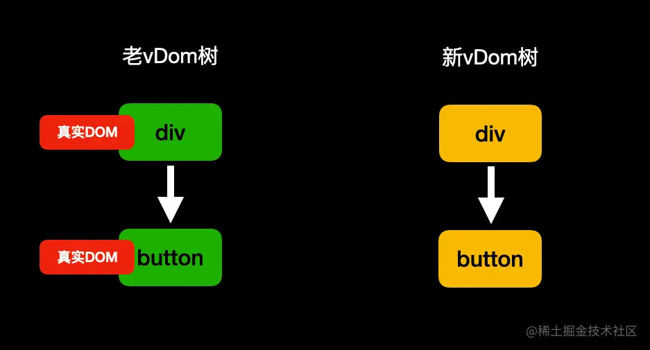

**2. 一个神奇的效果**

```js
import React, { PureComponent } from 'react'

export default class App extends PureComponent {
    state = { flag: false }

    render() {
        return (
            <>
                {
                    this.state.flag ?
                        <div>
                            <input type="password" />
                            <button onClick={() => {
                                this.setState({
                                    flag: !this.state.flag
                                })
                            }}>显示/隐藏</button>
                        </div>
                        :
                        <div>
                            <input type="password" />
                            <input type="text" />
                            <button onClick={() => {
                                this.setState({
                                    flag: !this.state.flag
                                })
                            }}>显示/隐藏</button>

                        </div>
                }
            </>
        )
    }
}

```


从图中可以看到，我们输入了密码后，`重新渲染`生成了新的DOM，但是里面的密码还存在。这就很好的证明了`React`是如何重用`真实DOM`的。

**一道面试题**

```js
import React, { PureComponent } from 'react'

class ClassCompA extends PureComponent {
    componentDidMount() {
        console.log("111 ClassCompA componentDidMount");
    }

    componentWillUnmount() {
        console.log("222 ClassCompA componentWillUnmount");
    }

    render() {
        return (<div className="ClassCompA"></div>)
    }
}

class ClassCompB extends PureComponent {
    componentDidMount() {
        console.log("333 ClassCompB componentDidMount");
    }

    render() {
        return (<div className="ClassCompB">
            <ClassCompC />
        </div>)
    }
}


class ClassCompC extends PureComponent {
    componentDidMount() {
        console.log("444 ClassCompC componentDidMount");
    }

    render() {
        return (<div className="ClassCompC"></div>)
    }
}


export default class App extends PureComponent {
    state = {
        flag: true,
    }

    componentDidMount(){
        console.log("666 App componentDidMount");
    }

    componentDidUpdate() {
        console.log("555 App componentDidUpdate");
    }

    render() {
        return (
            <div className="wrapper">
                {this.state.flag ? <ClassCompA/> : <ClassCompB/>}
                <button onClick={() => {
                    this.setState({
                        flag: !this.state.flag
                    })
                }}>更新</button>
            </div>
        )
    }
}

```

**问：首次渲染和按下button控制台输出的顺序是什么？**

看的仔细的同学，相信根本就难不倒你，我们一起来捋一捋。

1. 首先，最外层的组件是`App`，所以开始`App`的挂载流程，运行`render`的过程中发现`条件渲染`先渲染`ClassCompA`。
2. 进入`ClassCompA`的挂载流程，没啥好渲染的就一个div，执行完`render`后将`componentDidMount`加入到队列中等待执行。此时队列里是`[111]`。
3. `App`再针对初始元素`button`做处理后，`render`执行结束，将自己的`componentDidMount`加入到队列中等待执行，此时队列里是`[111、666]`。
4. `React`根据`虚拟节点`生成`真实DOM`后，保存`vDom`树，开始运行队列。此时控制台打印`111`、`666`。
5. 按下`button`后，调用`setState`进行重新渲染，此时`App`还会运行两个生命周期方法 `getDerivedStateFromProps`和`shouldComponentUpdate`，然后运行`render`，生成新的`vDom`树。
6. 进入新旧两棵树的`对比更新`，虽然都是`组件节点`，但生成出的实例不同，认为是不相同的`节点类型`。开始卸载旧节点`ClassCompA`，并将`ComponentWillUnMount`加入到执行队列，等待执行。此时队列`[222]`。
7. 进入新节点挂载流程，创建`ClassCompB`实例，调用`render`生成`虚拟节点`。发现存在`组件节点ClassCompC`。再次进入到新节点挂载流程，创建实例。
8. `ClassComC`运行完`render`生成`vDom`树，将自己的`componentDidMount`加入到队列，等待将来执行。此时队列`[222、444]`。
9. 挂载完`ClassComC`后，`ClassComB`的`render`才算结束，此时将自己的`componentDidMount`加入到队列，等待执行，此时队列`[222、444、333]`。
10. 此时`App`的`render`才算结束，将自己的`componentDidUpdate`加入到队列，等待执行。此时队列`[222、444、333、555]`。
11. 将根据`虚拟节点`生成的`真实DOM`挂载到页面上后，开始执行队列。控制台输出`222`、`444`、`333`、`555`。

# 总结

对于`生命周期`我们只需关注比较重要的几个生命周期的运行点即可，比如`render`的作用、使用`componentDidMount`在挂载完`真实DOM`后做一些副作用操作、以及性能优化点`shouldComponentUpdate`、还有卸载时利用`componentWillUnmount`清除副作用。

对于`首次挂载`阶段，我们需要了解`React`的渲染流程是：通过我们书写的`初始元素`和一些其他`可以生成虚拟节点的东西`来生成`虚拟节点`。然后针对不同的节点类型去做不同的事情，最终将`真实DOM`挂载到页面上。然后执行渲染期间加入到队列的一些`生命周期`。然后组件进入到活跃状态。

对于`更新卸载`阶段，需要注意的是有几个`更新的场景`。以及`key`的作用到底是什么。有或没有会产生多大的影响。还有一些小细节，比如`条件渲染`时，不要去破坏结构。尽量使用`空节点`来保持前后结构顺序的统一。重点是新旧两棵树的`对比更新流程`。找到目标，节点类型一致时针对不同的`节点类型`会做哪些事，类型不一致时会去`卸载`整个旧节点。无论有多少子节点，都会全部`递归`进行卸载。

到这里，文章所有的部分就全部结束了，本文没有涉及到一行源码，全部都是总结出能在不看源码的情况下能大致了解整个`渲染流程`。为了减少混淆，也没有涉及到`Hooks`以及`Fiber`的概念，有兴趣的同学可以留言，可以考虑下次出一篇。最后，再喝一口水休息一下。对本文内容有异议或交流欢迎评论～


作者：特立独行的猪_
链接：https://juejin.cn/post/7121378029682556958
来源：稀土掘金
著作权归作者所有。商业转载请联系作者获得授权，非商业转载请注明出处。

# 作者：特立独行的猪_

https://juejin.cn/post/7121378029682556958